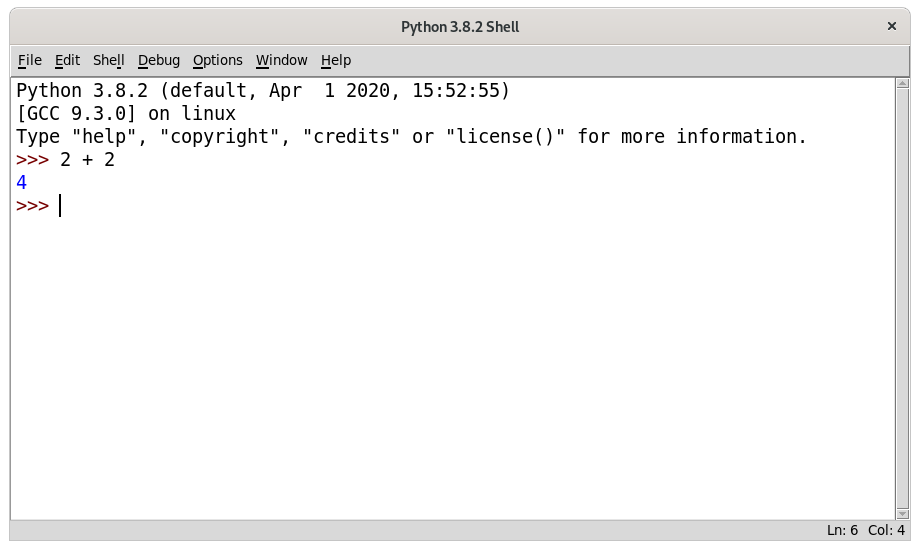

# 1 La consola interactiva

Antes de que pueda hacer juegos, necesitará aprender unos cuantos conceptos básicos de programación. Empezará en este capítulo aprendiendo cómo usar la consola interactiva de Python y ejecutar aritmética básica.

---
Temas cubiertos en este capítulo:
* Operadores
* Números enteros y de punto flotante
* Valores
* Expresiones
* Errores de sintaxis
* Almacenar valores en variables
---

## Algo de matemática simple

Abra IDLE siguiendo los pasos en «Abriendo IDLE» en la página xxvi. Primero, usará Python para resolver algunos problemas de matemática simples. La consola interactiva puede funcionar justo como una calculadora. Escriba **`2 + 2`** en la «shell» interactiva, en el «prompt» `>>>` y presione `ENTER`. (En algunos teclados, esta es la tecla `RETURN`.) La Figura 1-1 muestra cómo se ve este problema de matemática en la consola interactiva--note que responde con el número `4`.

*Figura 1-1: Escribiendo 2+2 en la «shell» interactiva*

Este problema de matemática es una simple instrucción de programación. El signo de más (`+`) le indica a la computadora que sume los números `2` y `2`. La computadora lo hace y responde con el número `4` en la línea siguiente. La tabla 1-1 lista otros símbolos matemáticos disponibles en Python.

Tabla 1-1: Operadores matemáticos

|Operador | Operación      |
|---------|----------------|
| `+`     | Suma           |
| `-`     | Resta          |
| `*`     | Multiplicación |
| `/`     | División       |

El signo de menos (`-`) resta números, el asterisco (`*`) multiplica números y la barra inclinada (`/`) divide números. Cuando se usan de esta forma, `+`, `-`, `*` y `/` se llaman *operadores*. Los operadores le dicen a Python qué hacer con los números que los rodean.

### Números enteros y de punto flotante

Los *enteros* (o *ints*, para abreviar, del inglés «integers») son números como 4, 99 y 0. Los números de punto flotante (o *floats* para abreviar, del inglés «floating») son fracciones o números con punto decimal como 3.5, 42.1 y 5.0. En Python, 5 es un entero, pero 5.0 es un flotante. Estos números se llaman *valores*. (Más adelante aprenderemos sobre otros tipos de valores además de los números.) En el problema matemático que escribió en la consola, 2 y 2 son números enteros.

## Expresiones

El problema matemático `2 + 2` es un ejemplo de una *expresión*. Como muestra la Figura 1-2, las expresiones están formadas por valores (los números) conectados por operadores (los signos matemáticos) que producen un nuevo valor que el código puede usar. Las computadoras pueden resolver millones de expresiones en segundos.

*Figura 1-2: Una expresión está formada por valores y operadores*

Intente escribir algunas de estas expresiones en la consola interactiva, presione `ENTER` después de cada una:

~~~Python
>>> 2+2+2+2+2
10
>>> 8*6
48
>>> 10-5+6
11
>>> 2  +        2
4
~~~

Estas expresiones todas parecen ecuaciones regulares de matemática, pero note todos los espacios en el ejemplo `2  +        2`. En Python, se puede agregar cualquier número de espacios entre valores y operadores. Sin embargo, siempre debe empezar las instrucciones al inicio de la línea (sin espacios) cuando las escribe en la consola interactiva.

## Evaluando expresiones

Cuando una computadora resuelve la expresión `10 + 5` y devuelve el valor `15`, esta ha *evaluado* la expresión. Evaluar una expresión reduce la expresión a un único valor, así como resolver un problema matemático reduce el problema a un único número: la respuesta. Por ejemplo, las expresiones `10 + 5` y `10 + 3 + 2` ambas evalúan a `15`.

Cuando Python evalúa una expresión, este sigue un orden de operaciones justo como cuando usted hace matemáticas. Hay sólo unas pocas reglas:

* Partes de la expresión dentro de paréntesis se evalúan primero.
* Multiplicación y división se hacen antes de suma y resta.
* La evaluación se realiza de izquierda a derecha.

La expresión `1 + 2 * 3 + 4` se evalúa a `11`, no a `13`, porque `2 * 3` se evalúa primero. Si la expresión fuera `(1 + 2) * (3 + 4)` se evaluaría a `21`, porque los `(1 + 2)` y `(3 + 4)` dentro de paréntesis se evalúan antes que la multiplicación.

Las expresiones pueden ser de cualquier tamaño, pero siempre se evalúan a un único valor. Incluso valores sencillos son expresiones. Por ejemplo, la expresión `15` se evalúa al valor `15`. La expresión `8 * 3 / 2 + 2 + 7 - 9` se evaluará al valor `12.0` a través de los siguientes pasos:

Aunque la computadora esta ejecutando todos estos pasos, estos no se ven en la consola interactiva. La consola interactiva solo le muestra el resultado:

~~~Python
>>> 8 * 3 / 2 + 2 + 7 - 9
12.0
~~~

Note que las expresiones con el operador de división `/` siempre evalúan a un flotante; por ejemplo, `24 / 2` evalúa a `12.0`. Las operaciones matemáticas con aunque sea un valor flotante también evalúan a valores flotantes, entonces `12.0 + 2` evalúa a `14.0`.

## Errores de sintaxis

Cuando escribe `5 +` en la consola interactiva, recibirá el siguiente mensaje
de error:

~~~Python
>>> 5 +
SynetaxError: invalid syntax
~~~

Este error ocurrió porque `5 +` no es una expresión. Las expresiones tienen valores conectados por operadores, y el operador `+` espera un valor *antes* y *después*. Un mensaje de error aparece cuando hace falta un valor esperado.

`SyntaxError` significa que Python no puede entender la instrucción porque la escribió de forma incorrecta. La programación de computadoras no se trata sólo de dar instrucciones para que la computadora siga, sino también de saber cómo dar esas instrucciones de forma correcta.

Pero, no se preocupe de cometer errores. Los errores no dañarán su computadora.Sólo vuelva a escribir la instrucción de forma correcta en la «shell» interactiva en el siguiente «prompt» de `>>>`.

## Almacenando valores en variables

Cuando una expresión se evalúa a un valor, se puede usar ese valor después almacenándolo en una *variable*. Piense que una variable es como una caja que puede contener un valor.

Una *sentencia de asignación* almacenará un valor dentro de una variable. Escriba un nombre para la variable, seguido del signo de igual (`=`), que se llama *operador de asignación*, y luego el valor a almacenar en la variable. Por ejemplo, escriba lo siguiente en la consola interactiva:

~~~Python
>>> spam = 15
>>>
~~~

La caja de la variable `spam` ahora almacena el valor `15`, como se muestra en la Figura 1-3.

*Figura 1-3: Las variables son como cajas que pueden almacenar valores.*

Cuando presiona ENTER, no verá nada de respuesta. En Python, se sabe que la instrucción fue exitosa si no aparece un mensaje de error. El «prompt» `>>>` aparece para que pueda escribir otra instrucción.

A diferencia de las expresiones, las *sentencias* son instrucciones que no evalúan a ningún valor. Por eso es que no hay un valor mostrado en la siguiente línea en la consola interactiva después de `spam = 15`. Si tiene confusión acerca de cuáles instrucciones son expresiones y cuáles son sentencias, recuerde que las expresiones evalúan a un único valor. Cualquier otro tipo de instrucción es una sentencia.

Las variables almacenan valores, no expresiones. Por ejemplo, considere la expresión en las sentencias `spam = 10 + 5` y `spam = 10 + 7 - 2`. Ambas evalúan a `15`. El resultado final es el mismo: ambas sentencias de asignación almacenan el valor `15` en la variable `spam`.

Un buen nombre de variable describe el dato que contiene. Imagine que se mude a una nueva casa y etiquete todas sus cajas como *Cosas*. ¡Nunca encontraría nada! Los nombres de variables `spam`, `eggs`, y `bacon` (jamonada, huevos y tocino, en español) son ejemplos usados en este libro.

La primera vez que una variable se usa en una sentencia de asignación, Python va a crear esa variable. Para revisar qué valor hay en una variable, escriba el nombre de la variable en la consola interactiva:

~~~Python
>>> spam = 15
>>> spam
15
~~~

Las expresión `spam` evalúa a el valor dentro de la variable spam: `15`. También puede usar variables en expresiones. Pruebe escribir lo siguiente en la consola interactiva:

~~~Python
>>> spam = 15
>>> spam + 5
20
~~~

Se establece el valor de la variable `spam` a `15`, entonces escribir `spam + 5` es como escribir la expresión `15 + 5`. Aquí están los pasos de la evaluación de `spam + 5`:

No puede usar una variable antes de que la sentencia de asignación la cree. Si trata de hacerlo, Python le dará un `NameError` porque ninguna variable con ese nombre existe aún. Cometer un error al escribir el nombre de una variable también causa este error:

~~~Python
>>> spam = 15
>>> spma
Traceback (most recent call last):
  File "<pyshell#8>", line 1, in <module>
    spma
NameError: name 'spma' is not defined
~~~

El error aparece porque hay una variable `spam` pero no una variable `spma`.

Puede cambiar el valor almacenado en una variable escribiendo otra sentencia de asignación. Por ejemplo, escriba lo siguiente en la consola interactiva:

~~~Python
>>> spam = 15
>>> spam + 5
20
>>> spam = 3
>>> spam + 5
8
~~~

Cuando escribe por primera vez `spam + 5`, la expresión se evalúa a `20` porque almacenó `15` dentro de `spam`. Pero, cuando escribió `spam = 3`, el valor `15` en la caja de la variable se reemplaza, o se *sobrescribe*, con el valor de `3` ya que la variable puede tener sólo un valor a la vez. Porque el valor de `spam` ahora es `3`, cuando escribe `spam + 5`, la expresión se evalúa a `8`. Sobrescribir es como sacar un valor de la caja para poner un nuevo valor adentro, como se muestra en la Figura 1-4.

*Figura 1-4: El valor 15 en spam se sobrescribe con el valor 3.*

Incluso puede usar el valor de la variable `spam` para asignar un nuevo valor a `spam`:

~~~Python
>>> spam = 15
>>> spam = spam + 5
>>> spam
20
~~~

La sentencia de asignación `spam = spam + 5` dice, «El nuevo valor de la variable `spam` será el valor actual de `spam` más cinco». Para seguir aumentando el valor de `spam` en `5` muchas veces, escriba lo siguiente en la consola interactiva:

~~~Python
>>> spam = 15
>>> spam = spam + 5
>>> spam = spam + 5
>>> spam = spam + 5
>>> spam
30
~~~

En este ejemplo, se asigna el valor de `15` en la primer sentencia. En la segunda sentencia, se suma `5` al valor de `spam` y se asigna a `spam` el nuevo valor `spam + 5`, que evalúa a `20`. Cuando hace esto tres veces, `spam` evalúa a `30`.

Hasta ahora hemos visto sólo una variable, pero se pueden crear tantas variables como sean necesarias en sus programas. Por ejemplo, asignemos diferentes valores a dos variables llamadas `eggs` y `bacon`, así:

~~~Python
>>> bacon = 10
>>> eggs = 15
~~~

Ahora la variable `bacon` tiene `10` adentro, y la variable `eggs` tiene `15` adentro. Cada variable es su propia caja, con su propio valor, como se muestra en la Figura 1-5.

*Figura 1-5: Cada una de las variables eggs y bacon almacenan variables.*

Escriba `spam = bacon + eggs` en la consola interactiva, y luego revise el nuevo valor de `spam`.

~~~Python
>>> bacon = 10
>>> eggs = 15
>>> spam = bacon + eggs
>>> spam
25
~~~

El valor en `spam` ahora es `25`. Cuando suma `bacon` y `eggs`, se están sumando sus valores, que son `10` y `15` respectivamente. Las variables contienen valores, no expresiones, entonces a la variable `spam` se le asignó el valor `25`, no la expresión `bacon + eggs`. Después de que la
sentencia `spam = bacon + eggs` asigna el valor `25` a `spam`, cambiar `bacon` o `eggs` no afectará a `spam`.

## Resumen

En este capítulo aprendió lo básico de escribir instrucciones en Python. Porque las computadoras no tienen sentido común y sólo entenderán instrucciones específicas, Python necesita que le diga exactamente qué hacer.

Las expresiones son valores (como 2 o 5) combinados con operadores (como + o -). Python puede evaluar expresiones--eso es, reducir la expresión a un único valor. Se pueden almacenar valores dentro de variables, para que el programa pueda recordar esos valores y usarlos luego.

Hay algunos otros tipos de operadores y valores en Python. En el siguiente capítulo, recorrerá algunos conceptos básicos más y escribirá su primer programa. Aprenderá a trabajar con texto en expresiones. Python no está limitado a sólo números, ¡es más que una calculadora!

[Previo: Introducción](introduccion.md) | [Siguiente: Capítulo 2: Escribiendo programas](capitulo2.md)