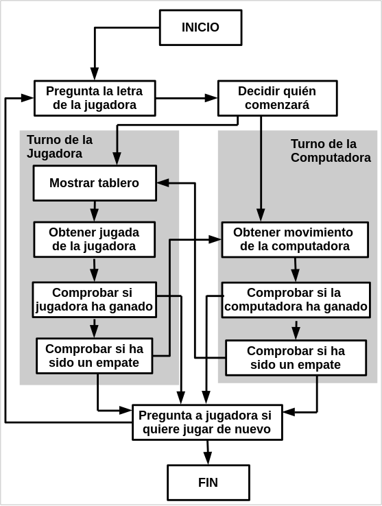
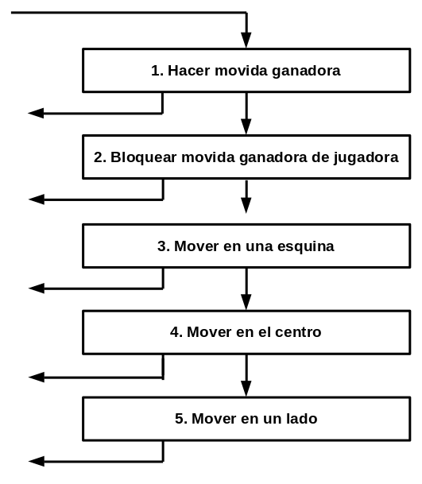
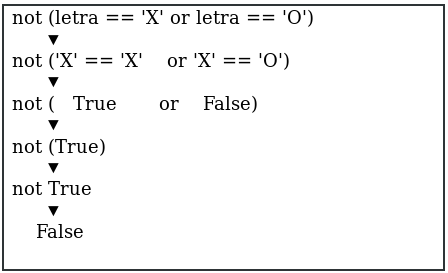

# 10 Tres en línea

Este capítulo presenta un juego de Tres en línea. El Tres en línea es normalmente jugado con dos personas. Una jugadora es *X* y la otra es *O*. Las jugadoras toman turnos para colocar sus *X* u *O*. Si una jugadora consigue ubicar tres de sus marcas en el tablero sobre la misma fila, columna o en diagonal, entonces gana. Cuando el tablero se completa pero ninguna jugadora gana entonces el juego termina empatado.

Este capítulo no introduce muchos conceptos de programación nuevos. La usuaria jugará contra una inteligencia artificial simple, que escribiremos usando nuestro conocimiento existente sobre programación. Una *inteligencia artificial (IA, o en inglés AI por Artificial Intelligence)* es un programa computacional que puede responder de manera inteligente a los movimientos de la jugadora. La IA que juega Tres en línea no es complicada; en realidad son solo unas pocas líneas de código.

Vamos a comenzar mirando una simple ejecución del programa. La jugadora realiza su movimiento ingresando el número del espacio que quiere tomar. Para ayudarnos a recordar cuál indice de la lista corresponde con cada espacio, numeraremos el tablero como el teclado numérico, como se muestra en la Figura 10-1.

*Figura 10-1: El tablero está numerado como el teclado numérico*

---

Temas cubiertos en este capítulo:

* Inteligencia Artificial
* Referencias en Listas
* Evaluación en Cortocircuito
* El Valor None

---

## Ejecución de ejemplo de Tres en línea

Esto es lo que la usuaria ve cuando ejecuta el programa de Tres en línea. El texto que la jugadora ingresa está encerrado entre asteriscos.

---

~~~Markdown
¡Bienvenida al Tres en línea!
¿Desea ser X o O?
**X**
La jugadora irá primero.
 | | 
-+-+-
 | | 
-+-+-
 | | 
¿Cuál es su próxima jugada? (1-9)
**3**
 | | 
-+-+-
 | | 
-+-+-
O| |X
¿Cuál es su próxima jugada? (1-9)
**4**
 | | 
-+-+-
X|O| 
-+-+-
O| |X
¿Cuál es su próxima jugada? (1-9)
**7**
X| |O
-+-+-
X|O| 
-+-+-
O| |X
¡La computadora le ha vencido! Ha perdido.
¿Desea volver a jugar? (sí/no)?
**no**
~~~

## Código fuente de Tres en línea

En un archivo nuevo, digite el siguiente código fuente y guárdelo como *tresenlínea.py*. Luego ejecute el juego presionando F5. Si obtiene errores, compare el código que digitó con el código del libro en la herramienta `diff` en línea en **https://www.nostarch.com/inventwithpython#diff*.

*tresenlínea.py*

~~~Python
  1. # Tres en línea
  2.
  3. import random
  4. 
  5. def dibujarTablero(tablero):
  6. # Esta función dibuja el tablero recibido como argumento.
  7. 
  8. # "tablero" es una lista de 10 cadenas representando el tablero (ignora índice 0)
  9. print(tablero[7] + '|' + tablero[8] + '|' + tablero[9])
 10. print('-+-+-')
 11. print(tablero[4] + '|' + tablero[5] + '|' + tablero[6])
 12. print('-+-+-')
 13. print(tablero[1] + '|' + tablero[2] + '|' + tablero[3])
 14.
 15. def ingresaLetraJugador():
 16.     # Permite a la jugadora ingresar que letra desea ser.
 17.     # Devuelve una lista con las letras de la jugadora como primer item, y la de la computadora como segundo.
 18.     letra = ''
 19.     while not (letra == 'X' or letra == 'O'):
 20.         print('¿Desea ser X o O?')
 21.         letra = input().upper()
 22. 
 23.     # el primer elemento de la lista es la letra de la jugadora, el segundo es la letra de la computadora.
 24.     if letra == 'X':
 25.         return ['X', 'O']
 26.     else:
 27.         return ['O', 'X']
 28. 
 29. def quienComienza():
 30.     # Elije al azar que jugador comienza.
 31.     if random.randint(0, 1) == 0:
 32.         return 'La computadora'
 33.     else:
 34.         return 'La jugadora'
 35. 
 36. def hacerJugada(tablero, letra, jugada):
 37.     tablero[jugada] = letra
 38. 
 39. def esGanador(ta, le):
 40.     # Dado un tablero y la letra de una jugadora, devuelve True (verdadero) si la misma ha ganado.
 41.     # Utilizamos "ta" por tablero y "le" por letra para no escribir tanto.
 42.     return ((ta[7] == le and ta[8] == le and ta[9] == le) or # horizontal superior
 43.             (ta[4] == le and ta[5] == le and ta[6] == le) or # horizontal medio
 44.             (ta[1] == le and ta[2] == le and ta[3] == le) or # horizontal inferior
 45.             (ta[7] == le and ta[4] == le and ta[1] == le) or # vertical izquierda
 46.             (ta[8] == le and ta[5] == le and ta[2] == le) or # vertical medio
 47.             (ta[9] == le and ta[6] == le and ta[3] == le) or # vertical derecha
 48.             (ta[7] == le and ta[5] == le and ta[3] == le) or # diagonal
 49.             (ta[9] == le and ta[5] == le and ta[1] == le)) # diagonal
 50. 
 51. def obtenerCopiaDelTablero(tablero):
 52.     # Hace una copia la lista del tablero y lo devuelve.
 53.     copaDelTablero = []
 54.     for i in tablero:
 55.         copaDelTablero.append(i)
 56.     return copaDelTablero
 57. 
 58. def hayEspacioLibre(tablero, jugada):
 59.     # Devuelte true si la jugada pasada como argumento está libre en el tablero
 60.     return tablero[jugada] == ' '
 61. 
 62. def obtenerJugadaJugadora(tablero):
 63.     # Permite a la jugadora ingresar su jugada.
 64.     jugada = ' '
 65.     while jugada not in '1 2 3 4 5 6 7 8 9'.split() or not hayEspacioLibre(tablero, int(jugada)):
 66.         print('¿Cuál es su próxima jugada? (1-9)')
 67.         jugada = input()
 68.     return int(jugada)
 69. 
 70. def elegirJugadaAlAzarDeLista(tablero, listaJugadas):
 71.     # Devuelve una jugada válida del tablero recibido como argumento.
 72.     # Devuelve None si no hay ninguna jugada válida.
 73.     jugadasPosibles = []
 74.     for i in listaJugadas:
 75.         if hayEspacioLibre(tablero, i):
 76.             jugadasPosibles.append(i)
 77. 
 78.         if len(jugadasPosibles) != 0:
 79.             return random.choice(jugadasPosibles)
 80.         else:
 81.             return None
 82. 
 83. def obtenerJugadaComputadora(tablero, letraComputadora):
 84.     # Dado un tablero y una letra de la computadora, determina dónde moverse.
 85.     if letraComputadora == 'X':
 86.         letraJugador = 'O'
 87.     else:
 88.         letraJugador = 'X'
 89.
 90.     # Aquí está el algoritmo para nuestra IA del Tres en línea
 91.     # Primero, verifica si podemos ganar en la próxima jugada
 92.     for i in range(1, 10):
 93.         copiaTablero = obtenerCopiaDelTablero(tablero)
 94.         if hayEspacioLibre(copiaTablero, i):
 95.             hacerJugada(copiaTablero, letraComputadora, i)
 96.             if esGanador(copiaTablero, letraComputadora):
 97.                 return i
 98. 
 99.     # Verifica si la jugadora podría ganar en su próxima jugada, y la bloquea.
100.     for i in range(1, 10):
101.         copiaTablero = obtenerCopiaDelTablero(tablero)
102.         if hayEspacioLibre(copiaTablero, i):
103.             hacerJugada(copiaTablero, letraJugador, i)
104.             if esGanador(copiaTablero, letraJugador):
105.                 return i
106.
107.     # Intenta ocupar una de las esquinas de estar libre.
108.     jugada = elegirJugadaAlAzarDeLista(tablero, [1, 3, 7, 9])
109.     if jugada != None:
110.         return jugada
111. 
112.     # De estar libre, intenta ocupar el centro.
113.     if hayEspacioLibre(tablero, 5):
114.         return 5
115. 
116.     # Ocupa alguno de los lados.
117.     return elegirJugadaAlAzarDeLista(tablero, [2, 4, 6, 8])
118.
119. def tableroEstaCompleto(tablero):
120.     # Devuelve True si cada espacio del tablero fue ocupado, caso contrario devuele False.
121.     for i in range(1, 10):
122.         if hayEspacioLibre(tablero, i):
123.             return False
124.     return True
125. 
126.
127. print('¡Bienvenida al Tres en línea!')
128. 
129. while True:
130. # Reinicia el tablero
131.     elTablero = [' '] * 10
132.     letraJugador, letraComputadora = ingresaLetraJugador()
133.     turno = quienComienza()
134.     print(turno + ' irá primero.')
135.     juegoEnCurso = True
136. 
137.     while juegoEnCurso:
138.         if turno == 'La jugadora':
139.             # Turno de la jugadora
140.             dibujarTablero(elTablero)
141.             jugada = obtenerJugadaJugadora(elTablero)
142.             hacerJugada(elTablero, letraJugador, jugada)
143. 
144.             if esGanador(elTablero, letraJugador):
145.                 dibujarTablero(elTablero)
146.                 print('¡Felicidades, has ganado!')
147.                 juegoEnCurso = False
148.             else:
149.                 if tableroEstaCompleto(elTablero):
150.                     dibujarTablero(elTablero)
151.                     print('¡Es un empate!')
152.                     break
153.                 else:
154.                     turno = 'La computadora'
155. 
156.         else:
157.             # Turno de la computadora
158.             jugada = obtenerJugadaComputadora(elTablero, letraComputadora)
159.             hacerJugada(elTablero, letraComputadora, jugada)
160. 
161.             if esGanador(elTablero, letraComputadora):
162.                 dibujarTablero(elTablero)
163.                 print('¡La computadora le ha vencido! Ha perdido.')
164.                 juegoEnCurso = False
165.             else:
166.                 if tableroEstaCompleto(elTablero):
167.                     dibujarTablero(elTablero)
168.                     print('¡Es un empate!')
169.                     break
170.                 else:
171.                     turno = 'La jugadora'
172. 
173.     print('¿Desea volver a jugar? (sí/no)?')
174.     if not input().lower().startswith('s'):
175.         break
~~~

## Diseñando el programa

La Figura 10-1 muestra un diagrama de flujo del Tres en línea. El programa inicia al preguntarle a la jugadora que elija su letra, *X* u *O*. Quién toma el primer turno se elige al azar. Luego la jugadora y la computadora toman turnos haciendo movidas

*Figura 10-2: Diagrama de flujo de Tres en línea*

Las cajas a la izquierda del diagrama de flujo muestran lo que ocurre durante el turno de la jugadora, y las que están al lado derecho muestran lo que ocurre durante el turno de la computadora. Luego de que la jugadora o computadora hacen una movida, el programa comprueba por si ganó o causó un empate, y luego cambia el turno de juego. Después de terminado el juego, el programa le pregunta a la jugadora si desea jugar otra vez.

## Representando el tablero como datos

Primero, debe descubrir cómo representar el tablero como dato en una variable. Sobre papel, el tablero de Tres en línea se dibuja como un par de líneas horizontales y un par de líneas verticales, con una *X*,  *O* o un espacio vacío en cada uno de los nueve espacios.

En el programa, el tablero de Tres en línea se representa como una lista de cadenas como el arte ASCII del Ahorcado. Cada cadena representa uno de los nueve espacios en el tablero. Las cadenas serán, ya sea `'X'` para el jugador *X*, `'O'` para el jugador *O*, o un espacio simple `' '` para un espacio vacío.

Recuerde que estamos  acomodando nuestro tablero como un teclado numérico de un teclado de escritorio.  Entonces si una lista de 10 cadenas se guardó en una variable llamada `tablero`, entonces `tablero[7]` sería el espacio superior izquierdo en el tablero, `tablero[8]` sería el espacio superior central, `tablero[9]` sería el espacio superior derecho, y así sucesivamente. El programa ignora la cadena en el índice `0` de la lista. La jugadora ingresará un número de 1 a 9 para decirle al juego en qué espacio desea hacer una movida.

## Estrategias de IA del juego

La IA necesita poder considerar el tablero y decidir en qué tipo de espacios hacer su movida. Para ser claros, etiquetaremos tres tipos de espacios en el tablero de Tres en línea: esquinas, lados y el centro. El gráfico en la Figura 10-3 presenta qué es cada espacio.

La estrategia de la IA para jugar al Tres en línea seguirá un *algoritmo* simple (un algoritmo es una serie finita de instrucciones para computar un resultado). Un único programa puede hacer uso de varios algoritmos diferentes. Un algoritmo puede ser representado con un diagrama de flujo. El algoritmo de la IA del Tres en línea computará la mejor movida por hacer, como se muestra en la Figura 10-4.

*Figura 10-3: Ubicación de los lados, esquinas y centro en el tablero.*

*Figura 10-4:  Las cajas representan los cinco pasos del algoritmo “Obtener movimiento de la computadora”. Las flechas salientes a la izquierda van a la caja “Comprobar si la computadora ha ganado”.*

El algoritmo de la IA consiste en los siguientes pasos:

1. Ver si hay un movimiento con el que la computadora pueda ganar el juego. Si lo hay, hacer ese movimiento. En caso contrario, ir al paso 2.
2. Ver si existe un movimiento disponible para el jugador que pueda hacer que la computadora pierda el juego. Si existe, mover ahí para bloquear a la jugadora. En caso contrario, ir al paso 3.
3. Comprobar si alguna de las esquinas (espacios 1, 3, 7, ó 9) está disponible. Si lo está, mover allí. Si no hay ninguna esquina disponible, ir al paso 4.
4. Comprobar si el centro está libre. Si lo está, jugar en el centro. Si no lo está, ir al paso 5.
5. Mover en cualquiera de los lados (espacios 2, 4, 6, u 8). No hay más pasos, ya que si hemos llegado al paso 5 los únicos espacios restantes son los lados.

Todo esto ocurre dentro de la rectángulo “Obtener movimiento de la computadora.” en nuestro diagrama de flujo de la Figura 10-2. Podría añadir esta información al diagrama de flujo con los cuadros de la Figura 10-4.

Este algoritmo esta implementado en la función `obtenerJugadaComputadora()` y las otras funciones llamadas por `obtenerJugadaComputadora()`.

## Importar el módulo random

El primer par de líneas están compuestas de un comentario y una línea importando el módulo `random` de modo que pueda llamar a la función `randint()` más adelante:

~~~Python
  1. # Tres en línea
  2.
  3. import random
~~~

Usted ha visto ambos conceptos anteriormente, así que avancemos a la siguiente parte del programa. 

## Imprimiendo el tablero en la pantalla

En la siguiente parte del código, definimos una función para dibujar el tablero:

~~~Python
  5. def dibujarTablero(tablero):
  6. # Esta función dibuja el tablero recibido como argumento.
  7. 
  8. # "tablero" es una lista de 10 cadenas representando el tablero (ignora índice 0)
  9. print(tablero[7] + '|' + tablero[8] + '|' + tablero[9])
 10. print('-+-+-')
 11. print(tablero[4] + '|' + tablero[5] + '|' + tablero[6])
 12. print('-+-+-')
 13. print(tablero[1] + '|' + tablero[2] + '|' + tablero[3])
~~~

La función `dibujarTablero()` imprime el tablero de juego representado por el parámetro `tablero`. Recuerde que el tablero está representado como una lista de 10 cadenas, donde la cadena en el índice 1 es la marca en el espacio 1 en el  tablero de Tres en línea, y así sucesivamente. La cadena en el índice 0 es ignorado. Muchas de las funciones del juego trabajan pasándo una lista de 10 cadenas como el tablero. 

Asegúrente de tener el espaceado justo en las cadenas; en caso contrario, el tablero se verá chistoso cuando sea impreso en la pantalla. Acá hay algunos ejemplos de llamadas (con un argumento para `tablero`) a `dibujarTablero()` y lo que la función imprimiría. 

~~~Python
>>> dibujarTablero([' ', ' ', ' ', ' ', 'X', 'O', ' ', 'X', '', 'O'])
X||O
-+-+-
X|O| 
-+-+-
 | | 
>>> dibujarTablero([' ', '', '', '', '', '', '', '', '', ''])
||
-+-+-
||
-+-+-
||
~~~

El programa toma cada cadena y la coloca en el tablero en orden de numero de acuerdo al teclado numérico de la Figura 10-1,  así pues las tres primeras cadenas son la fila inferior del tablero, las siguientes tres cadenas son la del medio, y las últimas tres cadenas son la superior. 

## Permitiendo a la jugadora elegir X o O

A continuación, definiremos una función para asignar *X* o *O* a la jugadora:

~~~Python
15. def ingresaLetraJugador():
 16.     # Permite a la jugadora ingresar que letra desea ser.
 17.     # Devuelve una lista con las letras de la jugadora como primer item, y la de la computadora como segundo.
 18.     letra = ''
 19.     while not (letra == 'X' or letra == 'O'):
 20.         print('¿Desea ser X o O?')
 21.         letra = input().upper()
~~~

La función `ingresaLetraJugadora()` pregunta si la jugadora quiere ser *X* y *O*. La condición del bucle `while` contiene paréntesis, lo cual significa que la expresión dentro de los paréntesis es evaluada de primera. Si la variable `letra` fue establecida con `'X'`, la expresión evaluaría como esta:

Si `letra` tiene el valor `'X'` o `'O'`, entonces la condición del bucle es `False` y permite que la ejecución del programa continúe pasado el bloque del  `while`. Si la condición es `True`, el programa se mantendrá preguntándole a la jugadora que elija una letra hasta que la jugadora ingrese *X* u *O*. La línea 21 cambia automáticamente la cadena retornada por la llamada a `input()` a letras mayúsculas con el método `upper()` de  *string*. 

La siguiente función retorna una lista con dos elementos:

~~~Python
 23.     # el primer elemento de la lista es la letra de la jugadora, el segundo es la letra de la computadora.
 24.     if letra == 'X':
 25.         return ['X', 'O']
 26.     else:
 27.         return ['O', 'X']
~~~

El primer elemento (la cadena en el índice 0) es la letra de la jugadora y el segundo elemento (la cadena en el índice 1) es la letra de la computadora. Las sentencias `if` y `else` elijen la lista adecuada para retornar. 

## Decidiendo quién va primero

Luego creamos una función que usa `randint()` para elegir ya sea que la jugadora o la computadora juega primero:

~~~Python
 29. def quienComienza():
 30.     # Elije al azar que jugador comienza.
 31.     if random.randint(0, 1) == 0:
 32.         return 'La computadora'
 33.     else:
 34.         return 'La jugadora'
~~~

La función `quienComienza()` realiza un lanzamiento de moneda virtual para determinar si la computadora o la jugadora va primero. El lanzamiento de moneda se hace con una llamada a `random.randint(0,1)`. Hay un chance de 50 por ciento de que la función retorne 0 y un chance de 50 por ciento de que la función retorne 1. Si esta llamada a la función retorna un 0, la función `quienComienza()` retorna la cadena `'La computadora'`. En caso contrario, la función retorna la cadena `'La jugadora'`. El código que llama a esta función usará el valor de retorno para determinar quien hará la primera movida del juego. 

## Colocando una marca en el tablero

La función `hacerJugada` es simple:

~~~Python
 36. def hacerJugada(tablero, letra, jugada):
 37.     tablero[jugada] = letra
~~~

Los parámetros son: `tablero`, `letra` y `jugada`. La variable `tablero` es la lista con 10 cadenas que representa el estado del tablero. La variable `letra` es la letra de la jugadora (ya sea `'X'` o `'O'`). La variable `jugada` es el espacio en el tablero donde la jugadora quiere moverse (el cual es un entero desde 1 hasta 9). 

Pero espere, en la línea 37, este código parece que cambia uno de los elementos en la lista `tablero` por el valor en `letra`. Sin emabrgo, debido a que este código está en una función, el parámetro `tablero` será olvidado cuando la función retorne. Entonces ¿no debería el cambio en `tablero` olvidarse igualmente?

En realidad, este no es el caso, porque las listas son especiales cuando usted las pasa como argumentos a funciones. Usted está en realidad pasando una *referencia* a la lista, no la lista en sí misma. Aprendamos sobre la diferencia entre listas y referencias a listas. 

## Referencias a listas

Ingrese el siguiente código en la «shell» interactiva:

~~~Python
>>> spam = 42
>>> cheese = spam
>>> spam = 100
>>> spam
100
>>> cheese
42
~~~

Estos resultados tienen sentido a partir de lo que sabe hasta ahora. Asigna `42` a la variable `spam`, luego asigna el valor en `spam` a la variable `cheese`. Cuando luego sobrescribe `spam` a `100`, esto no afecta al valor en `cheese`. Esto es porque `spam` y `cheese` son variables diferentes que almacenan valores diferentes.

Pero las listas no trabajan de esta forma. Cuando usted asigna una lista a una variable, usted de hecho está asignando a la variable una referencia a la lista. Una *referencia* es un valor que apunta a la ubicación donde algún dato es almacenado. Veamos un código que hará esto más sencillo de comprender. Ingrese esto en la «shell» interactiva (los número entre paréntesis no deben ser ingresados, solo serán utilizados para las explicaciones posteriores):

~~~Python
(1) >>> spam = [0, 1, 2, 3, 4, 5]
(2) >>> cheese = spam
(3) >>> cheese[1] = '¡Hola!'
    >>> spam
    [0, '¡Hola!', 2, 3, 4, 5]
    >>> cheese
    [0, '¡Hola!', 2, 3, 4, 5]
~~~

El código solamente cambió la lista `cheese`, pero pareciera que ambas listas `cheese` y `spam` han cambiado. Esto es porque la variable `spam` no contiene el valor de la lista en ella misma sino que contiene la referencia a la lista, como se muestra en la figura 10-5. La lista en si misma no está contenida en ninguna variable sino que existen fuera de ellas. 

*Figura 10-5: La lista `spam` creada en (1). Las variables no almacenan listas sino que referencias a listas.*

Note que `cheese = spam` copia en en `cheese` (2) la *referencia a la lista* que está en `spam`, en lugar de copiar el valor de lista en si misma. Ahora ambas `spam` y `cheese` almacenan una referencia al mismo valor de lista. Pero solo hay una lista porque la lista en si misma no fue copiada. La Figura 10-6 muestra este forma de copiar. 

*Figura 10-6: Las variables `spam` y `cheese` almacenan dos referencias a la misma lista.*

Así que la línea `cheese[1] = 'Hello!'` en (3) cambia la misma lista a la que `spam` hace referencia. Esto es el porqué `spam` retorna el mismo valor de lista que `cheese`. Ambas tienen referencias que refieren a la misma lista, como se muestra en la Figura 10-7. 

*Figura 10-7: Al cambiar la lista cambian todas las variables con referencias a esa lista.*

Si usted quiere que `spam` y `cheese` almacenen dos listas diferentes, usted tiene que crear dos listas en vez de copiar una referencia:

~~~Python
>>> spam = [0, 1, 2, 3, 4, 5]
>>> cheese = [0, 1, 2, 3, 4, 5]
~~~

En el ejemplo anterior, `spam` y `cheese` almacenan dos listas diferentes (aún cuando estas listas son idénticas en contenido). Ahora si usted modifica una de las listas, esto no afectará la otra porque `spam` y `cheese` tienen referencias a dos listas diferentes:

~~~Python
>>> spam = [0, 1, 2, 3, 4, 5]
>>> cheese = [0, 1, 2, 3, 4, 5]
>>> cheese[1] = '¡Hola!'
>>> spam
[0, 1, 2, 3, 4, 5]
>>> cheese
[0, '¡Hola!', 2, 3, 4, 5]
~~~

La Figura 10-8 muestra cómo las variables y los valores de lista están establecidos en este ejemplo. 

Los diccionarios trabajan de la misma forma. Las variables no almacenan diccionarios; almacenan *referencias* a diccionarios.

*Figura  10-8: la variable `spam` y `cheese` ahora cada una almacena referencias a dos listas diferentes*. 

## Usando referencias a listas en `hacerJugada`

Volvamos a la función `hacerJugada()`:

~~~Python
 36. def hacerJugada(tablero, letra, jugada):
 37.     tablero[jugada] = letra
~~~

Cuando el valor de una lista es pasado como el parámetro `tablero`, la variable local de la función es en realidad una copia de la referencia a la lista, no una copia de la lista en sí misma. De modo que cualquier cambio a `tablero` en esta función también producirá un cambio en la lista original. Aún cuando `tablero`es una variable local, la función `hacerJugada()` modifica la lista original.

Los parámetros `letra` y `jugada` son copias de los valores de cadena y entero que usted pasa. Como son copias de valores, si usted modifica `letra` o `jugada` en esta función, las variables originales que usó cuando llamó a `hacerJugada()` no son modificadas. 

## Comprobando si la jugadora ganó

De las líneas 42 a 49 en la función `esGanador()`  son en realidad una extensa sentencia de `return` :

~~~Python
 39. def esGanador(ta, le):
 40.     # Dado un tablero y la letra de una jugadora, devuelve True (verdadero) si la misma ha ganado.
 41.     # Utilizamos "ta" por tablero y "le" por letra para no escribir tanto.
 42.     return ((ta[7] == le and ta[8] == le and ta[9] == le) or # horizontal superior
 43.             (ta[4] == le and ta[5] == le and ta[6] == le) or # horizontal medio
 44.             (ta[1] == le and ta[2] == le and ta[3] == le) or # horizontal inferior
 45.             (ta[7] == le and ta[4] == le and ta[1] == le) or # vertical izquierda
 46.             (ta[8] == le and ta[5] == le and ta[2] == le) or # vertical medio
 47.             (ta[9] == le and ta[6] == le and ta[3] == le) or # vertical derecha
 48.             (ta[7] == le and ta[5] == le and ta[3] == le) or # diagonal
 49.             (ta[9] == le and ta[5] == le and ta[1] == le)) # diagonal
~~~

Los nombres `ta` y `le` son atajos para los parámetros `tablero` y `letra`. Estos nombres más cortos significan que usted tendrá menos que teclear en esta función. Recuerde, a Python no le importa cómo  usted nombre sus variables. 

Hay ocho posibles formas de ganar en Tres en línea: usted puede tener una línea a lo ancho de la filas superior, intermedia o inferior; usted puede tener una línea hacía abajo en las columnas izquierda, intermedia o derecha; o usted puede tener una línea a través de cualquiera de las dos diagonales. 

Cada línea (de código) de la condición comprueba si dada cualquier línea los tres espacios son iguales a la letra proveída (combinada con el operador `and`). Usted combina cada línea usando el operador `or` para comprobar por las ocho diferentes formas de ganar. Esto significa que solo una de las ocho maneras debe ser `True` para que podamos decir que la jugadora que posee esa letra en `le` es la ganadora.

Pretendamos que `le` es `'O'` y `ta` es `[' ', 'O', 'O', 'O', ' ', 'X', ' ', 'X', ' ', ' ']`. El tablero se vería como este:

~~~
X| |
-+-+-
 |X|
-+-+-
O|O|O
~~~

Acá está cómo se evaluaría la expresión después de la palabra reservada `return` en la línea 42. Primero Python reemplaza las variables `ta`y `le` con los valores en cada variable:

~~~Python
return (('X' == 'O' and ' ' == 'O' and ' ' == 'O') or
(' ' == 'O' and 'X' == 'O' and ' ' == 'O') or
('O' == 'O' and 'O' == 'O' and 'O' == 'O') or
('X' == 'O' and ' ' == 'O' and 'O' == 'O') or
(' ' == 'O' and 'X' == 'O' and 'O' == 'O') or
(' ' == 'O' and ' ' == 'O' and 'O' == 'O') or
('X' == 'O' and 'X' == 'O' and 'O' == 'O') or
(' ' == 'O' and 'X' == 'O' and 'O' == 'O'))
~~~

Luego, Python evalúa a valores booleanos todas esas comparaciones `==` dentro de los paréntesis:

~~~Python
return ((False and False and False) or
(False and False and False) or
(True and True and True) or
(False and False and True) or
(False and False and True) or
(False and False and True) or
(False and False and True) or
(False and False and True))
~~~

Luego el intérprete de Python evalúa todas las expresiones dentro de los paréntesis:

~~~Python
return ((False) or
(False) or
(True) or
(False) or
(False) or
(False) or
(False) or
(False))
~~~

Desde ahora solo hay un valor dentro de cada uno de los paréntesis internos, usted se puede deshacer de esos:

~~~Python
return (False or
False or
True or
False or
False or
False or
False or
False)
~~~

Ahora Python evalúa la expresión conectada por todos esos operadores `or`:

~~~Python
return (True)
~~~

Una vez más, deshágase de los paréntesis, y usted quedará con un solo valor:

~~~Python
return True
~~~

Así que dados esos valores para  `ta` y `le`, la expresión se evaluaría a `True`. Así es cómo el programa le puede decir si una de las jugadoras ha ganado el juego.

## Duplicar los datos del tablero

La función `obtenerCopiaDelTablero()`le permite hacer fácilmente una copia de dada una lista con 10 cadenas que represente el tablero de Tres en línea en el juego. 

~~~Python
 51. def obtenerCopiaDelTablero(tablero):
 52.     # Hace una copia la lista del tablero y lo devuelve.
 53.     copaDelTablero = []
 54.     for i in tablero:
 55.         copaDelTablero.append(i)
 56.     return copaDelTablero
~~~

Cuando el algoritmo de IA está planeando sus movimientos, algunas veces necesitará hacer modificaciones a una copia temporal del tablero sin modificar el tablero real. En esos casos, llamamos a esta función para que haga una copia de la lista del tablero. La nueva lista se crea en la línea 53. 

Ahora mismo, la lista almacenada en `copiaDelTablero` es solo una lista vacía. El bucle `for` va a iterar sobre el parámetro `tablero`, anexando una copia de los valores de la cadena del tablero real al tablero duplicado. Después de que  la función `obtenerCopiaDelTablero()` construya copia del tablero real, retorna una referencia a este nuevo tablero en `copiaDelTablero`, no la original en `tablero`.

## Comprobando si un espacio del tablero está libre

Dado un tablero de Tres en línea y una posible movida, la sencilla función `hayEspacioLibre()` retorna si la movida está disponible o no:

~~~Python
 58. def hayEspacioLibre(tablero, jugada):
 59.     # Devuelte true si la jugada pasada como argumento está libre en el tablero
 60.     return tablero[jugada] == ' '
~~~

Recuerde que los espacios libres en la lista del tablero están marcados como una cadena de un único espacio. Si el elemento en el índice del espacio no es igual a `' '` entonces el espacio está tomado. 

## Permitir a la jugadora ingresar una movida

La función  `obtenerJugadaJugadora()` pregunta a la jugadora que ingrese el número del espacio al cual quiere hacer la movida:

~~~Python
 62. def obtenerJugadaJugadora(tablero):
 63.     # Permite a la jugadora ingresar su jugada.
 64.     jugada = ' '
 65.     while jugada not in '1 2 3 4 5 6 7 8 9'.split() or not hayEspacioLibre(tablero, int(jugada)):
 66.         print('¿Cuál es su próxima jugada? (1-9)')
 67.         jugada = input()
 68.     return int(jugada)
~~~

La condición en la línea 65 es `True` si cualquiera de las expresiones en el lado izquierdo o derecho del operador `or` es `True`. El bucle se asegura que la ejecución no continúe hasta que la jugadora haya ingresado un entero entre 1 y 9. Además comprueba que el espacio ingresado no esté ocupado, dado el tablero de Tres en línea pasado a la función como parámetro `tablero`. Las dos líneas de código en el bucle `while` simplemente solicitan a la jugadora que ingrese un número de 1 a 9.

La expresión en el lado izquierdo comprueba si  la movida de la jugadora es igual a `'1'`, `'2'`, `'3'` y así sucesivamente hasta `'9'` creando una lista estas cadenas (con el método `split()`) y comprobando si la `jugada` está en esa lista. En esta expresión, `'1 2 3 4 5 6 7 8 9'.split()` evalúa a `['1' '2' '3' '4' '5' '6' '7' '8' '9']'` pero la primera es más sencilla de escribir. 

La expresión en el lado derecho comprueba si la movida que la jugadora ingresó es un espacio libre en el tablero llamando a `hayEspacioLibre()`. Recuerde que `hayEspacioLibre()` retorna `True` si la movida que usted pasa está disponible en el tablero. Note que `hayEspacioLibre()` espera un entero por `jugada`, así que la función `int()` retorna una forma entera de `jugada`.

Los operadores `not` son añadidos en ambos lados para que la condición sea `True` cuando cualquiera de de estos requerimientos no sea cumplido. Esto causa que el bucle le pregunte a la jugadora de nuevo una y otra vez por un número hasta que ingrese una movida apropiada.

Finalmente, la línea 68 retorna la forma entera de cualquier movida que haya ingresado la jugadora. `input()` retorna un cadenas, así que la función `int()` es llamada para retornar la forma entera de la cadena. 

## Evaluación de cortocircuito 

Usted lo podrá haber notado, hay un posible problema en la función `obtenerJugadaJugadora()`. ¿Qué si la jugadora ingresó `'Z'` o alguna otra cadena no entera? La expresión `jugada not in '1 2 3 4 5 6 7 8 9'.split()` en el lado izquierdo del `or` retornaría `False` como es esperado, y entonces Python evaluaría la expresión en el lado derecho del operador `or`.

Pero llamando `int('Z')` causaría que Python de un error, porque la función `int()` solo puede tomar cadenas de caracteres numéricos como `'9'` o `'0'`, no cadenas como `'Z'`.

Para ver un ejemplo de este tipo de error, ingrese lo siguiente en la «shell» interactiva:

~~~Python
>>> int('42')
42
>>> int('Z')
Traceback (most recent call last):
  File "<pyshell#3>", line 1, in <module>
    int('Z')
ValueError: invalid literal for int() with base 10: 'Z'
~~~

Pero cuando usted juega Tres en línea e intenta ingresar `'Z'` para su movida, este error no sucede. Esto es porque la condición del bucle `while` está en cortocircuito. 

*Cortocircuito* significa que una expresión evalúa solo parte del camino, dado que el resto de la expresión no cambia lo que la expresión evalúa a. Acá hay un programa corto que da un buen ejemplo de cortocircuito. Ingrese lo siguiente en la «shell» interactiva:

~~~Python
>>> def DevuelveTrue():
       print('DevuelveTrue() ha sido llamada.')
       return True
>>> def DevuelveFalse():
       print('DevuelveFalse() ha sido llamada.')
       return False
>>> DevuelveTrue()
DevuelveTrue() ha sido llamada.
True
>>> DevuelveFalse()
DevuelveFalse() ha sido llamada.
False
~~~

Cuando `DevuelveTrue()` es llamada, imprime `'DevuelveTrue() ha sido llamada.'` y luego también despliega el valor de retorno de `DevuelveTrue()`. Lo mismo en `DevuelveFalse()`.

Ahora ingrese lo siguiente en la «shell» interactiva:

~~~Python
>>> DevuelveFalse() or DevuelveTrue()
DevuelveFalse() ha sido llamada.
DevuelveTrue() ha sido llamada.
True
>>> DevuelveTrue() or DevuelveFalse()
DevuelveTrue() ha sido llamada.
True
~~~

La primera parte tiene sentido: la expresión `DevuelveFalse() or DevuelveTrue()` llama ambas funciones, así usted ve ambos mensajes impresos. 

Pero la segunda expresión solo muestra `'DevuelveTrue() ha sido llamada.'` , no `'DevuelveFalse()) ha sido llamada.'` . Esto es porque Python no llamó a `DevuelveFalse()` del todo. Ya que el lado izquierdo del operador `or` es `True`, no importa lo que retorne `DevuelveFalse()`, así que Python ni se molesta en llamarla. La evaluación fue en cortocircuito. 

Lo mismo aplica para el operador `and`. Ahora ingrese lo siguiente en la «shell» interactiva:

~~~Python
>>> DevuelveTrue() and DevuelveTrue()
DevuelveTrue() ha sido llamada.
DevuelveTrue() ha sido llamada.
True
>>> DevuelveFalse() and DevuelveFalse()
DevuelveFalse() ha sido llamada.
False
~~~

De nuevo, si el lado izquierdo del operador `and` es `False`, entonces la expresión completa es `False`. No importa si el lado derecho del `and` es `True` o `False`, pues Python no se molestará en evaluarla. Ambos `False and True` y `False and False` evalúan a `False`, así que Python hace un cortocircuito en la evaluación.

Volvamos a las líneas 65 a 68 del programa Tres en línea:

~~~Python
 65.     while jugada not in '1 2 3 4 5 6 7 8 9'.split() or not hayEspacioLibre(tablero, int(jugada)):
 66.         print('¿Cuál es su próxima jugada? (1-9)')
 67.         jugada = input()
 68.     return int(jugada)
~~~

Como la parte de la condición en el lado izquierdo del operador `or` (`jugada not in '1 2 3 4 5 6 7 8 9'.split()`) evalúa a `True`, el intérprete de Python sabe que la expresión completa evaluará a `True`. No importa si la expresión en el lado derecho del `or` evalúa a `True` o `False`, porque solo un valor en cualquier lado del operador `or` necesita ser `True` para que la expresión completa sea `True`.

Así que Python deja de comprobar el resto de la expresión y ni siquiera se molesta en evaluar la parte de `not hayEspacioLibre(tablero, int(jugada))`. Esto significa que las funciones `int()` y `hayEspacioLibre()` nunca son llamadas mientras que `jugada not in '1 2 3 4 5 6 7 8 9'.split()` sea  `True`.

Esto funciona bien para el programa, porque si el lado derecho de la condición es `True`, entonces `jugada` no es una cadena numérica de un solo dígito. Eso causaría que `int()` nos de un error. Pero si `jugada not in '1 2 3 4 5 6 7 8 9'.split()` evalúa a True, Python hace un cortocircuito en ` not hayEspacioLibre(tablero, int(jugada))` e `int(jugada)` no es llamada.

## Eligiendo una movida de una lista de movimientos

Ahora veamos la función `elegirJugadaAlAzarDeLista()`, la cual es útil para el código de IA más adelante en el programa:

~~~Python
 70. def elegirJugadaAlAzarDeLista(tablero, listaJugadas):
 71.     # Devuelve una jugada válida del tablero recibido como argumento.
 72.     # Devuelve None si no hay ninguna jugada válida.
 73.     jugadasPosibles = []
 74.     for i in listaJugadas:
 75.         if hayEspacioLibre(tablero, i):
 76.             jugadasPosibles.append(i)
~~~

Recuerde que el parámetro `tablero` es una lista de cadenas que representa el tablero de Tres en línea. El segundo parámetro, `listaJugadas`, es una lista de números enteros de posibles espacios de los cuales elegir. Por ejemplo, si `listaJugadas` es `[1, 3, 7, 9]`, eso significa que `elegirJugadaAlAzarDelista()` debería retornar el entero de una de los espacios esquineros. 

Sin embargo `elegirJuagadaAlAzarDeLista()` primero comprueba que el espacio es válido para hacer una movida en él. La lista `jugadasPosibles` inicia como una lista vacía. El bucle  `for` luego itera sobre `listaJugadas`. Las movidas que causen que `hayEspacioLibre()` retorne `True` son añadidas a `jugadasPosibles` con el método `append()`.

Al llegar a este punto, la lista `jugadasPosibles` tiene todas las movidasque estaban en `listaJugadas` además de ser espacios libres. El programa luego comprobará si la lista está vacía:

 ~~~Python
 78.         if len(jugadasPosibles) != 0:
 79.             return random.choice(jugadasPosibles)
 80.         else:
 81.             return None
 ~~~

Si la lista no está vacía, entonces al menos hay una movida posible que se puede realizar en el tablero. 

Pero esta lista podría estar vacía. Por ejemplo, si `listaJugadas` era `[1, 3, 7, 9]` pero el tablero representado por el parámetro `tablero` tuviera todos los espacios esquineros ocupados, la lista `jugadasPosibles` sería `[]`. En ese caso, `len(jugadasPosibles)` evalúa a 0, y la función retorna un valor de `None` (nada).

## El valor `None`

El valor `None` representa la ausencia de valor. `None` es el único valor del tipo de dato `NoneType`. Usted podría utilizar el valor `None` cuando usted necesite un valor que signifique "no existe" o "ninguna de las anteriores".

Por ejemplo, digamos que usted tenía una variable llamada `respuestaExamen` que mantiene la respuesta de la usuaria a una trivia con preguntas de respuesta verdadero o falso. La variable podría contener `True` o `False` para la respuesta de la usuaria. Pero si la usuaria no respondió la trivia, a usted no le gustaría establecer `respuestaExamen` a `True` o `False`, porque entonces parecería que la usuaria respondió la trivia. En cambio, usted podría establecer `respuestaExamen` con `None` si la usuaria se brincó la trivia.

Como una nota al margen, `None` no se despliega en la «shell» interactiva como otros valores:

~~~Python
>>> 2 + 2
4
>>> 'Esto es una cadena.'
'Esto es una cadena.'
>>> None
~~~

Los valores de las primeras dos expresiones son impresas como salida en la siguiente línea, pero `None` no tiene valor, por eso no es impresa.

Las funciones que parecen no retornar nada en realidad retornan el valor `None`. Por ejemplo, `print()` retorna `None`:

~~~Python
>>> spam = print('¡Hola mundo!')
¡Hola mundo!
>>> spam == None
True
~~~

Acá asignamos `'print('¡Hola Mundo!')` a `spam`. La función `print()`, como todas las funciones, tiene un valor de retorno. Aún cuando `print()` imprima una salida, la llamada la función retorna `None`. El IDLE no muestra `None` en el «shell» interactivo, pero usted podrá saber que `spam` está establecida a `None` porque `spam == None` evalúa a `True`.

## Creando la IA de la computadora

La función `obtenerJugadaComputadora()` contiene el código de IA:

~~~Python
 83. def obtenerJugadaComputadora(tablero, letraComputadora):
 84.     # Dado un tablero y una letra de la computadora, determina dónde moverse.
 85.     if letraComputadora == 'X':
 86.         letraJugador = 'O'
 87.     else:
 88.         letraJugador = 'X'
~~~

El primer argumento es un tablero de Tres en línea para el parámetro `tablero`. El segundo argumento es la letra que la computadora usa, ya sea `'X'` o `'O'` en el parámetro `letraComputadora`. Las primeras líneas simplemente asignan la otra letra a una variable llamada `letraJugador`. De esta forma, el mismo código puede ser utilizado ya sea que la computadora sea `'X'` o `'O'`.

Recuerde cómo funciona el algoritmo del Tres en línea:

1. Ver si hay un movimiento con el que la computadora pueda ganar el juego. Si lo hay, hacer ese movimiento. En caso contrario, ir al paso 2.
2. Ver si existe un movimiento disponible para el jugador que pueda hacer que la computadora pierda el juego. Si existe, mover ahí para bloquear a la jugadora. En caso contrario, ir al paso 3.
3. Comprobar si alguna de las esquinas (espacios 1, 3, 7, ó 9) está disponible. Si lo está, mover allí. Si no hay ninguna esquina disponible, ir al paso 4.
4. Comprobar si el centro está libre. Si lo está, jugar en el centro. Si no lo está, ir al paso 5.
5. Mover en cualquiera de los lados (espacios 2, 4, 6, u 8). No hay más pasos, ya que si hemos llegado al paso 5 los únicos espacios restantes son los lados.

La función retornará un entero de 1 a 9 representando la movida de la computadora. Avancemos por cada uno de estos pasos para ver cómo están implementados en el código. 

## Comprobando si la computadora puede ganar en un movimiento

Antes que nada, si la computadora puede ganar en el siguiente movimiento, debería hacer esa movida ganadora inmediatamente.

~~~Python
 90.     # Aquí está el algoritmo para nuestra IA del Tres en línea
 91.     # Primero, verifica si podemos ganar en la próxima jugada
 92.     for i in range(1, 10):
 93.         copiaTablero = obtenerCopiaDelTablero(tablero)
 94.         if hayEspacioLibre(copiaTablero, i):
 95.             hacerJugada(copiaTablero, letraComputadora, i)
 96.             if esGanador(copiaTablero, letraComputadora):
 97.                 return i
~~~

El bucle `for` que inicia en la línea 92 itera sobre cada posible movimiento desde el 1 al 9. El código dentro del bucle simula lo que pasaría si la computadora realiza esa movida. 

La primera línea en el bucle (línea 93) hace una copia de la lista `tablero`.  Esto es para que la movida simulada dentro del bucle no modifique el tablero real almacenado en la variable `tablero`. `obtenerCopiaDelTablero()` retorna un valor indentico al de lista del tablero pero separado.

La línea 94 comprueba si el espacio es libre y, si es así, simula efectuar el movimiento en la copia del tablero. Si esta movida resulta en el gane de la computadora, la función retorna el entero de esa movida.

Si ninguno de los espacios resulta en un gane, el bucle termina y el programa continúa su ejecución en la línea 100.

## Comprobando si la jugadora puede ganar en una movida

A continuación, el código simulará una jugadora humana moviendo en cada espacio. 

~~~Python
 99.     # Verifica si la jugadora podría ganar en su próxima jugada, y la bloquea.
100.     for i in range(1, 10):
101.         copiaTablero = obtenerCopiaDelTablero(tablero)
102.         if hayEspacioLibre(copiaTablero, i):
103.             hacerJugada(copiaTablero, letraJugador, i)
104.             if esGanador(copiaTablero, letraJugador):
105.                 return i
~~~

El código es similar al bucle en la línea 92 excepto porque se pone la letra de la jugadora en la copia del tablero. Si la función `esGanador()` muestra que la jugadora ganaría con la movida, entonces la computadora retornará la misma movida para bloquear que esto ocurra.

Si la jugadora humana no puede ganar en una movida más, el bucle `for` finaliza, y la ejecución continúa en la línea 108.

## Comprobando los espacios esquineros, el centro y los lados (en ese orden)

Si la computadora no puede hacer una movida ganadora y no necesita bloquear la movida de la jugadora, se moverá a un espacio esquinero, centro o un lado, dependiendo de los espacios disponibles.

La computadora primero intenta mover a un espacio en una esquina:

~~~Python
107.     # Intenta ocupar una de las esquinas de estar libre.
108.     jugada = elegirJugadaAlAzarDeLista(tablero, [1, 3, 7, 9])
109.     if jugada != None:
110.         return jugada
~~~

La llamada a la función `elegirJugadaAlAzarDeLista()` con la lista `[1, 3, 7, 9]` asegura que la función retornará el entero para una de los espacios esquieneros 1, 3, 7 o 9.

Si todos los espacios esquineros están ocupados, la fucnión `elegirJugadaAlAzarDeLista()` retornará `None`, y la ejecución continúa en la línea 113:

~~~Python
112.     # De estar libre, intenta ocupar el centro.
113.     if hayEspacioLibre(tablero, 5):
114.         return 5
~~~

Si nunguna de las esquinas está disponible, la línea 144 mueve al centro si este está libre. Si el espacio del centro no está libre, la ejecución continuá en la línea 117:

~~~Python
116.     # Ocupa alguno de los lados.
117.     return elegirJugadaAlAzarDeLista(tablero, [2, 4, 6, 8])
~~~

Este código también hace una llamada a `elegirJugadaAlAzarDeLista()`, con la excepción de que usted le pasa una lista de espacios en los lados: `[2, 4, 5, 8]`. Esta función no retornará `None` porque los espacios en los lados son los únicos espacios posiblemente libres. Esto finaliza la función `obtenerJugadaComputadora()` y el algoritmo de IA.

## Comprobando si el tablero está lleno

La última función es `tableroEstaCompleto()`:

~~~Python
119. def tableroEstaCompleto(tablero):
120.     # Devuelve True si cada espacio del tablero fue ocupado, caso contrario devuele False.
121.     for i in range(1, 10):
122.         if hayEspacioLibre(tablero, i):
123.             return False
124.     return True
~~~

Esta función retorna `True` si la lista de 10 cadenas en el argumento `tablero`que se pasó tiene una `'X'` o `'O'` en cada índice (exceptuando el índice 0, el cual es ignorado). El bucle `for` nos permite comprobar los índices del 1 al 9 en la lista `tablero`. Tan pronto como este encuentre un espacio vacío en el tablero (eso es, cuando `hayEspacioLibre(tablero, i)` retorno `True`), la función `tableroEstaCompleto()` retornará `Falso`)

Si la ejecución consigue avanzar a través de cada iteración del bucle, entonces ningun espacio está libre. La línea 124 ejecutará `return True`.

## El bucle de juego

La línea 127 es la primera línea que no está dentro de una función, entonces es la primera línea de código en ejecutarse cuando usted corre este programa.

~~~Python
127. print('¡Bienvenida al Tres en línea!')
~~~

Esta línea saluda la jugadora antes de comenzar el juego. El programa entonces ingresa en un bucle `while` en la línea 129:

~~~Python
129. while True:
130. # Reinicia el tablero
131.     elTablero = [' '] * 10
~~~

El bucle `while` se mantiene enciclado hasta que la ejecución encuentre la sentencia `break`. La línea 131 establece el tablero principal en la variable llamada `tablero`. El tablero inicia vacío, lo cual representamos con una lista de 10 cadenas con un único espacio. Mejor que escribir esta lista completa, la línea 131 usa replicación de lista. Es más corto escribir `[' '] * 10` que `[' ', ' ', ' ', ' ', ' ', ' ', ' ', ' ', ' ', ' ']`.

## Eligiendo la marca de la jugadora y quien inicia

A continuación, la función `ingresaLetraJugador()` le permite a la jugadora ingresar ya sea que quiera ser *X* o *O*:

~~~Python
132.     letraJugador, letraComputadora = ingresaLetraJugador()
~~~

La función retorna una lista con dos cadenas, ya sea `['X', 'O']` o `['O', 'X']`. Usamos asignación múltiple para establecer en `letraJugador` el primer elemento retornado por la lista y a `letraComputadora` el segundo.

Desde ahí, la función `quienComienza()` decidirá aleatoriamente quien va primero, ya sea retornando la cadena `La Jugadora` o la cadena `La Computadora`, y luego la línea 134 le dirá a la jugadora quien irá primero:

~~~Python
133.     turno = quienComienza()
134.     print(turno + ' irá primero.')
135.     juegoEnCurso = True
~~~

La variable `juegoEnCurso` mantiene rastro de si el juego está aún siendo jugado o si alguien ganó o empataron.

## Retornando el turno de la jugadora

El bucle de la línea 137 mantendrá en un ida y vuelta entre el código del turno de la jugadora y del turno de la computadora, siempre y cuando `juegoEnCurso` este establecido a `True`:

~~~Python
137.     while juegoEnCurso:
138.         if turno == 'La jugadora':
139.             # Turno de la jugadora
140.             dibujarTablero(elTablero)
141.             jugada = obtenerJugadaJugadora(elTablero)
142.             hacerJugada(elTablero, letraJugador, jugada)
~~~

La variable `turno` fue originalmente establecida a ya sea `'La jugadora'` o `'La computadora'` por la llamada a `quienComienza()`en la línea 133. Si `turno` es igual a `La computadora`, entonces la condición de la línea 138 es `False`, y la ejecución salta a la línea 156.

Pero si la línea 138 evalúa a `True`, la línea 140 llama a `dibujarTablero()` y le pasa la variable `elTablero` para imprimir el tablero de Tres en línea en la pantalla. Luego `obtenerJugadaJugadora()` permite a la jugadora ingresar su movida (y también se asegura que es una ` jugada` válida). la función `hacerJugada()` añade al `tablero` la *X* o *O* de la jugadora.

Ahora que la jugadora ha hecho su movida, el programa debe comprobar si es que ha ganado el juego:

~~~Python
144.             if esGanador(elTablero, letraJugador):
145.                 dibujarTablero(elTablero)
146.                 print('¡Felicidades, has ganado!')
147.                 juegoEnCurso = False
~~~

Si la función `esGanador()` retorna `True`, el bloque de código del `if` despliega el tablero ganador e imprimirá un mensaje indicándole a la jugadora que ha ganado. También, la variable `juegoEnCurso` es establecida a `False` de modo que la ejecución no continúe en el turno de la computadora. 

Si la jugadora no ganó en su último movimiento, tal vez su movimiento haya completado el tablero y el juego haya empatado. El programa comprueba esa condición a continuación con una sentencia `else`:

~~~Python
148.             else:
149.                 if tableroEstaCompleto(elTablero):
150.                     dibujarTablero(elTablero)
151.                     print('¡Es un empate!')
152.                     break
~~~

En este bloque `else`, la función `tableroEstaCompleto()` retornará `True` si no hay más movidas para hacer. En ese caso, el bloque `if` iniciando en la línea 149 despliega el tablero empatado e indicará a la jugadora que ha ocurrido un empate. La ejecución entonces rompe el bucle `while` y salta a la línea 173.

Si la jugadora no ha ganado o empatado la partida, el programa ingresa a otra sentencia `else`:

~~~Python
153.                 else:
154.                     turno = 'La computadora'
~~~

La línea 154 establece la variable `turno` con `'La computadora'` para que así el programa ejecutará el código para el turno de la computadora en la siguiente iteración. 

## Corriendo el turno de la computadora

Si en la condición de la línea 138 la variable `turno` no fue `'La jugadora'`, entonces debe ser el turno de la computadora. El código en este bloque `else` es similar al código para el turno de la jugadora:

~~~Python
156.         else:
157.             # Turno de la computadora
158.             jugada = obtenerJugadaComputadora(elTablero, letraComputadora)
159.             hacerJugada(elTablero, letraComputadora, jugada)
160. 
161.             if esGanador(elTablero, letraComputadora):
162.                 dibujarTablero(elTablero)
163.                 print('¡La computadora le ha vencido! Ha perdido.')
164.                 juegoEnCurso = False
165.             else:
166.                 if tableroEstaCompleto(elTablero):
167.                     dibujarTablero(elTablero)
168.                     print('¡Es un empate!')
169.                     break
170.                 else:
171.                     turno = 'La jugadora'
~~~

Las líneas de la 157 a la 171 son casi idénticas al código para el turno de la jugadora en las líneas 139 a la 154. La única diferencia es que este código usa la letra de la computadora y llama a `obtenerJugadaComputadora()`.

Si el juego no está ganado o empatado, la línea 171 establece `turno` con el turno de la jugadora. No hay más líneas de código dentro de este bucle `while`, así que la ejecución regresa a la sentencia `while` de la línea 137.

## Preguntando a la jugadora si quiere jugar de nuevo

Finalmente, el programa le pregunta a la jugadora si ella quiere jugar otra partida:

~~~Python
173.     print('¿Desea volver a jugar? (sí/no)?')
174.     if not input().lower().startswith('s'):
175.         break
~~~

Las línesa 173 a la 175 son ejecutadas inmediatamente despúes del bucle `while` iniciado por la sentencia `while` de la línea 137. `juegoEnCurso` es establecida a `False` cuando el juego ha terminado, así que en este punto el juego pregunta a la jugadora si ella desea volver a jugar.

La expresión `not input().lower().startswith('s')` será `True` si la jugadora ingresa cualquier cosa que no inicie con 's'. En ese caso, la sentencia `break` se ejecuta. Eso rompe la ejecución del bucle `while` que fue iniciada en la línea 129. Pero como no hay más líneas de código despúes del bloque `while`, el programa terminará y el juego finalizará.

## Resumen

Crear un programa con IA se reduce a considerar cuidadosamente todas las posibles situaciones que la IA puede encontrar y cómo debería responder en cada una de esas situaciones. El Tres en línea es simple porque no hay tantas movidas posibles, como las hay en  juegos como ajedrés o tablero.

La IA de nuestra computadora comprueba cualquier posible movida ganadora. En caso contrario, comprueba si debe bloquear la movida de la jugadora. Luego la IA simplemente elige cualquier espacio disponible, esquineros, el centro o los lados. Este es un algoritmo sencillo para que la computadora lo siga.

la clave para implementar nuestra IA es hacer copias de los datos del tablero y simular movidas en la copia. De esa forma, el código de IA puede ver si una movida resulta en un gane o perdida. Luego la IA puede hacer esa movida en el tablero real. Este tipo de simulación es efectiva prediciendo lo que una mala o buena movida.

Previo: Capítulo 9: Extendiendo el Ahorcado](capitulo9.md) | [Siguiente: Capítulo 10: Panecillos ](capitulo10.md)
