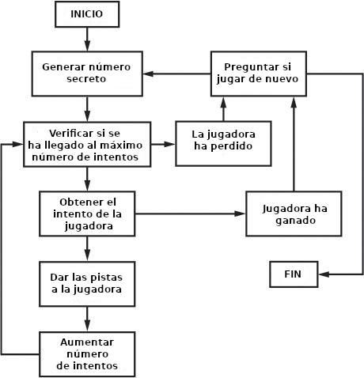

# 11 Panecillos


Panecillos es un juego de deducción en el que la jugadora trata de adivinar un número aleatorio de tres dígitos, generado por la computadora y en el que no se repiten dígitos. La computadora dará a la jugadora tres tipos de pistas:


* **Panecillos** - Ninguna de las tres cifras del intento está en el número secreto.
* **Pico** - Una de las cifras está en el número secreto, pero no en el lugar correcto.
* **Fermi** -El intento tiene una cifra correcta en el lugar correcto.

 Después de cada intento se pueden recibir múltiples pistas ordenadas alfabéticamente. Sí el número secreto es 456 y el intento fue 546, la pista será "Fermi Pico Pico". "Fermi" es por el 6 y "pico pico" por el 4 y 5.

 En este capítulo usted aprenderá algunos nuevos métodos y funciones de Python. También va a aprender acerca de operadores de asignación aumentada e interpolación de cadenas. A pesar de que no le permiten hace nada que no pudiera hacer antes, son bonitos atajos para hacer la programación más fácil.

***
Temas cubiertos en este capítulo:
* La función `random.shuffle()`
* Los operadores de asignación aumentada  `+=`,`-=`,`*=`,`/=`
* El método `sort()`
* El método `join()`
* Interpolación de cadenas 
* Ciclos anidados
***

## Corrida ejemplo de Panecillos

Aquí está lo que la usuaria ve cuando ejecuta el programa Panecillos. 

~~~Python
Estoy pensando en un número de 3 dígitos. Intenta adivinar cuál es.
Aquí hay algunas pistas:
Cuando digo:    Eso significa:
  Pico          Un dígito es correcto pero está en la posición incorrecta.
  Fermi         Un dígito es correcto y está en la posición correcta.
  Panecillos    Ningún dígito es correcto.
He pensado un número. Tienes 10 intentos para adivinarlo.
Intento #1:
123
Fermi
Intento #2:
453
Pico
Intento #3:
425
Fermi
Intento #4:
326
Panecillos
Intento #5:
489
Panecillos
Intento #6:
075
Fermi Fermi
Intento #7:
015
Fermi Pico
Intento #8:
175
¡Lo has adivinado!
¿Deseas volver a jugar? (sí o no)
no
~~~

## Código fuente de Panecillos

En un archivo nuevo escriba el siguiente código fuente y guárdelo como *panecillos.py*, después ejecute el juego y si tiene errores, compare el código con el código de este libro con la herramienta diff en  *https://www.nostarch.com/inventwithpython#diff*.


*panecillos.py*

```python
 1. import random
 2.
 3.DIGITOSNUM = 3
 4.MAXINTENTOS = 10
 5.
 6.def obtenerNumSecreto(DIGITOSNUM):
 7.   	#Devuelve una cadena con digitos únicos de longitud DIGITOSNUM
 8.		numeros = list(range(10))
 9.		random.shuffle(numeros)
10.		numSecreto = ''
11.		for i in range(DIGITOSNUM):
12.			numSecreto += str(numeros[i])
13.		return numSecreto
14.
15.def obtenerPistas(intento, numSecreto):
16.		#Devuelve una cadena con las pistas Pico, Fermi y Panecillo
17.		if intento == numSecreto:
18.			return '¡Lo has adivinado!'
19.	
20.		pista = []
21.		for i in range(len(intento)):
22.			if intento[i] == numSecreto[i]:
23.				pista.append('Fermi')
24.			elif intento[i] in numSecreto:
25.				pista.append('Pico')
26.		if len(pista) == 0:
27.			return 'Panecillos'
28.
29.		pista.sort()
30.		return ' '.join(pista)
31.
32.def esSoloDigitos(num):
33.		#Devuelve True si num es una cadena de solamente números, sino devuelve False
34.		if num == '':
35.			return False
36.	
37.		for i in num:
38.			if i not in '0 1 2 3 4 5 6 7 8 9'.split():
39.				return False
40.		
41.		return True
42.
43.
44.print('Estoy pensando en un número de %s dígitos. Intenta adivinar cuál es.' % (DIGITOSNUM))
45.print('Aquí hay algunas pistas:')
46.print('Cuando digo:    Eso significa:')
47.print('  Pico          Un dígito es correcto pero está en la posición incorrecta.')
48.print('  Fermi         Un dígito es correcto y está en la posición correcta.')
49.print('  Panecillos    Ningún dígito es correcto.')
50.
51.while True:
52.		numSecreto = obtenerNumSecreto(DIGITOSNUM)
53.		print('He pensado un número. Tienes %s intentos para adivinarlo.' % (MAXINTETOS))
54.
55.		numIntentos = 1
56.		while numIntentos <= MAXINTETOS:
57.			intento = ''
58.			while len(intento) != DIGITOSNUM or not esSoloDigitos(intento):
59.				print('Intento #%s: ' % (numIntentos))
60.				intento = input()
61.		
62.			print(obtenerPistas(intento, numSecreto))
63.			numIntentos += 1
64.
65.			if intento == numSecreto:
66.				break
67.			if numIntentos > MAXINTETOS:
68.				print('Te has quedado sin intentos. La respuesta era %s.' % (numSecreto))
69.
70.		print('¿Deseas volver a jugar? (sí o no)')
71.		if not input.lower().startswith('s')
72.			break
```

## Diagrama de Flujo de Panecillos

El diagrama de flujo dela Figura 11-1 describe lo que sucede en este juego, además del orden en el que cada paso ocurre.

El diagrama de flujo de Panecillos es muy simple. La computadora genera un número secreto, la jugadora trata de adivinar ese numero y la computadora le da a la jugadora pistas basadas en su conjetura. Esto pasa una y otra vez hasta que la jugadora gane o pierda. Al finalizar el juego, sin importar si la jugadora ganó o no, la computadora pregunta si se quiere jugar de nuevo. 



## Importando random y definiendo obtenerNumSecreto()

Al inicio del programa importamos el modulo `random`y configuramos algunas variables globales. Luego definiremos una función llamada  `obtenerNumSecreto()`.

```python
 1. import random
 2.
 3.DIGITOSNUM = 3
 4.MAXINTENTOS = 10
 5.
 6.def obtenerNumSecreto(DIGITOSNUM):
 7.   	#Devuelve una cadena con digitos únicos de longitud DIGITOSNUM
```

En lugar de usar el entero  `3`  para indicar el número de dígitos en la respuesta, utilizamos la constante `DIGITOSNUM`. Lo  mismo aplica para el número de intentos que cada jugadora obtiene; utilizamos la constante `MAXINTENTOS` en vez del entero  `10` . Ahora será más fácil cambiar el número de intentos o de dígitos del número secreto. Basta con cambiar los valores en las líneas 3 o 4 y el resto del programa seguirá funcionando sin cambios adicionales. 

La función `obtenerNumSecreto()` genera un número secreto que contiene solamente dígitos únicos. El juego de panecillos es mucho más divertido sin números secretos con duplicados como  `244` o  `333` . Pronto vamos a utilizar algunas funciones nuevas de Python para hacer que esto sea posible en  `obtenerNumSecreto()`.

## Mezclando un conjunto único de dígitos

Las primeras dos líneas de mezclan un conjunto de dígitos no repetidos.

```python
 8.		numeros = list(range(10))
 9.		random.shuffle(numeros)
```

En la línea 8 `list(range(10))` evalúa en  ` [0, 1, 2, 3, 4, 5, 6, 7, 8, 9]`   para que la variable `numeros` contenga una lista con todos los 10 dígitos.

### Cambiando el orden de la lista con la función *random.shuffle()*

La función cambia el orden de los elementos de la lista de forma aleatoria (en este caso, la lista de dígitos). Esta función no devuelve un valor, sino que modifica la lista que recibe en sí misma. Esto funciona de manera similar a la función  `hacerJugada()` del juego de Tres en Línea en el capítulo10. Esta es la razón por la cual no se escribe`numeros=random.shuffle(numeros)`.  

Experimente con la función `shuffle()` del  escribiendo el siguiente código en la consola interactiva.

```python
>>> import random
>>> spam = list(range(10))
>>> print(spam)
[0, 1, 2, 3, 4, 5, 6, 7, 8, 9]
>>> random.shuffle(spam)
>>> print(spam)
[3, 0, 5, 9, 6, 8, 2, 4, 1, 7]
>>> randon.shuffle(spam)
>>> print(spam)
[1, 2, 5, 9, 4, 7, 0, 3, 6, 8]
>>> random.shuffle(spam)
>>> print(spam)
[9, 8, 3, 5, 4, 7, 1, 2, 0, 6]
```

Cada vez que se invoca `random.shuffle()` en `lista`, los elementos de `lista` se mezclan. Ahora verá como usamos la función `shuffle()`  para generar un número secreto. 

###Obteniendo el número secreto de la mezcla de dígitos

El número secreto será una cadena con el primer dígito de `DIGITOSNUM`  de la lista mezclada de enteros.

```python
10.		numSecreto = ''
11.		for i in range(DIGITOSNUM):
12.			numSecreto += str(numeros[i])
13.		return numSecreto
```

La variable`numSecreto` inicia como una cadena en blanco. El ciclo `for` en la línea 11 itera `DIGITOSNUM` veces. En cada iteración del ciclo, el entero en el índice  `i`  es extraído de la lista mezclada, convertido a una cadena y concatenado al final de `numSecreto`.

Por ejemplo, si  `numeros` se refiere a la lista ` [9, 8, 3, 5, 4,  7,  1, 2, 0, 6]` entonces la primera iteración, `numeros[0]` (esto es, 9) será pasado a `str()`; lo que devuelve `9`, que es concatenado al final de `numSecreto`. En la segunda iteración, sucede lo mismo con `numeros[1]` (es decir 8) y en la tercera iteración pasa una vez más con `numeros[2]` (que es 3). El valor final de `numSecreto` es `983`.

Note que `numSecreto` en esta función  contiene una cadena y no un entero. Esto puede parecer extraño, pero recuerde que no se pueden concatenar enteros. La expresión `9+8+3` evalúa a `20` y lo que se quiere es `'9'`+`'8'`+`'3'` que genera `'983'`.

##Operadores de asignación aumentada 
El operador `+=` en la línea 12 es una de los operadores de *asignación aumentada*. Normalmente, si se quiere sumar o concatenar un valor a una variables, usted usa código que se ve así.
```python
>>> spam = 42
>>> spam = spam + 10
>>> spam
52
>>> eggs = '¡Hola '
>>> eggs = eggs + 'mundo!' 
'¡Hola mundo!'
```

Los operadores de asignación aumentada son formas más cortas de escribir que no exigen reescribir el nombre de la variable. El siguiente código hace lo mismo que el código anterior:

```python
>>> spam = 42
>>> spam += 10   # Lo mismo que num = num + 10
>>> spam
52
>>> eggs = '¡Hola '
>>> eggs += 'mundo!'  # Lo mismo que saludo = saludo + 'mundo!'
'¡Hola mundo!'
```

Hay otros operadores de asignación aumentada. Escriba lo siguiente en la consola interactiva:

```python
>>> spam = 42
>>> spam -= 2   # Lo mismo que num = num + 10
>>> spam
52
>>> eggs = '¡Hola '
>>> eggs += 'mundo!' 
'¡Hola mundo!'
```

Hay otros operadores de asignación aumentada. Escriba lo siguiente en la consola interactiva:

```python
>>> spam = 42
>>> spam -= 2
>>> spam
40
```

La expresión `spam -= 2` es la misma que `spam = spam -2`, entonces la expresión primero evalúa `spam = 42 - 2` y luego `spam = 40`.

Hay operadores de asignación aumentada para multiplicación y división también:

```python
>>> spam *= 3
>>> spam
120
>>> spam/=10
>>> spam
12.0
```

La expresión `spam *= 3` es equivalente a `spam = spam * 3`. Entonces, dado que `spam` fue asignada con `40` antes, la expresión  completa sería `spam = 40 * 3` que da como resultado `120`. La expresión `spam /= 10` es equivalente a `spam = spam / 10` y `spam= 120 / 10` resulta en `12.0` . Note que `spam` es flotante después de ser dividido.

##Calculando las pistas

La función `obtenerPistas()` devolverá una sola cadena con las pistas fermi, pico y panecillos, dependiendo de los parámetros `intento` y `numSecreto`.
```python
15.def obtenerPistas(intento, numSecreto):
16.		#Devuelve una cadena con las pistas Pico, Fermi y Panecillo
17.		if intento == numSecreto:
18.			return '¡Lo has adivinado!'
19.	
20.		pistas = []
21.		for i in range(len(intento)):
22.			if intento[i] == numSecreto[i]:
23.				pistas.append('Fermi')
24.			elif intento[i] in numSecreto:
25.				pistas.append('Pico')
```

El paso más obvio y sencillo es comprobar si el intento con el número secreto, como lo hacemos en la línea 17. En caso de cumplirse, la línea 18 devuelve `'¡Lo has adivinado!'`.

Si el intento no es el mismo que el número secreto, el programa debe averiguar cuáles pistas darle a la jugadora. La lista `pistas` inicia vacía y se le añadirán `'Fermi'` y `'Pico'` según se necesite.

El programa hace esto iterando a través de cada índice posible en `intento` y `numSecreto`. La cadena en ambas variables será del mismo largo, así que en la línea 21 podría haber utilizado `len(pistas)` o `len(numSecreto)` y habría funcionado de igual manera. Mientras el valor `i` cambia de  `0` a `1` a `2` de manera sucesiva, la línea 22 verifica sí el primer, segundo y tercer caracter de `intento` es el mismo que el caracter en el índice correspondiente de `numSecreto`. De ser así, la línea 23 agrega la cadena `'Fermi'` a `pistas`.

De lo contrario, en la línea 24 se verifica el número en la i-ceava posición en `intento`existe en alguna posición de  `numSecreto`. En ese caso, se sabe que el número está en alguna posición del número secreto, pero no en la misma posición. En ese caso la línea 25 agrega `'Pico'` a `pistas`.

Si la lista `pistas` está vacía después del ciclo, entonces se sabe que no hay dígitos correctos en `intento`:

```python
26.		if len(pista) == 0:
27.			return 'Panecillos'
```

En ese caso, la línea 27 retorna  `Panecillos` como única pista.

## El método de listas sort()

Las listas tienen un método `sort()` que organiza los elementos de la lista en orden alfabético o numérico. Cuando `sort()` es invocado, no devuelve una lista ordenada sino que ordena los elementos en la lista propiamente. De la misma forma en la que funciona el método `shuffle()`.

Usted nunca va a querer usar `return spam.sort()` porque lo que obtendría es en valor `None`. Por lo anterior se debería utilizar dos líneas separadas, primero `spam.sort()` y después `return spam`.

Ingrese lo siguiente en su consola interactiva:

```python
>>> algo = ['gato','perro','murcielago','oso hormiguero']
>>> algo.sort()
>>> algo
['gato', 'murcielago', 'oso hormiguero', 'perro']
>>> algo = [9,8,3,5.5,5,7,1,2.1,0,6]
>>> algo.sort()
>>> algo
[0, 1, 2.1, 3, 5, 5.5, 6, 7, 8, 9]
```

Cuando ordenamos una lista de cadenas, las cadenas son devueltas en orden alfabético, pero cuando ordenamos una lista de números , los números se acomodan por orden numérico.

En la línea 29, donde utilizamos `sort()` en `pistas` 

```python
29. 	pista.sort()
```

La razón por la cual se requiere ordenar la lista `pistas`  alfabéticamente es para eliminar información que ayudaría a la jugadora a adivinar el número correcto con más facilidad. Si `pistas` fuese `['Pico','Fermi','Pico'] ` eso le indicaría a la jugadora que el dígito central del intento está en la posición correcta. Ya que las otras dos pistas son `Pico`,  en este caso la jugadora sabría que para ganar bastaría con intercambiar el primer y el tercer dígito.

Si las reglas siempre están en orden alfabético, la jugadora no puede estar segura de a cuál dígito se refiere `Fermi`. Esto hace al juego más difícil y divertido.

## El método de cadenas join()

El método de cadenas de caracteres `join()` devuelve una lista de cadenas como una única cadena de caracteres unida.

```python
30. 	return ' '.join(pistas)
```

La cadena de caracteres con la que el método es invocado (en la línea 30, esto es un espacio sencillo,` ' '`) aparece entre cada cadena en la lista. Para ver un ejemplo, ingrese lo siguiente en su consola interactiva:

```python
>>> ' '.join(['Mi', 'nombre', 'es', 'Zophie'])
'Mi nombre es Zophie'
>>> ', '.join(['La vida', 'el Universo', 'y todo'])
'La vida, el Universo, y todo'
```

Entonces la cadena de caracteres, que es devuelta en la línea 30, es una combinación de cada cadena de caracteres en `pistas` con un espacio entre cada una de ellas. El método de cadenas; `join()` es algo así como el opuesto del método `split()`. Mientras que `split()` devuelve una lista con las cadenas de caracteres por separado, `join()` devuelve una cadena de una lista combinada.

## Verificando si una cadena de caracteres tiene únicamente números

La función `esSoloDigitos()` ayuda a determinar si la jugadora ingresó un intento valido:

```python
32.def esSoloDigitos(num):
33.		#Devuelve True si num es una cadena de solamente números, sino devuelve False
34.		if num == '':
35.			return False
```

La línea 34 verifica si `num` es una cadena de caracteres en blanco, de ser así, devuelve `False`. El ciclo `for` itera sobre cada caracter de la cadena de caracteres `num`:

```python
37.		for i in num:
38.			if i not in '0 1 2 3 4 5 6 7 8 9'.split():
39.				return False
40.		
41.		return True
```

El valor de `i` va a tener un único caracter en cada iteración. Dentro del bloque del `for`, el código verifica si `i` existe en la lista devuelta por `'0 1 2 3 4 5 6 7 8 9'.split()`.(El valor de retorno de `split()` es equivalente a `['0', '1', '2', '3', '4', '5', '6', '7', '8', '9']`). Si `i` no es parte de esa lista, entonces usted sabe que el caracter en `num` no es un dígito.

Pero si la ejecución continua más allá del ciclo `for`, entonces se sabe que cada caracter en `num` es un dígito. En ese caso, la línea 41 devuelve `True`.

## Iniciando el juego

Después de las definiciones de las funciones, la línea 44 es donde en realidad donde inicia el programa:

```python
44.print('Estoy pensando en un número de %s dígitos. Intenta adivinar cuál es.' % (DIGITOSNUM))
45.print('Aquí hay algunas pistas:')
46.print('Cuando digo:    Eso significa:')
47.print('  Pico          Un dígito es correcto pero está en la posición incorrecta.')
48.print('  Fermi         Un dígito es correcto y está en la posición correcta.')
49.print('  Panecillos    Ningún dígito es correcto.')
```

La invocación a la función `print()`  le dice a la jugadora las reglas del juego, además de indicar qué significan las pistas de pico, fermi y panecillos. El llamado a  `print()` tiene `%(DIGITOSNUM )` añadido al final y `%s` dentro de la cadena de caracteres. Esta es una técnica conocida como *interpolación de cadenas*.

## Interpolación de cadenas

La interpolación de cadenas, también llamada formateo de cadenas de es una abreviatura de código. Normalmente, si usted quiere utilizar valores dentro de cadenas, utilizaría el operador de concatenación `+`:

```python
>>> nombre = 'Alice'
>>> evento = 'la fiesta'
>>> ubicacion = 'la piscina'
>>> dia = 'Sábado'
>>> hora = '6:00pm'
>>> print('Hola, ' + nombre + '. ¿Vas a ir a ' + evento + ' en ' +
ubicacion + ' este ' + dia + ' a las ' + hora + '?')
Hola, Alice. ¿Vas a ir a la fiesta en la piscina este Sábado a las 6:00pm?
```

Como puede ver, escribir una cadena que concatene dentro de ella muchas otras cadenas, puede tomar mucho tiempo.  Como alternativa, usted puede usar interpolación de cadenas, que permiten utilizar campos como `%s`  en la cadena. Estos campos se llaman especificadores de conversión. Una vez que usted escribe estos especificadores, puede poner todos los nombres de variable al final de la cadena. Cada `%s` se reemplaza con una variable al dinal de la línea, en el orden en que coloque las variables. por ejemplo, el siguiente código hace lo mismo que el código anterior:

```python
>>> nombre = 'Alice'
>>> evento = 'la fiesta'
>>> ubicacion = 'la piscina'
>>> dia = 'Sábado'
>>> hora = '6:00pm'
>>> print('Hola, %s. ¿Vas a ir a %s en %s este %s a las %s?' %(nombre, evento,ubicacion, dia,hora))
Hola, Alice. ¿Vas a ir a la fiesta en la piscina este Sábado a las 6:00pm?
```

Note que la primera variable `nombre` es usada para el primer `s%`, la segunda variable para el segundo `s%` y así sucesivamente. Usted tiene LA que tener el mismo número de especificadores de conversión `s%` que de variables.

Otro beneficio de usar interpolación de cadenas en lugar de concatenación de las mismas, es que la interpolación funciona con cualquier tipo de dato no solamente con cadenas de caracteres. Todos los valores son automaticamente convertidos al tipo de dato string. Si concatena un entero a una cadena de caracteres, obtendrá el siguiente error:

```python
>>> algo = 42
>>> print('Algo == ' + algo)
Traceback (most recent call last):
  File "<stdin>", line 1, in <module>
TypeError: must be str, not int
```

La concatenación de cadenas de caracteres solamente puede combinar dos cadenas, pero `spam` es un entero. En este caso tendría que recordar escribir `str(spam)` en lugar de `spam`.

Ahora ingrese lo siguiente en la consola interactiva:

```python
>>> algo = 42
>>>print('Algo es %s' % (algo))
Algo es 42
```

Con interpolación de cadenas de caracteres, la conversión a cadenas se hace de forma automática.

## El ciclo del Juego

La línea 51 es un ciclo `while` infinito cuya condición es `True`, entonces el ciclo continuará por siempre hasta que se ejecute un `break`.

```python
51.while True:
52.		numSecreto = obtenerNumSecreto(DIGITOSNUM)
53.		print('He pensado un número. Tienes %s intentos para adivinarlo.' % (MAXINTETOS))
54.
55.		numIntentos = 1
56.		while numIntentos <= MAXINTETOS:
```

Dentro del ciclo infinito, usted obtiene un número secreto por medio de la función `obtenerNumSecreto()`. Este número es asignado a `numSecreto`. Recuerde que el valor de `numSecreto` es una cadena de caracteres no un entero.

La línea 53 le dice a la jugadora cuantos dígitos hay en el número secreto utilizando interpolación en vez de concatenación. En la línea 55 se asigna `1` a la variable `numIntentos` ya que este sería el primer intento. Luego en la línea 56 se define un nuevo ciclo `while` que itera mientras que la jugadora tenga intentos disponibles. En código, esto es cuando `numIntentos` es menor o igual que `MAXINTENTOS`.

Note que el ciclo `while`  en la línea 56 está dentro de otro que se inició en la línea 51. Estos ciclos dentro de otros ciclos se llaman `ciclos anidados`. Cualquier `break` o `continue`, como el `break` de la línea 66, solamente va a romper o continuar el ciclo más interno y no los de fuera.

### Obteniendo el intento de la jugadora

La variable `intento` contiene el intento de la jugadora devuelto desde `input()`. El código se mantiene iterando y preguntando por nuevos intentos hasta que la jugadora adivine:

```python
57.			intento = ''
58.			while len(intento) != DIGITOSNUM or not esSoloDigitos(intento):
59.				print('Intento #%s: ' % (numIntentos))
60.				intento = input()xxxxxxxxxx >>> 

```

Un intento válido tiene solamente dígitos y la misma cantidad de números que el número secreto. El ciclo `while` empieza en la línea 58 verifica la validez del intento.

A la variable `intento` se le asigna la cadena de caracteres en blanco en la línea 57, por lo que la condición del ciclo `ẁhile` es `False` la primera vez que se verifica, asegurando la ejecución del ciclo en la línea 59.

### Obteniendo las pistas

Después de que la ejecución pasa el ciclo `while` iniciado en la línea 58, `intento` contiene un intento válido. Ahora el programa le pasa `intento` y `numSecreto`  a la función `obtenerPistas()`:

```python
62.			print(obtenerPistas(intento, numSecreto))
63.			numIntentos += 1
```

Devuelve una cadena de caracteres on las pistas, que son dadas a la jugadora en la línea 62. La línea 63 incrementa `numIntentos` utilizando el operador de asignación aumentada de adición.

### Verificando si la jugadora ganó o perdió

Ahora veremos si la jugadora ganó o perdió el juego:

```python
65.			if intento == numSecreto:
66.				break
67.			if numIntentos > MAXINTETOS:
68.				print('Te has quedado sin intentos. La respuesta era %s.' % (numSecreto))
```

Si `intento` tiene el mismo valor que `numSecreto`, la jugadora adivinó el número secreto y la línea 66 rompe el ciclo `while` que se inicio en la línea 56. De lo contrario, la ejecución continúa en la línea 67, cuando el programa verifica si la jugadora se quedó sin intentos disponibles.

Si quien juega aún tiene intentos disponibles, la ejecución salta de regreso al ciclo `while` en la línea 56, donde deja a la jugadora intentar adivinar de nuevo. Si se acaban los intentos (o el programa sale del ciclo con `break` en la línea 66), la ejecución procede después del ciclo a la línea 70.

### Preguntando si se desea volver a jugar

La línea 70 pregunta a la jugadora si quiere jugar de nuevo:

```python
70.		print('¿Deseas volver a jugar? (sí o no)')
71.		if not input.lower().startswith('s')
72.			break
```

La función `input()` obtiene la respuesta, sobre la cual se invoca primero al método `lower()`y después a `startswith()` para verificar si la respuesta empieza con una `s`. Si no, el programa se sale del ciclo `while` que se inició en la línea 51. Debido a que no hay más código después de ese ciclo, el programa termina su ejecución.

Si la respuesta termina con una `s`, el programa no ejecuta el `break` y la ejecución vuelve de regreso a la línea 51. El programa genera un nuevo número secreto para que sea posible jugar un juego nuevo.

## Resumen

Panecillos es un juego simple de programar pero puede ser difícil de ganar. Pero si continúa jugando, descubrirá eventualmente mejores formas de conjeturar y usar las pistas que el juego le da. De la misma forma, podrá mejorar sus habilidades de programación si continúa practicando.

Este capítulo se introdujeron algunas nuevas funciones y métodos - `shuffle()`, `sort()` y `join()`-, junto con un par de atajos. Los operadores de asignación aumentada requieren escribir menos cuando se quiere cambiar el valor relativo de una variable, tal como en `spam = spam + 1`, que puede abreviarse como `spam += 1`. La interpolación de cadenas puede hacer que el código sea mucho más legible colocando `%s` (*llamado especificador de conversión*) dentro de la cadena en lugar de usar muchas operaciones de concatenación de cadenas.

El siguiente capítulo no nos enfocaremos en programar pero sí en conceptos - Cordenadas cartesianas y números negativos - que serán necesarios para los juegos de los siguientes capítulos del libro. Estos conceptos matemáticos no solamente son utilizados en en los juegos Sonar, Reversi y Evasor, sino además en muchos otros juegos. Si ya conoce estos conceptos, igual puede hojear el siguiente capítulo para refrescarlos.

[Previo: Capítulo 10: Tres en línea ](capitulo10.md) | [Siguiente: Capítulo 12: El sistema de coordenadas cartesianas](capitulo12.md)
