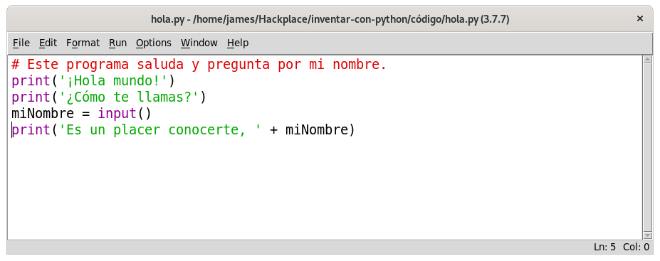
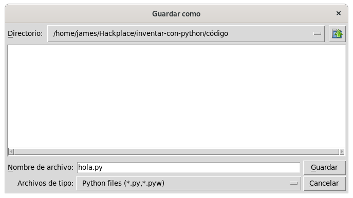
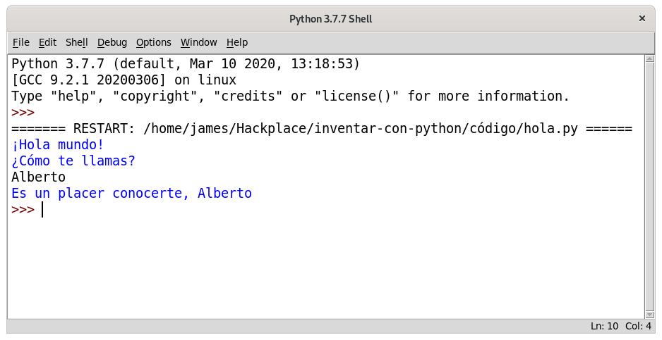
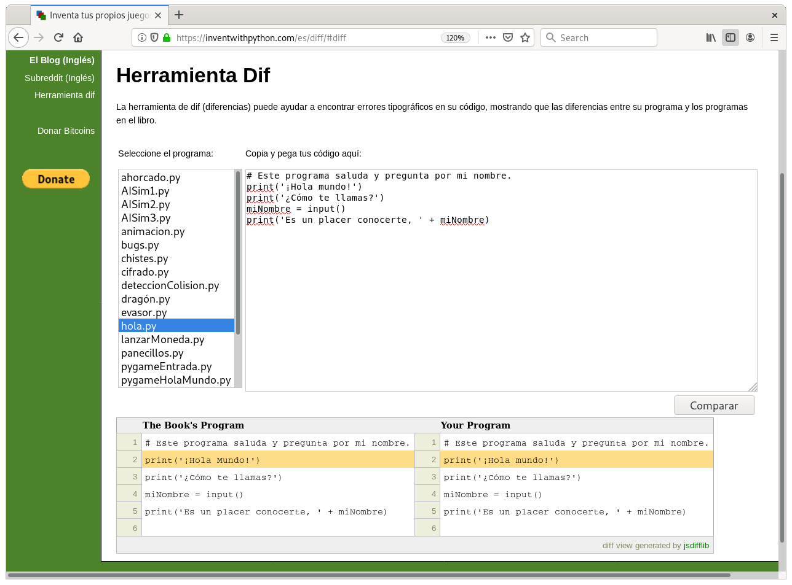
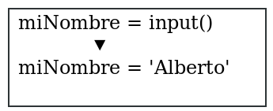
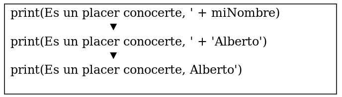

# Escribiendo programas

Ahora veremos lo que *Python* puede hacer con texto. Casi todos los programas le muestran texto a la usuaria, y las usuarias le introducen texto a los programas a través del teclado. En este capítulo, hará su primer programa,
el cual hace ambas cosas. Aprenderá a almacenar texto en variables, combinar
texto, y mostrar el texto en la pantalla. El programa que usted creará muestra 
el saludo Hola mundo y pregunta por el nombre de la usuaria.

***
Temas cubiertos en este capítulo:
* Strings (cadenas de caracteres)
* Concatenación de cadenas de caracteres
* Tipos de datos (como cadenas de caracteres o enteros)
* Usar el editor de archivos IDLE para escribir programas
* Guardar y ejecutar programas en IDLE
* Flujo de ejecución
* Comentarios
* La función `print()`
* La función `input()`
* Diferencia entre mayúsculas y minúsculas.
***

## Valores cadenas de caracteres

En Python, los valores de texto se llaman cadenas de caracteres. Las cadenas de caracteres pueden ser usadas igual que como se usan valores enteros o valores  flotantes. Usted puede almacenar cadenas de caracteres en variables. En el código, las cadenas de caracteres empiezan y terminan con comillas simples (''). Escriba el siguiente código en la «shell» interactiva:

~~~Python
>>> spam = 'hola'
~~~

Las comillas simples le indican a Python dónde comienza y dónde termina 
la cadena de caracteres. Estas comillas no son parte del valor del texto 
de la cadena de caracteres. Ahora si escribe spam dentro de la consola 
interactiva, verá el contenido de la variable spam. Recuerde, Python evalua
las variables como el valor almacenado dentro de la variable. En este caso,
este es la cadena de caracteres 'hola'.

~~~Python
>>> spam = 'hola'
>>> spam
'hola'
~~~

Las cadenas de caracteres pueden tener cualquier caracter que posea el teclado dentro de ellos y pueden ser tan largos como usted lo requiera. Todos estos son ejemplos de cadenas de caracteres:

~~~Python
'hola'
'¡Buenos días!'
'GATITOS'
'7 manzanas, 14 naranjas, 3 limones'
'Cualquier cosa no relacionada con elefantes es irrelefante.'
'Hace mucho tiempo, en una galaxia muy, muy lejana...'
'O*&#wY%*&OCfsdYO*&gfC%YO*&%3yc8r2'
~~~

## Concatenación de cadenas de caracteres

Usted puede combinar cadenas de caracteres con operadores para crear expresiones, igual que como lo había hecho con los valores enteros y flotantes. Cuando combina dos cadenas de caracteres con el operador `+`, esa acción es llamada *concatenación de cadenas de caracteres*. Ejecute `'Hola' + 'mundo'` en la «shell» interactiva:

~~~Python
>>> 'Hola' + 'mundo'
'Holamundo'
~~~

La expresión es evaluada como un único valor de cadena de caracteres: 'Holamundo'. No hay espacios entre las palabras porque no hay espacios en ninguna de las cadenas de caracteres concatenadas, a diferencia de este ejemplo:

~~~Python
>>> 'Hola ' + 'mundo'
'Hola mundo'
~~~

El operador `+`, trabaja distinto con los valores de cadenas de caracteres y 
los enteros porque son *tipos de datos* distintos. Todos los valores tienen 
un tipo de dato. El tipo de dato de 'Hola' es una cadena de caracteres. El 
tipo de dato del valor 5 es un entero. El tipo de dato le dice a Python
qué debe realizar el operador cuando evalúa expresiones. El operador `+`
concatena cadenas de caracteres, pero suma valores enteros y flotantes.

## Escribiendo programas en el editor de archivos IDLE

Hasta el momento, usted ha estado escribiendo instrucciones dentro de la consola interactiva, una por una. Cuando usted escribe programas, se ingresan varias instrucciones y todas son ejecutadas a la vez, y eso es lo que hará a continuación. ¡Es hora de escribir su primer programa!

Además del intérprete, IDLE tiene otra parte llamada *editor de archivos*. Para abrirlo, haga clic en el menú **Archivo** localizado en la parte superior superior de la consola interactiva. Luego seleccione **Nuevo archivo**. Una ventana en blanco aparecerá para que escriba el código del programa dentro de esta, como se muestra en la Figura 2-1.

*Figura 2-1: el editor de archivos (izquierda) y la «shell» interactiva (derecha)*

Ambas ventanas parecen similares, pero recuerde: la «shell» interactiva tiene el  «prompt» `>>>`, mientras que el editor de archivos no.

## Creando el programa Hola mundo

Es una tradición para las programadoras que el primer programa que realicen
muestre *Hola mundo* en la pantalla. Ahora mismo usted creará su primer 
programa Hola mundo.

Cuando escriba su programa, recuerde no incluir los números al principio de cada línea de código. Estos números están incluidos en este libro para poder referenciar la línea donde se encuentra el código. La esquina inferior derecha del editor de archivos le indicará donde se encuentra el cursor, de esta manera podrá verificar en cual línea de código se encuentra. La figura 2-2 muestra que el cursor está en la línea 1 (de arriba hacia abajo del editor) y la
columna 0 (de izquierda a derecha).

*Figura 2-2: La esquina inferior derecha del editor de archivos le dice donde
se encuentra el cursor.*

Escriba el siguiente texto dentro de la nueva ventana del editor de archivos. Este es el *código fuente* del programa. Contiene las instrucciones que Python va a seguir cuando el programa sea ejecutado.

*hola.py*

~~~Python
1. # Este programa saluda y pregunta por mi nombre.
2. print('¡Hola mundo!')
3. print('¿Cómo te llamas?')
4. miNombre = input()
5. print('Es un placer conocerte, ' + miNombre)
~~~

IDLE marcará las diferentes instrucciones con colores distintos. Después de que haya escrito el código, la ventana deberá verse como la Figura 2-3.

*Figura 2-3: el editor de archivos se verá como esto cuando haya escrito el código.*

Verifique si la ventana de su IDLE se ve parecida.

## Guardando el programa

Cuando usted haya escrito su código fuente, guárdelo haciendo clic en **Archivo -> Guardar como**. O presionando CTRL+S para guardarlo con el atajo del teclado. La Figura 2-4 muestra la ventana de Guardar cuando se abre. Nombre el archivo como *hola.py* en área de texto y luego haga clic en **Guardar** .

*Figura 2-4: Guardando su programa.*

Debería guardar sus programas con frecuencia mientras los escribe. De esa manera, si la computadora falla o se sale accidentalmente del IDLE, no perderá mucho trabajo.

Para cargar su programa previamente guardado, haga clic en **Archivo -> Abrir** Seleccione el archivo *hola.py* en la ventana que aparece y haga clic sobre el botón **Abrir**. Su programa *hola.py* se abrirá en el editor de archivos.

## Ejecutando su programa

Es hora de ejecutar el programa. Haga clic en **Ejecutar -> Ejecutar Módulo**. O sólo presione F5 desde el editor de archivos (FN-5 en OS X). Su programa será ejecutado desde la consola interactiva.

Escriba su nombre cuando el programa se lo solicite. Se parecerá a
la Figura 2-5.

*Figura 2-5: Consola interactiva después de ejecutar hola.py*

Cuando escriba su nombre y presione ENTER, el programa la saludará por su nombre. ¡Felicidades! Ha escrito su primer programa y ahora es una programadora. Presione F5 de nuevo para ejecutar el programa una segunda vez y escriba un nombre distinto.

Si tiene algún error, compare su código con el código de este libro en la [Herramienta Diff](https://inventwithpython.com/es/diff/). Copie y pegue su código desde el editor de archivos a la página web y haga clic en el botón que dice <b>Compare</b>. Esta herramienta destacará cualquier diferencia que haya entre su código y el código en este libro, como se muestra en la Figura 2-6.

Mientras programa, si tiene un *NameError* que se ve como el de a continuación, eso significa que está utilizando Python2 en lugar de Python3.

~~~Python
Hola mundo
¿Cuál es su nombre?
Alberto
Traceback (most recent call last):
  File "C:/Python26/test1.py", line 4, in <module>
    myName = input()
  File "<string>", line 1, in <module>
NameError: name 'Alberto' is not defined
</pre>
~~~

Para solucionar este problema, instale Python3 y vuelva a ejecutar el programa. (Vaya a "Descargar e instalar Python" en la página xxv.)

*Figura 2-6: Usando la herramienta Diff en https://inventwithpython.com/es/diff/#diff*

## Como funciona el programa "Hola Mundo"

Cada línea de código es una instrucción interpretada por Python. Estas instrucciones forman el programa. Las instrucciones de un programa de  computadora son como pasos en una receta. Python completa cada instrucción en orden, comenzando desde la parte de arriba del programa moviéndose hasta abajo.

El paso por el que Python está actualmente trabajando en el programa se llama la *ejecución*. Cuando un programa comienza, la ejecución es la primera instrucción. Después de ejecutada la instrucción, Python va hacia la siguiente instrucción.

Veamos cada línea de código para observar qué está haciendo. Comenzaremos en la línea número 1.

## Comentarios para la programadora
La primera línea del programa Hola mundo es un *comentario*:

~~~Python
1. # Este programa saluda y pregunta por mi nombre.
~~~

Todo texto seguido de la marca numeral (#) es un comentario. Los comentarios son las notas informativas acerca de lo que el código hace; no están escritas para Python, sino para usted, la programadora. Python ignora los comentarios cuando ejecuta un programa. Las programadoras usualmente ponen un comentario en la parte de arriba del código para ponerle un título a su programa. El comentario en el programa Hola mundo le dice que el programa saluda y pregunta por su nombre.

## Funciones: miniprogramas dentro de programas

Una función es como un miniprograma dentro de su programa que contiene  algunas instrucciones para que Python ejecute. Lo genial acerca de las funciones es que sólo necesita saber qué es lo que hacen, y no cómo lo hacen. Python brinda algunas funciones implementadas. Usamos `print()` e `input()` en el programa Hola mundo.

Una *llamada* a función es una instrucción que le dice a Python que ejecute el código dentro de una función. Por ejemplo, su programa llama la función `print()` para mostrar una cadena de caracteres en la pantalla. La función `print()` toma la cadena de caracteres que escribió dentro de  los paréntesis como un argumento de entrada y lo muestra en la pantalla.

## La función `print()`

Las líneas 2 y 3 del programa Hola mundo son llamadas a `print()`:

~~~Python
2. print('Hola mundo')
3. print('¿Cuál es su nombre?')
~~~

Un valor entre los paréntesis en una llamada a función es un *argumento*.  El argumento de la llamada `print()` en la línea 2 es `'Hola mundo'`, y el argumento de la llamada `print()` en la línea 3 es `'¿Cuál es su nombre?'`. A esto se le llama *pasar* el argumento a la función.

## La función `input()`

La línea 4 es una declaración de asignación de una variable, *myName*, y una función de llamada, `input()`:

~~~Python
4. miNombre = input()
~~~

Cuando `input()` es llamada, el programa espera para que la usuaria escriba un texto. El texto de la cadena de caracteres que la usuaria escribe se convierte en el valor al que evalúa la llamada a función. Las llamadas a función pueden ser usadas dentro de expresiones en cualquier lugar donde un valor pueda ser usado.

El valor al que evalúa la llamada a función se llama valor de retorno. (De hecho, "el valor al que evalúa la llamada a función retorna" significa lo mismo que "el valor al que evalúa la llamada a función".) En este caso, el valor de retorno de la función `input()` es la cadena de caracteres que la usuaria escribió: su nombre. Si la usuaria ingresa *Alberto*, la llamada a función `input()` evalúa el la cadena de caracteres 'Alberto'. La evaluación se ve como esto:

Así es cómo el valor de la cadena de caracteres es almacenado en la variable miNombre.

## Expresiones en llamadas a funciones

La última línea de código en el programa Hola mundo es otra llamada a la función `print()`:

~~~Python
5. print('Es un placer conocerte, ' + miNombre)
~~~

La expresión `Gusto en conocerle', + miNombre` está rodeada por los paréntesis del `print()`. Porque los argumentos son valores únicos, Python evaluará primero esta expresión y luego pasará ese valor como el argumento. Si miNombre contiene el valor 'Alberto', la evaluación se verá así:

Así es como el programa saluda a la usuaria por su nombre.

## El final del programa
Una vez que el programa ejecuta la última línea, *termina* o *sale*. Esto significa que el programa para de ejecutarse. Python olvida todos los valores de las variables, incluida la cadena de caracteres almacenada en *miNombre*. Si ejecuta el programa otra vez y escribe un nombre diferente, el programa pensará que es su nombre:

~~~Python
Hola mundo
¿Cuál es su nombre?
Carolyn
Es un placer conocerte, Carolyn
~~~

Recuerde, la computadora hace exactamente lo que la programó para hacer. Las computadoras son tontas y sólo siguen las instrucciones que usted le dio de forma exacta. A la computadora no le importa si usted escribe su nombre, o el nombre de otra persona o algo tonto. Escriba cualquier cosa que quiera. La computadora lo tratará de la misma manera:

~~~Python
Hola mundo
¿Cuál es su nombre?
<b>caca</b>
Es un placer conocerte, caca.
</pre>
~~~

## Nombrar variables

Dar a las variables un nombre descriptivo hace más fácil entender lo que el programa hace. Usted podría haber llamado la variable *myName* como *abrahamLincoln* o *nOmBrE*, y Python habría ejecutado el programa de la misma manera. Pero estos nombres realmente no nos dicen mucho acerca de qué contiene el valor de la variable. Como se discutió en el Capítulo 1, si usted se estuviera mudando a una nueva casa y etiqueta todas las cajas como *Cosas*, ¡eso no sería de ninguna ayuda! Los ejemplos de la consola interactiva que se muestran en este libro usan nombres como *spam*, *eggs*, y *bacon* porque los nombres de las variables en estos ejemplos no importan. De todas maneras, los programas de este libro utilizan nombres descriptivos, y así deben estar en sus programas.

Los nombres de las variables son sensibles a mayúsculas o minúsculas,  esto significa que si alguna letra del nombre de las variables está en minúscula o mayúscula, lo tomará como si fuera una variable distinta. Es esta manera *spam*, *SPAM*, *Spam* y *sPAM* son cuatro variables diferentes en Python. Cada una contiene sus diferentes valores separados unos de otros. Es una mala idea tener variables que combinen desordenadamente las mayúsculas con las minúsculas en su programa. En lugar de eso use nombres descriptivos para sus variables.

Los nombres de las variables usualmente se escriben en minúscula. Si hay más de una palabra en el nombre de la variable, es una buena idea escribir en mayúscula la primera letra de cada palabra después de la primera. Por ejemplo, el nombre de la variable *loQueHeDesayunadoEstaMañana* es más fácil de entender cuando se lee que *loquehedesayunadoestamañana*. La utilización de mayúsculas y minúsculas de esta manera se denomina *Joroba de camello*, en inglés *Camel Case*, (porque se parece a las jorobas en la espalda de un camello), y hace que su código sea más legible.  Las programadoras también prefieren usar nombres de variables más cortos para hacer el código más fácil de entender: *desayuno* o *comidaEstaMañana* es más legible que *loQueHeDesayunadoEstaMañana*. Estas son *convenciones* opcionales, pero estandariza la forma de programar en Python.

## Resumen

Una vez que entienda como usar cadenas de caracteres y funciones, ya puede  comenzar a hacer programas que interactúen con las usuarias. Esto es importante porque el texto es el principal medio de comunicación entre la computadora y la usuaria. La usuaria escribe texto a través del teclado con la función `input()`, y la computadora muestra el texto en la pantalla con la función `print()`.

Los cadenas de caracteres son sólo valores de un nuevo tipo de datos. Todos los valores tienen un tipo de dato, y este valor afecta cómo el operador `+` funciona. 

Las funciones se usan para llevar a cabo instrucciones complicadas en el programa. Python tiene muchas funciones preprogramadas de las que aprenderá más adelante en este libro. Las llamadas a funciones pueden ser usadas en expresiones donde sea que un valor sea utilizado. 

La instrucción o paso en su programa donde Python está trabajando en un instante dado se llama ejecución. En el Capítulo 3, aprenderá más acerca de hacer que la ejecución del programa vaya de diferentes maneras, no sólo de arriba hacia bajo del programa. Una vez que aprenda esto, ¡estará lista para crear juegos!

[Previo: Capítulo 1: La consola interactiva](capitulo1.md) | [Siguiente: Capítulo 3: Adivine el número](capitulo3.md)