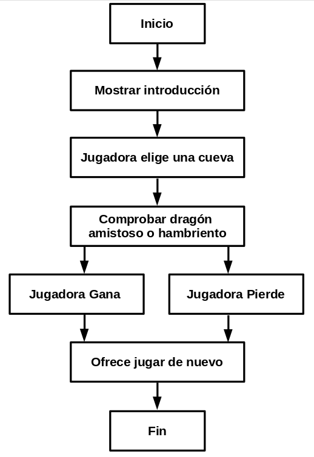
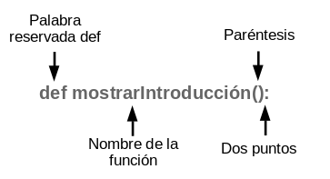
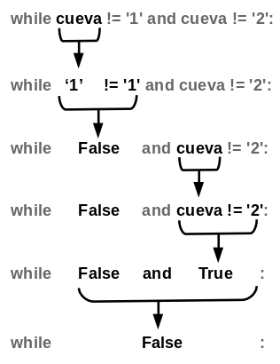

# 5 Reino de Dragones

El juego que usted creará en este capítulo se llama Reino de Dragones. La jugadora decide entre dos cuevas, una de ellas contiene un tesoro y otra un destino desafortunado.

## ¿Cómo jugar a Reino de dragones?

En este juego, la jugadora está en una tierra llena de dragones. Todos los dragones viven en cuevas junto a sus grandes montones de tesoros encontrados. Algunos dragones son amigables, y compartirán sus tesoros contigo. Otros son codiciosos y hambrientos, y se comerán a cualquiera que entre a su cueva. La jugadora se encuentra frente a dos cuevas, una con un dragón amigable y la otra con un dragón hambriento, pero no sabe cuál dragón está en qué cueva. La jugadora tiene que elegir entre las dos.

---

Temas cubiertos en este capítulo:
* Diagramas de flujo
* Creando nuestras propias funciones con la palabra reservada `def`
* Hileras de caracteres de múltiples líneas
* Sentencias `while`
* Los operadores Booleanos `and`, `or` y `not`
* Tablas de verdad
* La palabra reservada `return`
* Entorno de variables (Global y Local)
* Parámetros y Argumentos
* La función `sleep()`

---

## Prueba de ejecución de Reino de dragones

Así es como se vería el el juego Reino de dragones al ejecutarlo. Las entradas proporcionadas por la jugadora aparecen encerradas entre asteriscos.

~~~Markdown
Estás en una tierra llena de dragones. Frente a tí 
hay dos cuevas. En una de ellas, el dragón es generoso 
y amigable y compartirá su tesoro contigo. El otro dragón 
es codicioso y está hambriento, y te devorará inmediatamente.
¿A qué cueva quieres entrar? (1 ó 2)
**1**
Te aproximas a la cueva...
Es oscura y espeluznante...
¡Un gran dragon aparece súbitamente frente a tí! Abre sus fauces y...
¡Te engulle de un bocado!
¿Quieres jugar de nuevo? (sí or no)
**no**
~~~

## Diagrama de flujo para Reino de dragones

A menudo ayuda anotar todo lo que quiere que su juego o programa haga antes de comenzar a escribir código. Cuando usted hace esto, usted está *diseñando el programa*. 

Por ejemplo, puede ayudar dibujar un diagrama de flujo (en inglés flowchart).  Un diagrama de flujo es una ilustración que muestra cada posible acción que puede ocurrir en el juego, y qué acciones llevan a qué otras acciones. La Figura 5-1 es un diagrama de flujo para Reino de dragones. 

Para ver qué pasa en el juego, coloque su dedo sobre el recuadro "Inicio". Luego siga la flecha desde ese recuadro hasta otro recuadro. Su dedo es como la ejecución del programa. El programa termina cuando llega al recuadro "Fin".

*Figura 5-1: Diagrama de flujo para el juego Reino de dragones*

Cuando llega al recuadro “Comprobar dragón amistoso o hambriento”, puede ir al recuadro “Jugadora gana” o al recuadro “Jugadora pierde”. Esta bifurcación muestra cómo el programa puede hacer diferentes cosas. De cualquier forma, ambos caminos conducirán al recuadro “Ofrece jugar de nuevo”.

## Código fuente de Reino de dragones

Abra una nueva ventana en el editor de archivos haciendo clic en **Archivo > Nueva ventana**. Escriba el código fuente y guárdelo como *dragon.py*. Luego ejecute el programa presionando F5.  Si obtiene errores, compare el código que escribió con el código del libro en la herramienta de diff en línea en [https://www.nostarch.com/inventwithpython#diff](https://www.nostarch.com/inventwithpython#diff ). 

*dragon.py*

~~~Python
 1. import random
 2. import time
 3.
 4. def mostrarIntroducción():
 5.    print('''Estás en una tierra llena de dragones.Frente
 a tí hay dos cuevas. En una de ellas, el dragón es generoso
y amigable y compartirá su tesoro contigo. El otro dragón es
codicioso y está hambriento, y te devoraránmediatamente.''')
 9.     print()
10.
11. def elegirCueva():
12.     cueva = ''
13.     while cueva != '1' and cueva != '2':
14.         print('¿A qué cueva quieres entrar? (1 ó 2)')
15.         cueva = input()
16.
17.     return cueva
18.
19. def explorarCueva(cuevaElegida):
20.     print('Te aproximas a la cueva...')
21.     time.sleep(2)
22.     print('Es oscura y espeluznante...')
23.     time.sleep(2)
24.     print('¡Un gran dragon aparece súbitamente frente a tí! Abre sus fauces y...')
25.     print()
26.     time.sleep(2)
27.
28.     cuevaAmigable = random.randint(1, 2)
29.
30.     if cuevaElegida == str(cuevaAmigable):
31.          print('¡Te regala su tesoro!')
32.     else:
33.          print('¡Te engulle de un bocado!')
34.
35. jugarDeNuevo = 'sí'
36. while jugarDeNuevo == 'sí' or jugarDeNuevo == 's':
37.     mostrarIntroducción()
38.     númeroDeCueva = elegirCueva()
39.     explorarCueva(númeroDeCueva)
40.
41.     print('¿Quieres jugar de nuevo? (sí o no)')
42.     jugarDeNuevo = input()
~~~

Veamos el código fuente en más detalle.

## Importando los módulos "random" y "time"

Este programa importa dos módulos:

~~~Python
 1. import random
 2. import time
~~~

El módulo `random` proveerá la función `randint()` como lo hizo en el juego “Adivina el Número” del capítulo 3.  La línea 2 importa el módulo `time` , el cual contiene funciones relacionadas con tiempo.

## Funciones en Reino del dragones

Las funciones le permite ejecutar el mismo código fuente en múltiples ocasiones sin necesidad de tener que copiar y pegar ese código una y otra vez. En vez de eso, usted escribe el código dentro de una función y llama la función cuando necesite. Debido a que usted escribe el código únicamente una vez en la función, si el código de la función tiene una equivocación, usted únicamente tiene que cambiarlo en un lugar en el programa.

Ya ha utilizado unas pocas funciones, `print()`, `input()`, `randint()`, `str()`, e `int()`. Sus programas llamaron estas funciones para ejecutar el código dentro de estas. En Reino de dragones, usted escribirá sus propias funciones utilizando sentencias `def`.

## Sentencias `def`

La línea 4 es una sentencia `def`:

~~~Python
 4. def mostrarIntroducción():
 5.     print('''Estás en una tierra llena de dragones. Frente a tí hay dos cuevas. En una de ellas, el dragón es generoso y amigable y compartirá su tesoro contigo. El otro dragón es codicioso y está hambriento, y te devorará inmediatamente.''')
 9.     print()
~~~

La sentencia `def` define una nueva función (en este caso, la función `mostrarIntroducción()`), la cual puede llamar más adelante en el programa.

La Figura 5-2 muestra las partes de una sentencia `def`. Comienza con la palabra reservada `def` seguida por un nombre defunción con paréntesis, y luego dos puntos (:). El bloque a continuación de la sentencia `def` es llamado el bloque `def`.

*Figura 5-2: Partes de una sentencia def*

## Llamando a una función

Cuando *define* una función, usted especifica las instrucciones para que se ejecuten en el bloque que le sigue. Cuando *llama* una función, ejecuta el código dentro del bloque `def`. A no ser que llame a la función, las instrucciones del bloque `def` no se ejecutarán. 

En otras palabras, cuando le ejecución alcanza a un enunciado `def`, omite lo que sigue hasta la primera línea a continuación del bloque `def`. Pero cuando una función es llamada, la ejecución entra a la función y se posiciona en la primera línea del bloque `def`.

Por ejemplo, la llamada a la función  `mostrarIntroducción()` en la línea 37:

~~~Python
37.     mostrarIntroducción()
~~~

La llamada a esta función ejecuta la llamada a `print()`, que muestra la introducción "Estás en una tierra llena de dragones...". 

## ¿Dónde colocar las definiciones de funciones?

La sentencia `def` y el bloque `def` de una función deben aparecer *antes* de llamar a la función, del mismo modo que cuando le asigna un valor a una variable antes de usar la variable. Si coloca la llamada antes de la definición de la función, obtendrá un error. Miremos un pequeño programa de ejemplo. Abra una nueva ventana en el editor de archivos, escriba este código, guárdelo como *ejemplo.py*, y ejecútelo:

~~~Python
decirAdios()
def decirAdios():
    print('¡Adios!')
~~~

Si tratas de ejecutarlo, Python te dará un mensaje de error como este:

~~~Python
Traceback (most recent call last):
  File "ejemplo.py", line 1, in <module>
    decirAdios()
NameError: name 'decirAdios' is not defined
~~~

Para arreglar esto, coloca la definición de la función antes de llamar a la función:

~~~Python
def decirAdios():
    print('¡Adios!')
decirAdios()
~~~

Ahora, la función está definida antes de que esta sea llamada, así Python sabrá que debe hacer `decirAdios()`. De otro modo, Python no tendrá las instrucciones para `decirAdios()` cuando esta sea llamada y no podrá ejecutarla. 

## Hileras de caracteres de múltiples líneas

Hasta ahora, todas las hileras de caracteres en las llamadas a funciones `print()` han sido en una línea y han tenido un carácter de comilla al incio y al final. Sin embargo, si usted utiliza tres comillas al inicio y al final de la hilera, entonces esta puede continuar en varias líneas. Estas son *hileras de caracteres de múltiples líneas*. Escriba lo siguiente en el «shell» interactivo para ver cómo funcionan las hileras de caracteres (string) de múltiples líneas. 

~~~Python
>>> fizz = '''Estimada Alicia,
Volveré a la casa de Carol a fin de mes.
Tu amigo,
Berto'''
>>> print(fizz)
Estimada Alicia,
Volveré a la casa de Carol a fin de mes.
Tu amigo,
Berto
~~~

Observe los cambios de línea en la hilera de caracteres impresa.  En una hilera de múltiples líneas, los caracteres de cambio de línea están incluidos como parte de la hilera. No tiene que usar el caracter de escape \n o comillas de escape siempre y cuando no use tres comillas juntas. Estos cambios de línea hace el código más fácil de leer cuando hay grandes cantidades de texto involucradas.

## Cómo hacer bucles con enunciados while

La línea 11 define otra función llamada `elegirCueva()`:

~~~Python
11. def elegirCueva():
~~~

Este código de la función pregunta a la jugadora a cuál cueva quiere entrar, ya sea la 1 o la 2. Necesitaremos usar un enunciado `while` para preguntarle a la jugadora que elija una cueva, lo cual marca el inicio de un nuevo tipo de bucle: el bucle `while`.

A diferencia de un bucle `for`, que hace un bucle un número específico de veces, un bucle `while` se repite mientras una cierta condición tenga el valor de verdad `True` (mientras sea cierta). 

Cuando la ejecución llega a un enunciado `while`, evalúa la condición al lado de la palabra reservada `while`. Si la condición se evalúa a `True` (verdadero),la ejecución se mueve dentro del bloque que sigue, llamado el bloque del `while`. Si la condición se evalúa a `False` (falso), la ejecución pasa del bloque del `while`.

Piense que el enunciado `while` es casi lo mismo que un enunciado `if`. La ejecución del programa ingresa a los bloques de ambos enunciados si la condición es `True`. Pero cuando la ejecución alcanza el final del bloque en un ciclo `while`, vuelve a la instrucción `while` para verificar la condición de nuevo. 

Observe el bloque `def` de `elegirCueva()` para ver un bucle `while` en acción:

~~~Python
12.     cueva = ''
13.     while cueva != '1' and cueva != '2':
~~~

La línea 12 crea una nueva variable llamada `cueva` y almacena una hilera vacía en esta. Luego un bucle `while` comienza en la línea 13. La función `elegirCueva()` necesita asegurarse que la jugadora ingresó 1 o 2 y no alguna otra cosa. Acá el bucle se mantiene preguntándole a la jugadora qué cueva elige hasta que ingrese una de las dos respuestas válidas. Esto es llamada una `validación de la entrada`.

Además la condición contiene un nuevo operador que usted no había visto antes: `and`. Justo como `-` y `*` son operadores matemáticos, y `==` y `!=` son operadores de comparación, el operador `and` es un operador booleano. Daremos una mirada más cercana a los operadores booleanos. 

## Operadores booleanos

La lógica Booleana se ocupa de enunciados que son verdaderas (True) o falsos (False). Los operadores Booleanos comparan valores y se evalúan a un único valor Booleano.

Piensa en este enunciado, “Los gatos tienen bigotes y los perros tienen colas.” “Los gatos tienen bigotes” es verdadero y “los perros tienen colas” también es verdadero, luego el enunciado completo “Los gatos tienen bigotes **y** los perros tienen colas” es verdadero.

Pero el enunciado “Los gatos tienen bigotes y los perros tienen alas” sería falso. Incluso si “los gatos tienen bigotes” es verdadero, los perros no tienen alas, luego “los perros tienen alas” es falso. En lógica Booleana, los enunciados sólo pueden ser completamente verdaderos o completamente falsos. Debido a la conjunción "y” (`and`), el enunciado completo es verdadero sólo si *ambas* partes son verdaderas. Si una o ambas partes son falsas, entonces el enunciado completo es falso.

## El operador `and`

En Python el operador `and` requiere que toda la expresión sea verdadera (`True`) o falsa (`False`). Si los valores booleanos en ambos lados de la palabra reservada `and` son `True`, entonces la expresión es evalúa  a `True`. Si alguno o ambos valores booleanos es `False`, entonces la expresión es evaluada a `False`.

Escriba en el «shell» interactivo las siguientes expresiones con el operados `and`:

~~~Python
>>> True and True
True
>>> True and False
False
>>> False and True
False
>>> False and False
False
>>> spam = 'Hola'
>>> 10 < 20 and spam == 'Hola'
True
~~~

El operador `and` puede ser utilizado para evaluar cualquieras dos expresiones booleanas. En el último ejemplo, `10<20` evalúa a `True`y `spam == 'Hola'` también evalúa a `True`, así que las dos expresiones booleanas unidas por el operador `and` evalúan a `True`.

Si usted olvida como trabaja un operador booleano, puede mirar su *tabla de verdad* que muestra cómo evalúa cada combinación de valores booleanos. La Tabla 5-1 muestra las combinaciones para el operador `and`.

**Tabla 5-1:** Tabla de verdad del operador `and`.

| A `and` B       | Evalúa a |
| --------------- | -------- |
| True and True   | True     |
| True and False  | False    |
| False and True  | False    |
| False and False | False    |

## El operador `or`

El operador `or` es similar al operador `and`, excepto que se evaluará a `True` si *cualquiera de los dos* valores booleanos es `True`. La única vez en que el operador `or` se evalúa a False es si *los dos* valores booleanos son `False`.

Prueba escribir lo siguiente en el «shell» interactivo:

~~~Python
>>> True or True
True
>>> True or False
True
>>> False or True
True
>>> False or False
False
>>> 10 > 20 or 20 > 10
True
~~~

En el último ejemplo, `10` no es mayor que `20` pero `20` es mayor que `10`, de modo que la primera expresión evalúa a  `False` y la segunda expresión evalúa a `True`. Porque la segunda expresión es `True`, toda la expresión se evalúa a `True`.

La tabla de verdad del operador `or` se muestra en la tabla 5-2.

**Tabla 5-2:** Tabla de verdad del operador `or`.

| A `OR` B        | Evalúa a |
| --------------- | -------- |
| True and True   | True     |
| True and False  | True     |
| False and True  | True     |
| False and False | False    |

## El operador `not`

En lugar de combinar dos valores, el operador `not` sólo actúa sobre un valor. El operador `not` (no) se evalúa al valor booleano opuesto: Las expresiones  `True` se evaluará a `False` y las expresiones `False` se evaluarán a `True`.

Prueba escribir lo siguiente en la consola interactiva:

~~~Python
>>> not True
False
>>> not False
True
>>> not ('negro' == 'blanco')
True
~~~

El operador `not` también puede ser utilizado en cualquier otra expresión boolean. En el último ejemplo, la expresión `'negro' == 'blanco'` es `True`. 

La tabla de verdad del operador `not` se muestra en la tabla 5-3.

**Tabla 5-3:** Tabla de verdad del operador `not`.

| `not`A    | Evalúa a |
| --------- | -------- |
| not True  | False    |
| not False | True     |

## Evaluando operadores booleanos

Miremos otra vez la línea 13 del juego Reino de dragones:

~~~Python
13.     while cueva != '1' and cueva != '2':
~~~

La condición tiene dos partes conectadas por el operador Booleano `and`. La condición es `True` sólo si ambas partes son `True`.

La primera vez que se comprueba la condición de la sentencia `while`, `cueva` está definida como la cadena vacía, `''`. La cadena vacía no es igual a la cadena `'1'`, luego el lado izquierdo se evalúa a `True`. La cadena vacía tampoco es igual a la cadena `'2'`, por lo que el lado derecho se evalúa a `True`.

Entonces la condición se transforma en `True and True`. Como ambos valores Booleanos son `True`, la condición finalmente se evalúa a `True`, así la ejecución del programa entra al bloque `while`, donde el programa intentará asignar un valor no vacío a `cueva`.

La línea 14 le pregunta a la jugadora qué cueva quiere elegir:

~~~Python
13.   while cueva != '1' and cueva != '2':
14.        print('¿A qué cueva quieres entrar? (1 ó 2)')
15.        cueva = input()
~~~

La línea 15 permite a la jugadora escribir la respuesta y pulsar ENTER. Esta respuesta es almacenada en `cueva`. Después de ejecutar este código, la ejecución vuelve a la parte superior de la sentencia `while` y vuelve a comprobar la condición en la línea 13.

Si la jugadora ha ingresado 1 ó 2, entonces `cueva` será `'1'` o `'2'` (ya que `input()` siempre devuelve cadenas). Esto hace que la condición sea `False`, y la ejecución del programa continuará debajo del bucle `while`. Por ejemplo, si el usuario escribiese `'1'` la evaluación se vería así:

Pero si la jugadora hubiese escrito `3` o `4` o `HOLA`, esa respuesta habría sido inválida. La condición seguiría siendo `True` y entrando al bloque `while` para preguntar de nuevo a la jugadora. El programa simplemente continúa preguntando hasta que la jugadora responda 1 o 2. Esto garantiza que cuando la ejecución continúe avanzando la variable `cueva` contendrá una respuesta válida.

## Retorno de valores

La línea 17 tiene algo nuevo llamado una sentencia de `return` (retorno).

~~~Python
17.     return cueva
~~~

Una sentencia `return` aparece únicamente dentro de bloques `def` done una función -- en este caso `elegirCueva()` es definida. ¿Recuerda como la función `input()` devuelve un valor de cadena que la jugadora ha ingresado? La función `elegirCueva()` también devuelve un valor. La línea 17 devuelve la cadena almacenada en `cueva`, sea `'1'` o `'2'`.

Una vez ejecutada la sentencia `return`, la ejecución del programa sale inmediatamente del bloque `def` (como cuando la sentencia `break` hace que la ejecución salga de un bloque `while`.) La ejecución del programa vuelve a la línea que contiene la llamada a la función. La llamada a la función será entonces evaluada al valor de retorno.

Ve ahora hacia abajo y observa la línea 38 por un momento:

~~~Python
38.    númeroDeCueva = elegirCueva()
~~~

En la línea 38, cuando el programa llama la función `elegirCueva()`, que fue definida en la línea 11, la llamada de la función evalúa a la cadena dentro de `cueva`, que es entonces almacenada en `númeroDeCueva`. El bucle `while` garantiza que `elegirCueva()` devolverá sólo `'1'` o `'2'` como valor de retorno. Entonces `númeroDeCueva` solo tendrá uno de esos dos valores. 

## Entorno global y entorno local

Hay algo especial acerca de las variables que son creadas dentro de funciones, como la variable `cueva` en la función `elegirCueva()`de la línea 12:

~~~Python
12.    cueva = ''
~~~

Un `entorno local` es creado siempre que una función es llamada. Cualquier variable asignada en esta función existe en el entorno local. Piense el `entorno` como un contenedor de variables. Lo que hace especiales a las variables en un entorno local es que estas son olvidadas cuando la función retorna y estas serán creadas de nuevo si la función es llamada nuevamente. El valor de una variable local no es recordado entre llamadas a la función. 

Las variable que son asignadas fuera de funciones existen en el `entorno global`. Solamente hay un entorno global, y este es creado cuando su programa inicia. Cuando su programa finaliza, el entorno global es destruido, y todas sus variables olvidadas. De lo contrario, la próxima vez que ejecute su programa, las variables recordarán sus valores de la última vez que lo ejecutó.

Una variable que existe en el entorno local es llamada `variable local`, mientras que una variable que exista en el entorno global es llamada `variable global`. Una variable debe ser de uno u otro, no puede ser local y global. 

La variable `cueva` es creada dentro de la función `elegirCueva()`. Esto significa que es creada en el entorno local de la función `elegirCueva()`. Esta será olvidada cuando  `elegirCueva()` retorne y será creada nuevamente si `elegirCueva()` es llamada una segunda vez. 

Las variables locales y globales pueden tener el mismo nombre, pero son variables diferentes pues están en distintos entornos. Escribamos un programa nuevo para ilustrar estos conceptos:

~~~Python
0 def bacon():
1     spam = 99  # Creamos una variable local llamada "spam"
2     print(spam)# Imprime 99
3 spam = 42      # Una variable global llamada "spam":
4 print(spam)    # Imprime 42
5 bacon()        # Llama a la función bacon() e imprime 99
6 print(spam)    # Imprime 42
~~~

Primero hicimos una función llamada `bacon()`. En `bacon()`, creamos una variable llamada `spam` y le asignamos a esta 99 (1). En (2), llamamos a `print()` para imprimir esta variable local `spam`, que es 99. En (3), la variable global con nombre `spam` también es declarada y establecida con  42. Esta variable es global porque está fuera de todas las funciones. Cuando la variable global `spam` es pasada a `print()` en (4), este imprime 42. Cuando la función `bacon()` es llamada en (5), (1) y (2) son ejecutados, y la variable local `spam` es creada, establecida y después impresa. Así llamar a `bacon()` imprime el valor 99. Después de que el llamado a la función `bacon()` retorne, la variable local `spam` es olvidada. Si imprimimos `spam` en (6), estamos imprimiendo la variable global, por eso la salida es 42.

Al ser ejecutado, este código mostrará las siguientes salidas::

~~~Pytho
42
99
42
~~~

Dónde se crea una variable determina en qué entorno está esta. Mantenga esto presente cuando escriba sus programas.

## Parámetros

La siguiente función que el programa define se llama `explorarCueva()`. 

~~~Python
19. def explorarCueva(cuevaElegida):
~~~

Nota el texto `cuevaElegida` entre paréntesis. Esto es un *parámetro*: una variable local que es utilizada por el código de la función. Cuando una función es llamada, los argumentos de la llamada son los valores asignados a esos parámetros. 

Volvamos al «shell» interactivo por un momento. Recuerda cómo para algunas llamadas a funciones como `str()` o `randint()`, pasarías uno o más argumentos entre paréntesis:

~~~Python
>>> str(5)
'5'
>>> random.randint(1, 20)
14
>>> len('Hola')
4
~~~

Este ejemplo incluye una función que usted no había visto antes: `len()`. La función `len()` retorna un entero indicando cuántos caracteres hay en la hilera que se pasó a la función. En este caso, esta nos dice que la hilera `Hola` tiene 4 caracteres. 

También pasará un argumento al llamar a `explorarCueva()`. Este argumento es almacenado en una nueva variable llamada `cuevaElegida`, la cual es el parámetro de `explorarCueva()`.

Aquí hay un pequeño programa que demuestra cómo se define una función con (`decirHola`) con un parámetro (`nombre`):

~~~Python
def decirHola (nombre):
    print(Hola, ' + nombre + '. Tu nombre tiene ' + 
          str(len(nombre)) + 'letras.')
sayHello('Alicia')
sayHello('Berto')
spam = 'Carolina'
sayHello(spam)
~~~

Cuando llama a `decirHola()` con un argumento entre paréntesis, el argumento se asigna al parámetro `nombre`, y el código de la función es ejecutado. Solamente hay una línea de código en la función `decirHola()`, la cual es una llamada a la función `print()`. Dentro de la función `print()` hay algunas hileras y la variable `nombre`, al lado de una llamada a la función `len()`. Acá, `len()` se usa para contar el número de caracteres en `nombre`. Si ejecuta este programa, verás algo así:

~~~Python
Hola, Alicia. Tu nombre tiene 6 letras.
Hola, Berto. Tu nombre tiene 5 letras.
Hola, Carolina. Tu nombre tiene 8 letras.
~~~

Para cada llamada a `decirHola()`, se imprime un saludo y el largo del argumento `nombre`. Note que debido a que la hilera `Carolina`  es asignada a la variable `spam`, `decirHola(spam)` es equivalente a `decirHola('Carolina')`.

## Mostrando los resultados del juego

Volviendo al código fuente del juego Reino de dragones:

~~~Python
20    print('Te aproximas a la cueva...')
21    time.sleep(2)
~~~

El módulo `time` tiene una función llamada `sleep()` que pone al programa en pausa. La línea 21 pasa el valor entero 2 de modo que `time.sleep()` pondrá al programa en pausa por 2 segundos.

~~~Python
22    print('Es oscura y espeluznante...')
23    time.sleep(2)
~~~

Aquí el código imprime algo más de texto y espera por otros 2 segundos. Estas pequeñas pausas agregan suspenso al juego, en lugar de mostrar todo el texto a la vez. En el programa Chistes del capítulo anterior, has llamado a la función `input()` para poner el juego en pausa hasta que el jugador pulsara la tecla ENTER. Aquí, el jugador no tiene que hacer nada excepto esperar un par de segundos. 

~~~Python
24    print('¡Un gran dragon aparece súbitamente frente a tí! Abre sus fauces y...')
25    print()
26    time.sleep(2)
~~~

Con el suspendo en construcción, nuestro programa determinará a continuación cuál cueva tiene al dragón amigable.

## Decidiendo qué cueva tiene el Dragón amigable

La línea 28 llama a la función `random.randint()` que devolverá 1 ó 2. 

~~~Python
28    cuevaAmigable = random.randint(1, 2)
~~~

Este valor entero se almacena en `cuevaAmigable` y representa la cueva con el dragón amigable.

~~~Python
30    if cuevaElegida == str(cuevaAmigable):
31         print('¡Te regala su tesoro!')
~~~

La línea 30 comprueba si la cueva elegida por la jugadora en la variable `cuevaElegida` ('1' o '2') es igual a la cueva del dragón amistoso.

Pero el valor en `cuevaAmigable` es un entero porque `randint()` devuelve enteros. No puedes comparar cadenas y enteros con el signo `==`, porque *siempre* resultarán distintas. `'1'` no es igual a `1` y `'2'` no es igual a `2`.

Entonces se pasa `cuevaAmigable` a la función `str()`, la cual devuelve el valor de cadena de `cuevaAmigable`. De esta manera los valores serán el mismo tipo de datos y pueden ser comparados en forma relevante. También podríamos haber convertido `cuevaElegida` a un valor entero. En ese caso la línea 30 se habría visto así:

~~~Python
if int(cuevaElegida) == cuevaAmigable:
~~~

Si `cuevaElegida` es igual a `cuevaAmigable`, la condición se evalúa a `True`, y la línea 31 comunica a la jugadora que ha ganado el tesoro.

Ahora debemos añadir un poco de código para ejecutar en caso de que la condición sea falsa. La línea 32 es una sentencia `else`:

~~~Python
32    else:
33        print('¡Te engulle de un bocado!')
~~~

la sentencia `else` siempre viene a continuación del bloque `if`. El bloque `else` se ejecuta si la condición de la sentencia `if` fue `False`. Piensa en esto como la forma del programa de decir, “Si esta condición es verdadera entonces ejecuta el bloque `if`, en caso contrario ejecuta el bloque `else`.”

En este caso, la sentencia `else` se ejecuta cuando `cuevaElegida`no es igual a `cuevaAmigable`. Luego, la llamada a la función `print()` en la línea 33 es ejecutada, comunicándole a la jugadora que ha sido engullida por el dragón.

## El bucle del juego

La primera parte del programa define varias funciones pero no ejecuta el código dentro de estas. La línea 35 es donde la parte principal del programa comienza porque es la primera línea que se ejecuta:

~~~Python
35 jugarDeNuevo = 'sí'
36 while jugarDeNuevo == 'sí' or jugarDeNuevo == 's':
~~~

En esta línea es donde la parte principal del programa comienza.  Las sentencias `def` anteriores sólo definen las funciones, pero sin ejecutarlas. No ejecutaron el código dentro de esas funciones. 

Las líneas 35 y 36 configuran un bucle que contiene al resto del juego. Al final del juego, la jugadora puede escribir si desea jugar de nuevo. Si es así, la ejecución vuelve a entrar al bucle `while` para ejecutar todo el juego otra vez. En caso contrario, la condición de la sentencia `while` será `False` y la ejecución continuará hasta el final del programa y terminará. 

La primera vez que la ejecución llega a esta sentencia `while`, la línea 35 ha acabado de asignar `'sí'` a la variable `jugarDeNuevo`. Esto significa que la condición será `True`. De esta forma se garantiza que la ejecución entrará al bucle al menos una vez.

## Llamando a las Funciones en el Programa

La línea 37 llama a la función `mostrarIntroducción()`:

~~~Python
37    mostrarIntroducción()
~~~

Esta no es una función de Python, es la función que ha definido anteriormente en la línea 4. Cuando se llama a esta función, la ejecución del programa salta a la primera línea en la función `mostrarIntroducción()` en la línea 5. Cuando todas las líneas en la función han sido ejecutadas, la ejecución vuelve a la línea 37 y continúa bajando.

La línea 38 también llama a una función que definió:

~~~Python
38     númeroDeCueva = elegirCueva()
~~~

Recuerda que la función `elegirCueva()` permite al jugador elegir la cueva a la que desea entrar. Cuando se ejecuta `return cueva` en la línea 17, la ejecución del programa vuelve a la línea 38. La llamada a `elegirCueva()` se evalúa al valor de retorno, el cual será un valor entero que representa la cueva a la que la jugadora a elegido entrar. El valor de retorno es almacenado en una nueva variable llamada `númeroDeCueva`. 

Entonces la ejecución del programa continúa en la línea 39.

~~~Python
39     explorarCueva(númeroDeCueva)
~~~

La línea 39 llama a la función `explorarCueva()`, pasándole el valor en `númeroDeCueva` como argumento. No sólo la ejecución salta a la línea 20, sino que el valor en `númeroDeCueva` se copia al parámetro `cuevaElegida` dentro de la función `explorarCueva()`. Esta es la función que mostrará `'¡Te regala su tesoro!'` o `'¡Te engulle de un bocado!'` dependiendo de la cueva que la jugadora elija.

## Preguntando a la jugadora si quiere jugar de nuevo

Sin importar si el jugador gana o pierde, se le pregunta si quiere jugar de nuevo. 

~~~Python
41    print('¿Quieres jugar de nuevo? (sí o no)')
42    jugarDeNuevo = input()
~~~

La variable `jugarDeNuevo` almacena lo que haya ingresado el jugador. La línea 42 es la última línea del bloque `while`, de modo que el programa vuelve a la línea 36 para comprobar la condición del bucle `while`: `jugarDeNuevo == 'sí'` o `jugarDeNuevo == 's'`.

Si la jugadora ingresa la cadena `'sí'` o `'s'`, la ejecución entrará nuevamente al bucle en la línea 37. 

Si la jugadora ingresa `'no'` o `'n'`, o una tontería como `'Juan Santamaría'`, entonces la condición será `False` y la ejecución del programa continuará después del bloque `while`. Pero dado que no hay más líneas después del bloque `while`, el programa termina. 

Una cosa a tener en cuenta: la cadena `'Sí'` no es igual a la cadena `'sí'` pues la computadora no considera letras mayúsculas y minúsculas como iguales. Si la jugadora ingresa la cadena `Sí`, entonces la condición de la sentencia `while` se evaluará a `False` y el programa terminará igualmente. El programa "El ahorcado" le enseñará como evitar este problema (Ver "Los métodos de String `lower()`y `upper()`" en la página 10"). 

¡Acabas de completar tu segundo juego! En Reino de Dragones, has usado mucho de cuanto aprendiste en el juego “Adivina el Número” y has aprendido unos cuantos trucos nuevos. Si no entendiste algunos de los conceptos en este programa, recorre cada línea del código fuente otra vez e intenta modificar el código fuente viendo cómo cambia el programa.

En el capítulo 6, no crearás un juego. En lugar aprenderás cómo usar una funcionalidad de IDLE llamada *depurador*. 

## Resumen

En el juego “Reino de Dragones”, has creado tus propias funciones. Las funciones son un mini-programa dentro de tu programa. El código dentro de la función se ejecuta cuando la función es llamada. Al descomponer tu código en funciones, puedes organizar tu código en secciones más pequeñas y fáciles de entender.

Los argumentos son valores pasados al código de la función cuando la función es llamada. La propia llamada a la función se evalúa al valor de retorno.

También has aprendido acerca de entornos de variables. Las variables creadas dentro de una función existen en el entorno local, y las variables creadas fuera de todas las funciones existen en el entorno global. El código en el entorno global no puede usar las variables locales. Si una variable local tiene el mismo nombre que una variable en el entorno global, Python la considera una variables separada y asignar nuevos valores a la variable local no cambiará el valor de la variable global.

Los entornos de variables pueden parecer complicados, pero son útiles para organizar funciones como fragmentos de código separados del resto del programa. Dado que cada función tiene su propio entorno local, puedes estar seguro de que el código en una función no ocasionará errores en otras funciones.

Las funciones son tan útiles que casi todos los programas las usan. Entendiendo cómo funcionan las funciones, podemos ahorrarnos escribir muchas líneas de código y hacer que los errores sean más fáciles de arreglar.

[Previo: Capítulo 4: Un programa que cuenta chistes](capitulo4.md) | [Siguiente: Capítulo 6: Usando el depurador](capitulo6.md)