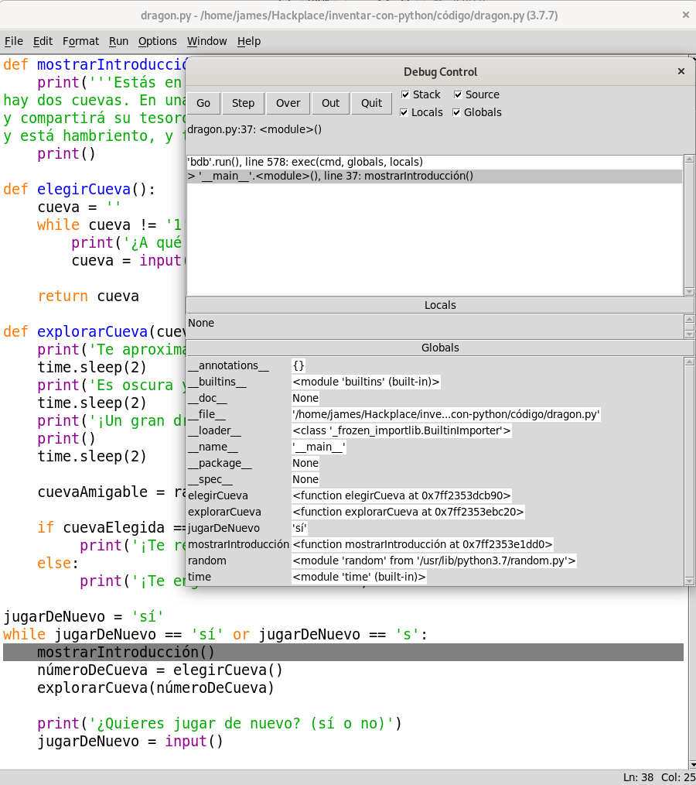
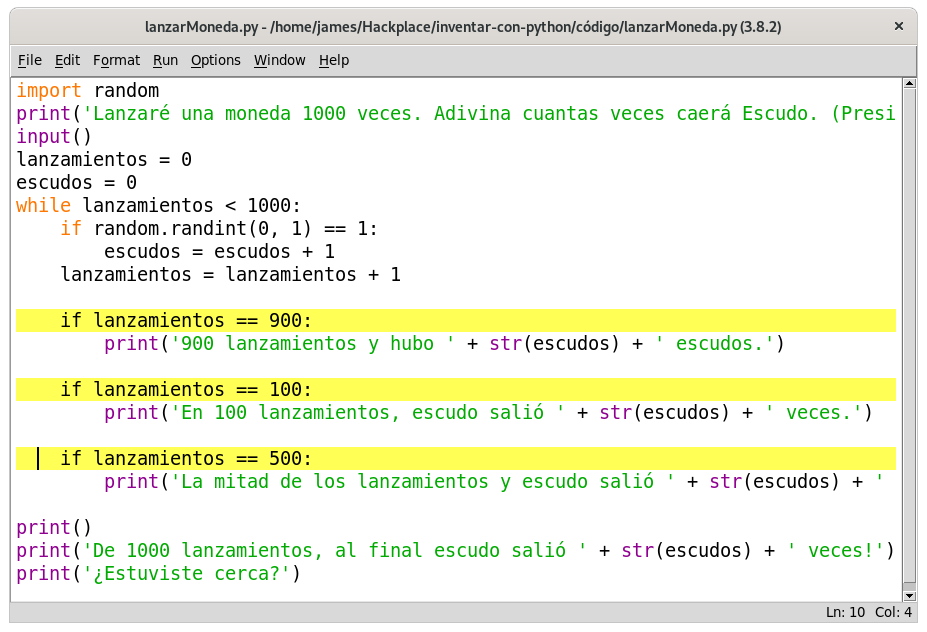

# 6 Usando el depurador

Si ingresas el código erróneo, la computadora no dará el programa correcto. Un programa de computadora siempre hará lo que tu le digas, pero lo que tu le digas al programa que haga puede que no sea lo que tu *quieres* que haga. Estos errores son *pulgas* (en inglés *bugs*) de un programa de computadora. Las pulgas ocurren cuando el programador no pensó cuidadosamente lo que el programa hace.

***

Temas cubiertos en este capítulo:

* 3 tipos diferentes de errores
* Depurador de IDLE
* Ir y salir
* Entrar en, sobre, salir
* Puntos de quiebre (Breakpoints)

---

## Tipos de errores

Hay tres tipos de errores que pueden ocurrir en tu programa:

* **Errores de Sintaxis**, estos provienen de errores de tipografía. Cuando el intérprete de Python ve un error de sintaxis, es porque tu código no se encuentra escrito correctamente en lenguaje Python. Un programa en Python aún con tan sólo un error de sintaxis no correrá.

* **Errores de Ejecución**, estos ocurren mientras el programa está corriendo. El programa funcionará hasta que alcanza la línea de código con el error y luego el programa terminará con un mensaje de error (eso se le llama *colapsar *, del inglés “crashing”). El intérprete mostrará un *“traceback”* (rastreo) y mostrará la línea donde ocurre el problema.

* **Errores de Semántica** son los más difíciles de solucionar. Estos errores no 'crashean' un programa, pero este no hará lo que el programador espera. Por ejemplo, si el programador desea la variable `total` sea la *suma* de los valores en las variables `a`, `b` y `c` pero escribe `total = a * b * c`, entonces el valor en `total` será erróneo. Esto podría colapsar el programa más adelante, pero no es inmediatamente obvio donde el error de semántica ocurre.

Hallar las pulgas en un programa puede ser arduo ¡si es que siquiera los notas! Cuando corres tu programa, puedes descubrir que a veces ciertas funciones no son llamadas cuando deberían serlo, o tal vez son llamadas demasiadas veces. Puedes condicionar un ciclo `while` incorrectamente, ocasionando un número de ciclos incorrecto. Puedes escribir un ciclo que nunca termine, un error semántico conocido como *ciclo infinito*. Para parar un programa pegado en un ciclo infinito, puedes presionar CTRL-C en «shell» interactivo.

De hecho, desde el «shell» interactivo, cree un ciclo infinito al escribir el siguiente código (recuerde presionar ENTER dos veces para indicarle al «shell» que ha terminado de escribir el bloque del `while`):

~~~Python
>>> while True:
        print('¡¡¡Presiona Ctrl-C para parar este ciclo infinito!!!')
~~~

Ahora presione y mantenga la teclas CTRL-C  para detener el programa. El «shell» se verá así:

~~~Python
¡¡¡Presiona Ctrl-C para parar este ciclo infinito!!!
¡¡¡Presiona Ctrl-C para parar este ciclo infinito!!!
¡¡¡Presiona Ctrl-C para parar este ciclo infinito!!!
¡¡¡Presiona Ctrl-C para parar este ciclo infinito!!!
¡¡¡Presiona Ctrl-C para parar este ciclo infinito!!!
Traceback (most recent call last):
  File "<pyshell#1>", line 1, in <module>
    while True: print('¡¡¡Presiona Ctrl-C para parar este ciclo infinito!!!')
KeyboardInterrupt

~~~

El ciclo `while` siempre es True, de modo que el programa se mantendrá imprimiendo la misma línea para siempre hasta que sea detenido por la usuaria. En este ejemplo, presionamos CTRL-C para detener el ciclo infinito después de que el ciclo `while` se ejecutó cinco veces.

## El depurador

Puede ser difícil darse cuenta cómo el código está causando una pulga porque las líneas de código se ejecutan rápidamente y los valores en las variables cambian frecuentemente. Un *depurador* es un programa que te permite correr tu programa una línea de código a la vez en el mismo orden que Python ejecuta cada instrucción. El depurador también le muestra, en cada paso, cuales son los valores almacenados en las variables.

## Iniciando el depurador

En el IDLE, abra el juego Reino de dragones que hizo en el capítulo 5. Después de abrir el archivo *dragon.py*, de clic en el «shell» interactivo y luego clic en **Debug ► Debugger** para hacer aparecer la ventana "Debug Control", en español Control de depuración (Figura 6-1).

Cuando el depurador es ejecutado, la ventana Control de depuración se verá como en la Figura 6-2. Asegúrese de seleccionar los campos **Stack**, **Locals**, **Source** y **Globals**.

Ahora cuando corras el juego Reino de dragones presionando F5, el depurador IDLE se activará. Esto es conocido como correr un programa *bajo un depurador*. Cuando ejecuta el programa bajo el depurador, el programa se detendrá antes de ejecutar la primera instrucción. Si presionas sobre la barra del título del editor del archivo (y has seleccionado el campo **Source** en la ventana del Control de depuración), la primera línea de código estará resaltada en gris. La ventana del Control de depuración muestra que la ejecución se encuentra en la línea 1, la cual es `import random`.

*Figura 6-1: Ventana de Control de Depuración.*

*Figura 7-2: Corriendo Reino de dragones bajo el depurador.*

## Paso a paso a través del programa con el depurador

El depurador te permite ejecutar una línea de código a la vez,este proceso es llamado *paso a paso* (*stepping* en inglés). Para ejecutar una sola instrucción, presiona el botón *Step* en la ventana del Control de depuración. Python ejecutará la instrucción `import random`, y luego se detendrá antes de ejecutar la próxima instrucción. La ventana de Control de depuración mostrará que instrucción va a ser ejecutada cuando usted de clic en el botón *Step*, la ejecución ahora se encuentra en la línea 2, en `import time`. Presiona el botón **Quit** (Salir) para terminar el programa por ahora.

Aquí hay un resumen de lo que pasa cuando presionas el botón *Step* mientras corres el juego Reino de dragones bajo el depurador. Presiona F5 para correr Reino de Dragones otra vez, luego sigue estas instrucciones:

1. Presiona el botón **Step** dos veces para ejecutar las dos líneas de `import`.
2. Presiona el botón **Step** otras tres veces para ejecutar las tres declaraciones `def`.
3. Presiona el botón **Step** otra vez para definir la variable `jugarDeNuevo`.
4. Presiona **Go** para correr el resto del programa, o presiona **Quit** para terminar el mismo.

El depurador salteó la línea 3 debido a que es una línea en blanco. Note que sólo se puede avanzar con el depurador, no puedes retroceder.

## Área de globales

El *área de globales* en la ventana de Control de depuración es donde se muestran todas las variables globales. Recuerde, las variables globales son aquellas creadas fuera de cualquier función (es decir, de entorno global).

El texto junto a los nombres de las funciones en el Área de globales se verá como "`<function explorarCueva at 0x012859B0>`". Los nombres de módulos también tienen texto de aspecto confuso junto a ellos, tales como “`<module 'random' from 'C:\\Python31\\lib\\random.pyc'>`“. Esta información detallada es útil para los programadores avanzados, pero no necesitas saber que significa para depurar tus programas. Tan sólo con ver que las funciones y los módulos se encuentran en el Área de globales te dirá que la función fue definida o el módulo importado.

También puede ignorar las líneas `__builtins__`, `__doc__`,  `__name__` y otras líneas similares en el Área de globales. (Esas son variables que aparecen en todo programa en Python.)

En el programa Reino de dragones, las tres declaraciones `def`, que ejecutan y definen funcione, aparecerán en el Área de globales de la ventana Control de depuración. Cuando la variable `jugarDeNuevo` es creada, aparecerá en el Área de  globales. Al lado del nombre de la variable aparecerá la cadena `'si'`. El depurador te permite ver los valores de todas las variables en el programa mientras el mismo corre. Esto es útil para solucionar pulgas en tu programa.

## Área de locales

Existe también un Área de locales, la cuál muestra las variables de entorno local y sus valores. El Área de locales sólo tendrá variables cuando la ejecución del programa se encuentre dentro de una función. Cuando la ejecución se encuentre en el entorno global, esta área estará en blanco.

##Los botones de ir (Go) y quitar (Quit)

Si se cansa de presionar el botón *Step* repetidamente y solo quieres correr el programa normalmente, presiona el botón *Go* en la parte superior de la ventana de Control de depuración. Esto le dirá al programa que corra normalmente en vez de paso a paso.

Para terminar el programa completamente, sólo presiona el botón *Quit* en la parte superior de la ventana de Control de depuración. El programa terminará inmediatamente. Esto es útil si necesitas empezar a depurar de nuevo desde el comienzo del programa.

## Entrar en (Stepping Into), por encima (Over), y salir (Out)

Iniciar el programa Reino de dragones con el depurador. Ejecuta el programa paso a paso hasta que el depurador se encuentre en la línea 37. Como se muestra en la Figura 6-3, esta es la línea de la función `mostrarIntroduccion()`. Cuando de clic de nuevo en *Step*, el depurador saltará dentro de la llamada de la función y aparecerá en la línea 5, la primera línea en la función `mostrarIntroducción()` El modo de ejecución *paso a paso* que ha estado realizando se llama *entrar en* (Stepping Into en ingles).

Cuando la ejecución se pause en la línea 5, querrá dejar de avanzar. Si da clic en *Step* una vez más, el depurador se detendrá en la función `print()`. La función `print()` es una de las funciones incorporadas de Python, así que no es muy útil ingresar en ella con el depurador. Las funciones propias de Python como `print()`, `input()`, `str()`, y `randint()` han sido cuidadosamente revisadas. Puede asumir que no son las partes causantes de pulgas en su programa.

Así que no quiere perder tiempo ingresando en el interior de la función `print()`. Entonces en vez de presionar *Step* para ingresar en el código de la función `print()`, presiona *Over*. Esto pasará *por encima* del código dentro de la función `print()`. El código dentro de `print()` será ejecutado a velocidad normal, y luego el depurador se pausará una vez que la ejecución vuelva de `print()`.

Pasar por encima es una manera conveniente de evitar pasar por el código dentro de una función. El depurador ahora estará pausado en la línea 38, `númeroDeCueva = elegirCueva()`.

Presiona *Step* de nuevo para ingresar en la función `elegurCueva()`. Continua la ejecución paso a paso hasta la línea 15, la llamada a `input()`. El programa esperará hasta que ingreses una respuesta en la «shell» interactiva, tal como lo haría corriendo el programa normalmente. Si intenta presionando el botón *Step* ahora, nada pasará porque el programa esperará una respuesta del teclado.

*Figure 6-3: Continua el paso a paso hasta la línea 37.*

Regrese al «shell» interactivo presionando clic en esa ventana y teclee en cuál cueva desea ingresar. El cursor parpadeante debe estar en la línea inferior en la consola interactiva antes de que pueda escribir. Caso contrario el texto que ingreses no aparecerá.

Una vez que presione ENTER, el depurador continuará el paso a través de las líneas de código de nuevo.

A continuación, de clic en el botón *Out* en la ventana Control de depuración . A esto se le llama Salir (en inglés *Stepping Out*) porque hará que el depurador corra cuantas líneas sean necesarias hasta salir de la función en la que se encuentra. Luego de que sale, la ejecución estará en la línea siguiente a la línea que llamó la función.

Si no te encuentras dentro de una función, presionar *Out* hará que el depurador ejecute todas las líneas restantes del programa. Este es el mismo comportamiento a presionar el botón **Go**.

Aquí un resumen de lo que cada botón hace:

* **Go** - Ejecuta el resto del código normalmente, o hasta que alcanza un punto de quiebre (en inglés *breakpoint*, ver página 73).
* **Step** - Ejecuta una línea de código o un paso. Si la línea es una llamada a una función, el depurador ingresará dentro de la función.
* **Over** - Ejecuta una línea de código o un paso. Si la línea es una llamada a una función, el depurador no ingresará *dentro* de la función pero por el contrario *pasará sobre* la llamada.
* **Out** - Ejecuta líneas de código hasta que el depurador salga de la función en la que estaba cuando se presionó **Out**. Esto *sale* de la función.
* **Quit** - Termina el programa inmediatamente.

Ahora que sabemos cómo usar el depurador, vamos a intentar encontrar pulgas en algunos programas.

## Encontrando la pulga

El depurador puede ayudarte a encontrar la causa de pulgas en tu programa. Por ejemplo, aquí hay un pequeño programa con una pulga. El programa brinda un problema de suma aleatoria para que la usuaria resuelva. En la «shell» interactiva, de clic en **Archivo > Nueva ventana** para abrir un nuevo editor de archivos. Escriba este programa en esa ventana y guarda el programa como *pulgoso.py*.

*pulgoso.py*

~~~Python
1. import random
2. numero1 = random.randint(1, 10)
3. numero2 = random.randint(1, 10)
4. print('¿Cuánto es ' + str(numero1) + ' + ' + str(numero2) + '?')
5. respuesta = input()
6. if respuesta == numero1 + numero2:
7.     print('¡Correcto!')
8. else:
9.     print('¡Nops! La respuesta es ' + str(numero1 + numero2))
~~~

Escriba el programa exactamente como se muestra, incluso si ya sabes cuál es el pulga. Luego intenta correr el programa presionando F5. Aquí es lo que es posible que veas al correr el programa:

~~~Python
Cuánto es 9 + 2?
11
¡Nops! La respuesta es 11
~~~

¡Esa es una pulga! El programa no colapsa, pero no está trabajando correctamente. El programa dice que el usuario está equivocado incluso si ingresa la respuesta correcta.

Ejecutar el programa en un depurador ayudará a encontrar la causa de la pulga. En la parte superior de la consola interactiva, presiona **Debug > Debugger** para mostrar la ventana Control de depuración. (Asegúrese de haber seleccionado las casillas de **Stack, Source, Locals, y Globals**). Luego presiona F5 en el editor de archivos para correr el programa. Esta vez correrá bajo el depurador.

El depurador comenzará en la línea `import random`:

~~~Python
1. import random
~~~

Nada especial sucede aquí, así que presiona **Step** para ejecutarla. Verás que el módulo `random` es agregado al Área de globales (Globals).

De clic en **Step** de nuevo para ejecutar la línea 2:

~~~Python
numero1 = random.randint(1, 10)
~~~

Una nueva ventana de edición aparecerá con el archivo *pulgas.py* . Ha ingresado dentro de la función `randint()` dentro del módulo `random`. ya sabe que las funciones incorporadas en Python no serán fuente de tus errores, así que presione **Out** para salir de la función `randint()` y volver a tu programa. Luego cierra la ventana del archivo *random.py*. La próxima vez, puedes presionar **Over** para saltar la función `randint()` en vez de ingresar en ella.

La línea 3 también es una llamada a la función `randint()`:

~~~Python
3. numero2 = random.randint(1, 10)
~~~

Evita ingresar en su código dando clic en **Over**.

La línea 4 es una llamada a `print()` para mostrarle a la jugadora los números aleatorios:

~~~Python
4. print('¿Cuánto es ' + str(numero1) + ' + ' + str(numero2) + '?')
~~~

¡Tu sabe que números le mostrará el programa incluso antes de que los imprima! Tan sólo mire el Área de globales en la ventana de Control de depuración. Puede ver las variables `numero1` y `numero2`, y a su lado los valores enteros almacenados en ellas.

La variable `numero1` posee el valor `5` y la variable `numero2` el valor `4` (Sus números aleatorios probablemente serán diferentes). Cuando presiones **Step**, la función `str()` concatenará las versiones cadenas de caracteres de estos enteros, y el programa mostrará la cadena en la llamada `print()` con estos valores. Cuando corrí el depurador, se vio como la Figura 6-4.

Presione **Step** desde la línea 5 para ejecutar `input()`.

~~~Python
5. respuesta = input()
~~~

El depurador espera hasta que la jugadora ingrese una respuesta al programa. Ingrese la respuesta correcta (en mi caso, 9) en la «shell» interactiva. El depurador continuará y se moverá a la línea 6.

~~~Python
6. if respuesta == numero1 + numero2:
7.     print('¡Correcto!')
~~~

La línea 6 es un enunciado `if`. La condición es que el valor en `respuesta` debe coincidir con la suma de `numero1` y `numero2`. Si la condición es `True`, el depurador se moverá a la línea 7. Si es `False`, el depurador se moverá a la línea 9. Dale clic en **Step** una vez mas para descubrir adonde se moverá.

~~~Python
8. else:
9.     print('¡Nops! La respuesta es ' + str(numero1 + numero2))
~~~

*Figura 6-4: `numero1` establecido en 5 y `numero2` en 4.*

¡El depurador ahora se encuentra en la línea 9! ¿Qué sucedió? La condición en el `if` debe haber sido `False`. Mira los valores en `numero1`, `numero2`, y `respuesta`. Note que `numero1` y `numero2` son enteros, así que su suma también debe ser un entero. Pero `respuesta` es una cadena.

Esto significa que `respuesta == numero1 + numero2` debió ser evaluado como `'9' == 9`. Una valor cadena y un valor entero siempre serán no iguales, así que la condición se evalúa como `False`.

Esta es la pulga en el programa: en el código usamos `respuesta` cuando debimos usar `int(respuesta)`. Cambia la línea 6 para usar `int(respuesta) == numero1 + numero2`  y corre el programa de nuevo.

~~~Python
¿Cuanto es 2 + 3?
5
¡Correcto!
~~~

Ahora el programa funciona correctamente. Córralo una vez más e ingrese una respuesta errónea a propósito. ¡Ahora habrás depurado este programa! Recuerda, la computadora correrá tus programas exactamente como los escribiste, incluso si lo que escribiste no es lo que quería.

## Estableciendo puntos de quiebre

Ejecutar el código paso a paso puede ser demasiado lento. Con frecuencia va a querer ejecutar el programa a velocidad normal hasta que alcance cierta línea. Un *punto quiebre* (en ingles *breakpoint*) se establece en una línea donde quieres que el depurador tome el control una vez que la ejecución alcance dicha línea. Si cree que hay un programa en su código, digamos, en la línea 17, tan sólo establece un punto de quiebre en esa línea (o tal vez unas líneas atrás).

Cuando la ejecución alcance esa línea, el programa tendrá un quiebre en la ejecución hacia el depurador. Luego podrá avanzar paso a paso por las líneas para ver que sucede. Al dar clic en **Go** ejecutará el programa normalmente hasta que alcance otro punto quiebre o el final del programa.

Para establecer un punto quiebre en Windows, de doble clic derecho en el editor de archivos y seleccione **Set Breakpoint** en el menú que aparece. En OS X, CTRL-clic para obtener un menú y seleccione **Set Breakpoint**. Usted puede establecer breakpoints en tantas líneas como usted guste. El editor de archivos resaltará en amarillo cada línea con un breakpoint. La Figura 6-5 muestra un ejemplo de cómo se ve un breakpoint.

*Figura 6-5: El editor de archivos con dos puntos de quiebre establecidos*

Para remover un punto de quiebre, de clic en la línea y seleccione **Clear Breakpoint** en el menú que aparece.

## Usando puntos de quiebre

Ahora veremos un programa que llama a `random.randint(0,1)` para simular lanzamientos de moneda. Si la función retorna el entero `1`, eso será "escudo" y `0` "corona".  La variable `lanzamientos` registrará cuantos lanzamientos se efectuaron. La variable `escudo` registrará en cuantos salió `escudo`.

El programa hará mil lanzamientos de moneda. Esto le tomaría a una persona más de una hora, pero ¡la computadora puede hacerlo en un segundo! No hay ningún error en este programa, pero el depurador nos permitirá ver el estado del programa mientras este está corriendo.  Escriba el siguiente código en el editor y guárdelo como `lanzarMoneda.py`. Si obtiene errores después de escribir este código, compárelo con el código de este libro con la herramienta *diff* en https://www.nostarch.com/inventwithpython#diff.

*lanzarMoneda.py*

~~~Python
 1. import random
 2. print('Lanzaré una moneda 1000 veces. Adivina cuantas veces caerá Escudo. (Presiona enter para comenzar)')
 3. input()
 4. lanzamientos = 0
 5. escudos = 0
 6. while lanzamientos < 1000:
 7.     if random.randint(0, 1) == 1:
 8.         escudos = escudos + 1
 9.     lanzamientos = lanzamientos + 1
10.
11.     if lanzamientos == 900:
12.         print('900 lanzamientos y hubo ' + str(escudos) + ' escudos.')
13.     if lanzamientos == 100:
14.         print('En 100 lanzamientos, escudo salió ' + str(escudos) + ' veces.')
15.     if lanzamientos == 500:
16.         print('La mitad de los lanzamientos y escudo salió ' + str(escudos) + ' veces.')
17.
18. print()
19. print('De 1000 lanzamientos, al final escudo salió ' + str(escudos) + ' veces!')
20. print('¿Estuviste cerca?')
~~~

El programa corre muy rápido. Toma más tiempo esperar a que el usuario presione ENTER que realizar los lanzamientos. Digamos que deseamos ver los lanzamientos de moneda uno a uno. En la «shell» interactiva, presiona **Debug > Debugger** para abrir la ventana de Control del depurador. Luego presiona F5 para correr el programa.

El programa comienza dentro del depurador en la línea 1. Presiona **Step** tres veces en la ventana de control para ejecutar las primeras tres líneas (estas son, líneas 1, 2 y 3). Notarás que los botones se deshabilitarán porque la función `input()` fue llamada y la «shell» interactiva está esperando que la usuaria escriba algo. De clic en la ventana del «shell» interactivo y presiona ENTER. (Asegúrese de presionar debajo del texto en la consola interactiva, de lo contrario puede que IDLE no reciba lo que teclea.)

Puedes presionar **Step** un par de veces mas, pero caerá en cuenta que le tomará un buen rato avanzar por todo el programa. En vez, establezca un punto de quiero en las líneas 12, 14 y 16 para que el depurador se detenga ahí cuando `lanzamientos` sea igual a `900`, `100` y `500` respectivamente. El editor de archivos resaltará estas tres líneas como se muestra en la Figura 6-6.

*Tres puntos quiebre establecidos en lanzarMoneda.py*

Luego de establecer los puntos quiebre, presiona **Go** en la ventana de Control del depurador. El programa correrá a velocidad normal hasta toparse con el siguiente punto quiebre. Cuando `lanzamientos` se encuentra en `100`, el condicional del enunciado `if` en la línea 13 es `True`. Esto causa que la línea 14 (donde hay un punto de quiebre) se ejecute, lo que le dice al depurador que frene el programa y tome el control. Mire la ventana de Control del depurador en la sección de Área de globales para ver cuál es el valor de `lanzamientos` y `escudos`.

Presiona nuevamente **Go** y el programa continuará hasta el siguiente punto quiebre en la línea 16. Otra vez, mira cómo los valores en `lanzamientos` y `caras` han cambiado.

Si presionas **Go** otra vez, la ejecución continuará hasta el último punto quiebre en la línea 12. 

## Resumen

Escribir programas es sólo la primera parte de programar. La siguiente parte es cerciorarse que lo escrito realmente funciona. Los depuradores le permiten dar pasar por las líneas del código una línea a la vez. Puede examinar qué lineas se ejecutan en qué orden, y qué valores contienen las variables. Cuando esto es demasiado lento, puede establecer puntos de quiebre para frenar el depurador sólo en las líneas que desea.

Utilizar el depurador es una gran forma de entender exactamente lo que el programa está haciendo. Mientras se le explica el código de todos los juegos que se usan en este libro, el depurador puede ayudarle a encontrar más por tu cuenta.

[Previo: Capítulo 5: Reino de dragones](capitulo5.md) [Siguiente: Capítulo 7: Diseñando el juego ahorcado con diagramas de flujo ](capitulo7.md)
