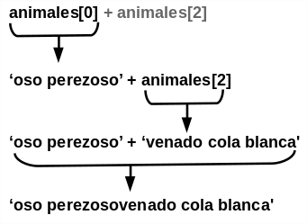
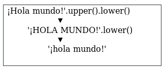
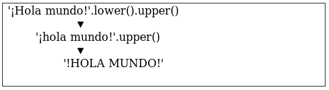
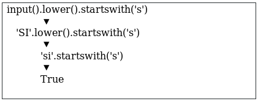

# 8 Escribiendo el código de Ahorcado

El juego de este capítulo introduce muchos conceptos nuevos, pero no se preocupe: experimentará con estos en el «shell» interactivo antes de programar el juego.

 Aprenderá sobre *métodos*, que son funciones vinculadas a valores. Aprenderá también acerca de un nuevo tipo de dato llamado *lista* (en inglés *list* ). Una vez entienda estos conceptos, será mucho mas fácil programar el Ahorcado.

***
Temas cubiertos en este capítulo:
* Listas
* El operador  `n` 
* Métodos
* Los métodos de string `spli()`, `lower()`, `upper()`, `startswith()` y `endswith()`.
* Sentencias `elif`
***

## Código fuente de Ahorcado

El juego de este capítulo es un poco más largo que los juegos anteriores, pero una buena parte de este es arte ASCII para las figuras de el ahorcado. Escriba lo siguiente en el editor de archivos y guárdelo como *ahorcado.py*.  Si obtiene errores después de escribir este código, compárelo con el código de este libro con la herramienta *diff* en *https://www.nostarch.com/inventwithpython#diff*.

*ahorcado.py*

~~~Python
  1. import random
  2. IMÁGENES_AHORCADO = ['''		
  3.   +---+
  4.       |		
  5.       |		
  6.       |		
  7.      ===''', '''		
  8.   +---+		
  9.   O   |
 10.       |		
 11.       |		
 12.      ===''', '''		
 13.   +---+		
 14.   O   |		
 15.   |   |		
 16.       |		
 17.      ===''', '''		
 18.   +---+		
 19.   O   |		
 20.  /|   |		
 21.       |		
 22.      ===''', '''		
 23.   +---+		
 24.   O   |		
 25.  /|\  |		
 26.       |		
 27.      ===''', '''		
 28.   +---+		
 29.   O   |		
 30.  /|\  |		
 31.  /    |		
 32.      ===''', '''		
 33.   +---+		
 34.   O   |		
 35.  /|\  |		
 36.  / \  |		
 37.      ===''']		
 38. palabras = 'hormiga babuino tejon murcielago oso castor camello gato almeja cobra pantera coyote cuervo ciervo perro burro pato aguila huron zorro rana cabra ganso halcon leon lagarto llama topo mono alce raton mula salamandra nutria buho panda loro paloma piton conejo carnero rata cuervo rinoceronte salmon foca tiburon oveja mofeta perezoso serpiente araña cigüeña cisne tigre sapo trucha pavo tortuga comadreja ballena lobo wombat cebra'.split()		
 39.
 40. def obtenerPalabraAlAzar(listaDePalabras):
 41.     # Esta función devuelve una cadena al azar de la lista de cadenas pasada como argumento.
 42.     índiceDePalabras = random.randint(0, len(listaDePalabras) - 1)		
 43.     return listaDePalabras[índiceDePalabras]
 44. 
 45. def mostrarTablero(letrasIncorrectas, letrasCorrectas, palabraSecreta):
 46.     print(IMÁGENES_AHORCADO[len(letrasIncorrectas)])
 47.     print()
 48. 
 49.     print('Letras incorrectas:', end=' ')
 50.     for letra in letrasIncorrectas:
 51.         print(letra, end=' ')
 52.     print()
 53. 
 54.     espaciosVacíos = '_' * len(palabraSecreta)
 55. 
 56.     for i in range(len(palabraSecreta)): # completar los espacios vacíos con las letras adivinadas
 57.         if palabraSecreta[i] in letrasCorrectas:
 58.             espaciosVacíos = espaciosVacíos[:i] + palabraSecreta[i] + espaciosVacíos[i+1:]
 59. 
 60.     for letra in espaciosVacíos: # mostrar la palabra secreta con espacios entre cada letra
 61.         print(letra, end=' ')
 62.     print()
 63. 
 64. def obtenerIntento(letrasProbadas):
 65.     # Devuelve la letra ingresada por la jugadora. Verifica que la jugadora ha ingresado sólo una letra, y no otra cosa.
 66.     while True:
 67.         print('Adivina una letra.')
 68.         intento = input()
 69.         intento = intento.lower()
 70.         if len(intento) != 1:
 71.             print('Por favor, introduce una letra.')
 72.         elif intento in letrasProbadas:
 73.             print('Ya has probado esa letra. Elige otra.')
 74.         elif intento not in 'abcdefghijklmnñopqrstuvwxyz':
 75.             print('Por favor ingresa una LETRA.')
 76.         else:
 77.             return intento
 78. 
 79. def jugarDeNuevo():
 80.     # Esta función devuelve True si la jugadora quiere volver a jugar, en caso contrario devuelve False.
 81.     print('¿Quieres jugar de nuevo? (sí o no)')
 82.     return input().lower().startswith('s')
 83. 
 84. 
 85. print('A H O R C A D O')
 86. letrasIncorrectas = ''
 87. letrasCorrectas = ''
 88. palabraSecreta = obtenerPalabraAlAzar(palabras)
 89. juegoTerminado = False
 90. 
 91. while True:
 92.     mostrarTablero(letrasIncorrectas, letrasCorrectas, palabraSecreta)
 93. 
 94.     # Permite a la jugadora escribir una letra.
 95.     intento = obtenerIntento(letrasIncorrectas + letrasCorrectas)
 96. 
 97.     if intento in palabraSecreta:
 98.         letrasCorrectas = letrasCorrectas + intento
 99. 
100.         # Verifica si la jugadora ha ganado.
101.         encontradoTodasLasLetras = True
102.         for i in range(len(palabraSecreta)):
103.             if palabraSecreta[i] not in letrasCorrectas:
104.                 encontradoTodasLasLetras = False
105.                 break
106.         if encontradoTodasLasLetras:
107.             print('¡Sí! ¡La palabra secreta es "' + palabraSecreta + '"! ¡Has ganado!')
108.             juegoTerminado = True
109.     else:
110.         letrasIncorrectas = letrasIncorrectas + intento
111. 
112.         # Comprobar si la jugadora ha agotado sus intentos y ha perdido.
113.         if len(letrasIncorrectas) == len(IMÁGENES_AHORCADO) - 1:
114.             mostrarTablero(letrasIncorrectas, letrasCorrectas, palabraSecreta)
115.             print('¡Te has quedado sin intentos!\nDespués de ' +
                       str(len(letrasIncorrectas)) + ' intentos fallidos y ' +
                       str(len(letrasCorrectas)) + ' aciertos, ' + 
                      'la palabra era "' + palabraSecreta + '"')
116.             juegoTerminado = True
117. 
118.     # Preguntar a la jugadora si quiere volver a jugar (pero sólo si el juego ha terminado).
119.     if juegoTerminado:
120.         if jugarDeNuevo():
121.             letrasIncorrectas = ''
122.             letrasCorrectas = ''
123.             juegoTerminado = False
124.             palabraSecreta = obtenerPalabraAlAzar(palabras)
125.         else:
126.             break
~~~

## Importando el módulo random

El programa Ahorcado selecciona aleatoriamente una palabra secreta de una lista de palabras para que la jugadora la adivine. El módulo `random` provee está habilidad, por lo que la línea 1 lo importa.

~~~Python
  1. import random
~~~

Pero la variable `IMÁGENES_AHORCADO` de la línea dos se ve un poco diferente a las variables que hemos visto hasta ahora. Con la idea de entender qué significa este código, necesitamos aprender algunos conceptos nuevos.

## Variables constantes

Las líneas de la 2 a la 37 son un largo sentencia de asignación para la variable `IMÁGENES_AHORCADO` .

~~~Python
  2. IMÁGENES_AHORCADO = ['''		
  3.   +---+
  4.       |		
  5.       |		
  6.       |		
  7.      ===''', '''		
  ---recorte---
 37.      ===''']
~~~

El nombre de variable `IMÁGENES_AHORCADO` está todo en mayúsculas. Esta es una convención en programación para variables constantes. Las *constantes* son variables que tienen por finalidad almacenar valores que nunca cambian desde la primera sentencia de asignación. Aunque puedes cambiar el valor de `IMÁGENES_AHORCADO` como con cualquier otra variable, un nombre con todas las mayúsculas te recuerda no hacerlo. 

Como todas las convenciones, es *su decisión* acatarla. Pero siguiendo esta convención hace mas fácil a otras y otros programadores leer su código. Sabrán que `IMÁGENES_AHORCADO` siempre tendrá el valor que se le asignó en entre la línea 2 y 37.

## Tipo de dato `list`

``IMÁGENES_AHORCADO``contiene varias cadenas multilínea. Esta puede hacerlo porque es una lista (en inglés list). Las listas tienen valores que pueden contener otros valores. Ingrese esto en la «shell» interactiva:

~~~Python
>>> animales = ['oso perezoso', 'manatí', 'venado cola blanca', 'zaguate']
>>> animales
['oso perezoso', 'manatí', 'venado cola blanca', 'zaguate']
~~~

El valor de lista en `animales` contiene cuatro valores. El valor de lista en `animales` contiene cuatro valores. Los valores de las listas comienzan con un paréntesis cuadrado apertura, `[`, y termina con un paréntesis cuadrado de cierre, `]`. Esto igual a las cadenas que comienzan y terminan con comillas.

Unas comas separan los valores individuales dentro de una lista. Estos valores también son llamados *elementos* o *ítemes*. Cada ítem en `IMÁGENES_AHORCADO` es una cadena de múltiples líneas.

Con listas se permite almacenar distintos valores sin recurrir a una variable para cada uno. Sin listas, el código se vería así:

~~~Python
>>>  animal1 = 'oso perezoso'
>>>  animal2 = 'manatí'
>>>  animal3 = 'venado cola blanca'
>>>  animal4 = 'zaguate'
~~~

Este código sería tedioso de mantener si tuviera cientos o millas de cadenas. Pero una lista puede contener fácilmente cualquier número de valores.

## Acceso a elementos con índices

Puede acceder a un elemento dentro de una lista añadiendo, al final de la variable de lista, paréntesis cuadrados con número entre ellos. El número dentro de paréntesis cuadrados es el *índice*. En Python, el índice del primer elemento de una lista es 0. El segundo elemento está en el índice 1, el tercero en el índice 2 y así sucesivamente. Decimos que las listas de Python están indexadas a cero porque los índices comienzan en 0 y no en 1.  

Mientras aún estamos en la «shell» interactiva y trabajando con la lista de `animales`, ingrese `animales[0]`, `animales[1]`, `animales[2]` y `animales[3]` para ver a qué evalúan:

~~~Python
>>> animales[0]
'oso perezoso'
>>> animales[1]
'manatí'
>>> animales[2]
'venado cola blanca'
>>> animales[3]
'zaguate'
~~~

Note que el primer valor en la lista, `'oso perezoso'`, está almacenado en el índice `0` y no en índice `1`. Cada elemento en la lista está numerado en orden comenzando en `0`.

Usando  los paréntesis cuadrados, puede tratar los elementos de la lista como cualquier otro valor. Por ejemplo, escriba `animales[0] + animales[2]` en el «shell» interactivo:

~~~Python
>>> animales[0] + animales[2]
'oso perezosovenado cola blanca'
~~~

Ambas variables en los índices `0` y `2` de `animales` son cadenas, por lo que son concatenadas. La evaluación se ve así: 

## Índices fuera de rango e "IndexError"

Si intenta acceder un índice que es demasiado grande, obtendrá un `IndexError` (Error de índice) que hará colapsar su programa. Para ver un ejemplo de este error, ingrese en el «shell» interactivo lo siguiente:

~~~Python
>>> animales = ['oso perezoso', 'manatí', 'venado cola blanca', 'zaguate']
>>> animales[9999]
Traceback (most recent call last):
  File "", line 1, in
    animales[9999]
IndexError: list index out of range
~~~

Debido a que no hay valor en el índice `9999`, usted obtiene un error. 

## Cambiando los Valores de los Elementos de una Lista con asignación por Índice

Usted también puede cambiar el valor de un elemento en una lista usando *asignación por índice*. Ingrese lo siguiente en el «shell» interactivo:

~~~Python
>>> animales = ['oso perezoso', 'manatí', 'venado cola blanca', 'zaguate']
>>> animales[1] = 'MANATÍ'
>>> animales
['oso perezoso', 'MANATÍ', 'venado cola blanca', 'zaguate']
~~~

La nueva cadena 'MANATÍ' sobreescribió el segundo elemento en la lista `animales`.  Al ingresar en el «shell» `animales[1]` solo evalúa al segundo elemento actual de la lista, pero usándolo en el lado izquierdo de una operación de asignación, le asigna un nuevo valor al elemento al segundo elemento de la lista. 

## Concatenación de listas

Puede unir listas en una sola lista con el operador `+`, del mismo modo como puede unir cadenas. Unir listas con el operador `+` es una *concatenación de listas*.  Para ver esto en acción, escriba lo siguiente en el «shell» interactivo:

~~~Python
>>> [1, 2, 3, 4] + ['manzanas', 'naranjas'] + ['Alicia', 'Beto']
[1, 2, 3, 4, 'manzanas', 'naranjas', 'Alicia', 'Beto']
~~~

`['manzanas'] + ['naranjas']` se evaluará a `['manzanas', 'naranjas']`. Pero `['manzanas'] + 'naranjas'` resultará en un error. No puede agregar una lista y una cadena con el operador `+`.  Si quiere agregar valores que no son listas a una lista sin usar concatenación, use el método `append()` (descrito más adelante en "Los métodos de `List`  `reverse()` y `appende()`").

## EL operador `in`

El operador `in` le puede decir si un valor está en una lista o no. Las expresiones que usan el operador `in` devuelven un valor lógico: `True` si el valor está en la lista y `False` si no está. Intenta introducir lo siguiente en el «shell» interactivo:

~~~Python
>>> animales = ['oso perezoso', 'manatí', 'venado cola blanca', 'zaguate']
>>> 'venado cola blanca' in animales
True
>>> 'zopilote' in animales
False
~~~

La expresión `'venado cola blanca' in animales` devuelve `True` porque la cadena `'venado cola blanca' ` es uno de los valores en la lista `animales`. Esta localizado en el índice `2`. Pero si escribe la expresión `'zopilote' in animales`, esto devolverá `False` porque la cadena `'zopilote'` no existe en la lista.

El operador `in` también funciona para las cadenas, verifica si una cadena existe en otra. Intenta introducir lo siguiente en el «shell» interactivo:

~~~Python
>>> 'hola' in 'Alicia le dice hola a Beto.'
True
~~~

Almacenar una lista de cadenas multilíneas en la variable `IMÁGENES_AHORCADO` cubrió un montón de conceptos. Por ejemplo, usted vio que las listas son útiles para almacenar múltiples valores en una sola variable. Usted también aprendió algunas técnicas para trabajar con listas, como asignación por índice y concatenación de listas. Los métodos son otro nuevo concepto que aprenderá cómo usar en el juego de Ahorcado; lo exploraremos a continuación. 

## Llamando métodos

Un *método* es una función adjuntada a un valor.  Para llamar a un método, usted debe adjuntarlo a un valor específico usando un punto. Python tiene muchos métodos útiles, usaremos algunos de estos en el programa de Ahorcado. 

Pero primero, veamos algunos métodos de `list` y `string`.

## Los métodos de lista `reverse()` y `append()`

El tipo de dato `list` tiene un par de métodos que usted probablemente usará mucho: `reverse()` y `append()`. El método  `reverse()` invertirá el orden de los elementos en una lista.  Intenta introducir `spam = [1, 2, 3, 4, 5, 6, 'miau', 'guau']`, y después `spam.reverse()` para invertir la lista. Luego, introduzca `spam` para ver los contenidos de la variable.

~~~Python
>>> spam = [1, 2, 3, 4, 5, 6, 'miau', 'guau']
>>> spam.reverse()
>>> spam
['guau', 'miau', 6, 5, 4, 3, 2, 1]
~~~

El método mas común de lista que usarás es `append()`. Este método añadirá el valor que pasas como argumento al final de la lista. Intente introducir lo siguiente en el «shell» interactivo:

~~~Python
>>> perros = []
>>> perros.append('macha')
>>> perros
['macha']
>>> perros.append('patas')
>>> perros
['macha', 'patas']
>>> perros.append('luna')
>>> perros
['macha', 'patas', 'luna']
>>> perros.append(42)
>>> perros
['macha', 'patas', 'luna', 42]
~~~

Estos métodos cambian las listas que los llaman. No devuelven una nueva lista. Decimos que esos métodos cambian la lista *“en el sitio”*.

## El método `split()` de String

El tipo de datos *string* tiene un método `split()`, el cual retorna una lista de cadenas hechas a partir de la cadena que se ha separado.  Intente usar el método `split()` ingresando lo siguiente en la «shell» interactiva:

~~~Python
>>> oracion = input()
Mi muy enérgica madre tan sólo nos sirvió nachos.
>>> oracion.split()
['Mi', 'muy', 'enérgica', 'madre', 'tan', 'sólo', 'nos', 'sirvió', 'nachos.']
~~~

El resultado es una lista de nueve cadenas, una cadena para cada una de las palabras de la cadena original, La separación ocurre cuando se encuentra un espacio en blanco en la cadena. Los espacios en blanco no están incluidos en ningún elemento de la lista.

La línea 38 del programa de Ahorcado también utiliza el método `split()`, como se muestra a continuación. EL código es extenso, pero es una sentencia simple que tiene una larga cadena de palabras separadas por espacios, con una llamada al método `split()` al final. El método `split()` devuelve una lista en la que cada palabra en la cadena es un elemento aparte.

~~~Python
38. palabras = 'hormiga babuino tejon murcielago oso castor camello gato almeja cobra pantera coyote cuervo ciervo perro burro pato aguila huron zorro rana cabra ganso halcon leon lagarto llama topo mono alce raton mula salamandra nutria buho panda loro paloma piton conejo carnero rata cuervo rinoceronte salmon foca tiburon oveja mofeta perezoso serpiente araña cigüeña cisne tigre sapo trucha pavo tortuga comadreja ballena lobo wombat cebra'.split()		
~~~

Es más fácil escribir código utilizando `split()`. Si lo hubieses creado desde el principio como lista, tendría que haber escrito: `['hormiga', 'babuino', 'tejon',` y así, con comillas y comas para cada palabra.

Puede añadir sus propias palabras a la cadena en la línea 38, o eliminar cualquiera que no quiere que esté en el juego. Solamente asegúrese que los espacios separen las palabras.

## Obteniendo una palabra secreta de la lista de palabras

La línea 40 define la función `obtenerPalabraAlAzar()`. Se pasará una lista como argumento por su parámetro `listaDePalabras`. Esta función devolverá una palabra secreta de la lista en `listaDePalabras`.

~~~Python
 40. def obtenerPalabraAlAzar(listaDePalabras):
 41.     # Esta función devuelve una cadena al azar de la lista de cadenas pasada como argumento.
 42.     índiceDePalabras = random.randint(0, len(listaDePalabras) - 1)		
 43.     return listaDePalabras[índiceDePalabras]
~~~

En la línea 42 almacena un índice aleatorio para esta lista en la variable `índiceDePalabras`. Lo hace llamando `randint()` con dos argumentos. El primer argumento es `0` (para el primer índice posible) y el segundo argumento es el valor que devuelve la expresión `len(listaDePalabras) - 1` (para el último índice posible en una `listaDePalabras`).

Recuerde que los índices de lista comienzan en 0 y no en 1. Si tiene una lista de tres elementos, el índice del primer elemento es 0, el índice del segundo elemento es 1, y el índice del tercer elemento es 2. La longitud de este lista es 3, pero el índice 3 estaría después del último índice. Esta es la razón por la que en la línea 42 se resta 1 de la longitud de `listaDePalabras`. El código en la línea 42 funcionará sin importar el tamaño de `listaDePalabras`. Ahora si quiere puede añadir o quitar cadenas a `listaDePalabras`.

A la variable `índiceDePalabras` se asignará un índice al azar para la lista pasada como el parámetro `listaDePalabras`. La línea 43 devolverá el elemento en `listaDePalabras` almacenado en el índice entero `índiceDePalabras`.

Supongamos que `['manzana', 'naranja', 'uva']` se pasa como argumento a `obtenerPalabraAlAzar()` y que `randint(0, 2)` devuelve el número entero `2`. Eso significaría que la línea 43 devolvería `listaDePalabras[2]` , y entonces se evaluaría para devolver `'uva'` (`return 'uva'`. Así es como `obtenerPalabraAlAzar()` devuelve una cadena aleatoria de la lista `listaDePalabras`.

Así, la entrada de `obtenerPalabraAlAzar()` es una lista de cadenas, y la salida que devuelve es una cadena seleccionada al azar de esa lista. En el juego de Ahorcado, así es cómo se selecciona una palabra secreta que adivine la jugadora.

## Mostrando el tablero a la jugadora

A continuación, necesita una función para imprimir el tablero de Ahorcado en pantalla. También mostrará el número de letras que la jugadora ha adivinado correctamente (e incorrectamente).

~~~Python
 45. def mostrarTablero(letrasIncorrectas, letrasCorrectas, palabraSecreta):
 46.     print(IMÁGENES_AHORCADO[len(letrasIncorrectas)])
 47.     print()
~~~

Este código define una nueva función llamada `mostrarTablero()`. Esta función tiene tres parámetros:

* **letrasIncorrectas** - Una cadena de las letras que la jugadora ha probado que no están en la palabra secreta.
* **letrasCorrectas** - Una cadena de las letras que la jugadora ha probado que se encuentran en la palabra secreta.
* **palabraSecreta** - Una cadena de la palabra secreta que la jugadora está tratando de adivinar.

La primera llamada a la función `print()` mostrará el tablero. La variable global `IMÁGENES_AHORCADO` tiene una lista de cadenas para cada tablero posible. (Recuerde que las variables globales pueden ser leídas desde adentro de una función.) `IMÁGENES_AHORCADO[0]` muestra una horca vacía, `IMÁGENES_AHORCADO[1]` muestra la cabeza (cuando la jugadora falla una letra), `IMÁGENES_AHORCADO[2]` muestra una cabeza y el cuerpo (cuando la jugadora falla dos letras), y así sucesivamente hasta `IMÁGENES_AHORCADO[6]` que muestra al ahorcado completo.

El número de letras en `letrasIncorrectas` reflejará cuantos intentos incorrectos ha hecho la jugadora. Llama a `len(letrasIncorrectas)` para averiguar este número. Así que, si `letrasIncorrectas` es `'aetr'` entonces `len('aetr')` devolverá `4`. Imprimir `IMÁGENES_AHORCADO[4]` mostrará el tablero del ahorcado apropiado para 4 fallos. Esto es lo que devuelve `IMÁGENES_AHORCADO[len(letrasIncorrectas)]` en la línea 46.

La línea 49 imprime la cadena `'Letras incorrectas:'` con un carácter de espacio al final en lugar de un salto de línea:

~~~Python
 49.     print('Letras incorrectas:', end=' ')
 50.     for letra in letrasIncorrectas:
 51.         print(letra, end=' ')
 52.     print()
~~~

El ciclo `for` en la línea 50 iterará por cada carácter de la cadena `letrasIncorrectas` y las imprimirá en la pantalla. Recuerde que `end=' '` remplazará el carácter de nueva línea que se imprime después de la cadena con un carácter de espacio en blanco. Por ejemplo, si `letrasIncorrectas` fuera `ajtw`, este ciclo `for` desplegaría `a j t w`.

El resto de la función `mostrarTablero()` (líneas 54 a 62) muestra las letras incorrectas y crea la cadena de la palabra secreta con todas las letras aún no adivinadas en blanco. Esta hace esto usando la función `range()` y cortes de lista.

## Funciones `list()` y `range()`

Cuando se llama con un argumento, `range()` devolverá un objeto `range` (en inglés, rango) de números enteros desde 0 hasta (pero sin incluir) el argumento. Este objeto *range* se puede utilizar en ciclos `for` pero también se puede convertir al tipo de datos `list`, más común, con la función `list()`. Intente introducir `list(range(10))` en el «shell» interactivo:

~~~Python
>>> list(range(10))
[0, 1, 2, 3, 4, 5, 6, 7, 8, 9]
>>> list('Hola')
['H', 'o', 'l', 'a']
~~~

La función `list()` es similar a las funciones `str()` o `int()`. Toma el valor que se pasa y devuelve una lista. Es fácil generar enormes listas con la función `range()`.  Prueba a introducir `list(range(10000))` en el intérprete interactivo:

~~~Python
>>> list(range(10000))
[0, 1, 2, 3, 4, 5, 6, 7, 8, 9, 10, 11, 12, 13, 14, 15,...
      ...omitido por brevedad...
...9989, 9990, 9991, 9992, 9993, 9994, 9995, 9996, 9997, 9998, 9999]
~~~

La lista es tan grande, que ni siquiera cabrá completa en la pantalla. Pero puede almacenar la lista en una variable:

~~~Python
>>> spam = list(range(10000))
~~~

Si pasa dos argumentos enteros a `range()`, el objeto `range` que devuelve va desde el primer argumento entero hasta (pero sin incluir) el segundo argumento entero. Intente introducir `list(range(10, 20))` en el intérprete interactivo:

~~~Python
>>> list(range(10, 20))
[10, 11, 12, 13, 14, 15, 16, 17, 18, 19]
~~~

Como puede ver, nuestra lista únicamente va hasta 19 y no incluye el 20.

## Listas y cortes de cadenas

El *corte de lista* crea un nuevo valor de lista con un subconjunto de elementos de otra lista. Para cortar una lista, especifique dos índices (el inicial y el final) con un dos puntos en los paréntesis cuadrados después del nombre de la lista. Por ejemplo, escriba lo siguiente en el «shell» interactivo:

~~~Python
>>> spam = ['manzanas', 'bananas', 'zanahorias', 'fechas']
>>> spam[1:3]
['bananas', 'zanahorias']
~~~

La expresión `spam[1:3]` evalúa a una lista con elementos en `spam` desde el índice `1` hasta (pero sin incluir) el índice `3`.

Si no completa el índice inicial, Python automáticamente pensará que usted quiere el índice `0` como su índice inicial:

~~~Python
>>> spam = ['manzanas', 'bananas', 'zanahorias', 'fechas']
>>> spam[:2]
['manzanas', 'bananas']
~~~

Si se omite el segundo índice, Python pensará automáticamente que deseas el resto de la lista:

~~~Python
>>> spam = ['manzanas', 'bananas', 'zanahorias', 'fechas']
>>> spam [2:]
['zanahorias', 'fechas']
~~~

Utiliza cortes con cadenas en la misma forma que los utilizas con listas. Cada carácter de la cadena es como un elemento de la lista. Prueba introducir lo siguiente en el «shell» interactivo:

~~~Python
>> miNombre = 'Zophie el Gato Gordo'
>>> miNombre[4:12]
'ie el Ga'
>>> miNombre[:10]
'Zophie el '
>>> miNombre[7:]
'el Gato Gordo'
~~~

La siguiente parte del código del Ahorcado utiliza cortes.

## Mostrando la Palabra Secreta con espacios en blanco

Ahora quiere imprimir la palabra secreta, pero con líneas en blanco para las letras que no se han adivinado. Puedes utilizar el caracter de guión bajo (_) para esto. En primer lugar, cree una cadena con nada más que un guión bajo para cada letra de la palabra secreta. A continuación, reemplace los espacios vacíos para cada letra en `letrasCorrectas`.

Así que, si la palabra secreta era `'nutria'` entonces la cadena en blanco sería `'_____'` (cinco caracteres de guión bajo). Si `letrasCorrectas` era la cadena `'rt'` tendría que cambiar la cadena a `'__tr__'`. Es lo que hacen las líneas 54 a 58 del código:

~~~Python
 54.     espaciosVacíos = '_' * len(palabraSecreta)
 55. 
 56.     for i in range(len(palabraSecreta)): # completar los espacios vacíos con las letras adivinadas
 57.         if palabraSecreta[i] in letrasCorrectas:
 58.             espaciosVacíos = espaciosVacíos[:i] + palabraSecreta[i] + espaciosVacíos[i+1:]
~~~

La línea 54 crea la variable `espaciosVacíos` llena de guiones bajos mediante la replicación de cadenas. Recuerde que el operador `*` también se puede aplicar a una cadena y un entero, por lo que la expresión `'_' * 5` devuelve `'_____'`. Esto nos asegurará que `espaciosVacíos` tenga tantos guiones bajos como letras haya en `palabraSecreta`.

La línea 56 tiene un bucle `for` que pasa por cada letra de `palabraSecreta` y reemplaza el guión bajo con la letra actual si existe en `letrasCorrectas`.

Veamos otra vez el ejemplo anterior, donde el valor de `palabraSecreta` es `'nutria'` y el valor en `letrasCorrectas` es `'tr'`. Querrías que la cadena `'__tr__'` sea mostrada al jugador. Vamos a averiguar cómo crear esta cadena.

La llamada de línea 56  a `len(palabraSecreta)` devolvería `5`. La llamada a `range(len(palabraSecreta))` se convierte en `range(5)`, lo que hace que el bucle itere sobre 0, 1, 2, 3 y 4.

Debido a que el valor de `i` se enfrentará a cada valor en `[0, 1, 2, 3, 4]`, el código en el bucle `for` es lo mismo que:

~~~Python
if palabraSecreta[0] in letrasCorrectas:
   espaciosVacíos = espaciosVacíos[:0] + palabraSecreta[0] + espaciosVacíos[1:]

if palabraSecreta[1] in letrasCorrectas:
   espaciosVacíos = espaciosVacíos[:1] + palabraSecreta[1] + espaciosVacíos[2:]
--recortado--
~~~

Solo estamos mostrando las primeras dos iteraciones del ciclo `for`, pero comenzando en `0`, `i` tomará el valor de cada número en el rango (range). En la primera iteración, `i` toma el calor de 0, de modo que el sentencia `if` revisará si la letra en el índice `0` de `palabraSecreta` está en `letrasCorrectas`. El ciclo hace esto para cada lera en `palabraSecreta`, una letra a la vez.

Si está confundido respecto a cual es el valor de algo como `palabraSecreta[0]` o `espaciosVacíos[3:]`, entonces mira la Figura 8-1. Muestra el valor de las variables `palabraSecreta` y `espaciosVacíos`, y el índice para cada letra en la cadena.

*Figura 8-1: Los índices de las cadenas `espaciosVacíos` y `palabraSecreta`.*

Si reemplaza los cortes de lista y los índices de lista con los valores que representan, el código del bucle sería algo como:

~~~Python
if 'n' in 'tr': # Falso
    espaciosVacíos = '' + 'n' + '_____' # Esta línea se salta.
--- recortado ---

if 'a' in 'tr': # Falso
    espaciosVacíos = '__tr_' + 'a' + '' # Esta línea se salta.
# espaciosVacíos ahora tiene el valor '__tr__'
~~~

Los ejemplos de código anteriores todos hacen *lo mismo* cuando `palabraSecreta` es `'nutria'` y `letrasCorrectas` es `'tr'`. Las siguientes líneas de código imprimen el nuevo valor de los `espaciosVacíos` con espacios entre cada letra:

~~~Python
 60.     for letra in espaciosVacíos: # mostrar la palabra secreta con espacios entre cada letra
 61.         print(letra, end=' ')
 62.     print()
~~~

Note que el ciclo `for` en la línea 60 no llama a la función `range()`. En vez de iterar sobre un objeto rango que una llamada a esa función retornaría, el ciclo itera sobre el valor de la cadena en la variable `espaciosVacíos`. En cada iteración, la variable `letra` tomará un nuevo caracter de los `espaciosVacíos` de `nutria`.

La salida impresa después que se añadan los espacios será `_ _ t r _`

## Obtener el intento de la Jugadora

La función `obtenerIntento()` será llamada para que la jugadora pueda introducir una letra como intento. La función devuelve la letra que la jugadora ha intentado como cadena. Además, `obtenerIntento()` se asegurará que la jugadora escriba una letra válida antes de salir de la función.

~~~Python
 64. def obtenerIntento(letrasProbadas):
 65.     # Devuelve la letra ingresada por la jugadora. Verifica que la jugadora ha ingresado sólo una letra, y no otra cosa.
~~~

Se pasa como argumento una cadena de las letras que el jugador ha intentado para el parámetro `letrasProbadas`. Entonces la función `obtenerIntento()` pide a la jugadora que adivine una sola letra. Esta letra será el valor que devolverá `obtenerIntento()`. Ahora, como Python es sensible a mayúsculas y minúsculas, tenemos que estar seguros de que el intento de la jugadora sea una letra minúscula para que la podamos revisar contra la palabra secreta. Ahí es donde el méotodo `lowe()` aparece.

## Los métodos de cadena `lower()` y `upper()`

Intente introducir **'¡Hola mundo!'.lower()** en el «shell» interactivo para ver un ejemplo del método `lower()`:

~~~Python
>>> '¡Hola mundo!'.lower()
'¡hola mundo!'
~~~

El método `lower()` retorna una cadena con todos los caracteres en minúscula. También hay un método `upper()` para cadenas, el cual devuelve una cadena con todos los caracteres en mayúsculas. Intente introducir **'¡Hola mundo!.upper()** en el intérprete interactivo:

~~~Python
>>> '!Hola mundo!'.upper()
'!HOLA MUNDO!'
~~~

Ya que el método `upper()` devuelve una cadena, también puede llamar un método en esa cadena también. Ahora ingrese esto en la «shell» interactiva:

~~~Python
>>> '¡Hola mundo!'.upper().lower()
'¡hola mundo!'
~~~

`'¡Hola mundo!'.upper()` devuelve la cadena `'¡HOLA MUNDO!'`, y entonces se llama el método `lower()` de esta cadena. Esto devuelve la cadena `'¡hola mundo!'`, que es el valor final de la evaluación.

El orden es importante. `'¡Hola mundo!'.lower().upper()` no es lo mismo que `'¡Hola mundo!'.upper().lower()`:

~~~Python
>>> '!Hola mundo!'.lower().upper()
'!HOLA MUNDO!'
~~~

Esta evaluación sería:

Si se almacena una cadena en una variable, puedes llamar un método de cadena en esa variable. Mire este ejemplo:

~~~Python
>>> spam = '¡Hola mundo!'
>>> spam.upper()
'!HOLA MUNDO!'
~~~

Este código no cambia el valor en `spam`. La variable `spam` seguirá conteniendo `'¡Hola mundo!'`.

Volviendo al programa Ahorcado, usamos `lower()` cuando preguntamos a la jugadora que adivine una letra:

~~~Python
66.     while True:
 67.         print('Adivina una letra.')
 68.         intento = input()
 69.         intento = intento.lower()
~~~

Ahora, aunque la jugadora ingrese una letra mayúscula como intento, la función `obtenerIntento()` retornará una letra minúscula.

## Saliendo del bucle while

El bucle `while` de la línea 66 se mantendrá pidiendo a la jugadora una letra hasta que introduzca una letra hasta que ella ingrese una letra que no se haya intentado previamente.

La condición para el bucle `while` es simplemente el valor booleano `True`. Eso significa que la única forma de salir de la ejecución de este bucle es mediante la ejecución de una sentencia `break` (que sale del bucle) o una sentencia `return`, que sale no sólo del bucle sino de toda la función.

El código dentro del bucle pide a la jugadora que introduzca una letra, que se almacena en la variable `intento`. Si la jugadora introduce una letra mayúscula, se sobrescribe con una letra minúscula en la línea 69.

## Sentencia elif

La siguiente parte del programa Ahorcado utiliza sentencias `elif`. Puede pensar las sentencias `elif` o “else if” como diciendo “Si esto es verdad, hacer esto. O bien, si esta próxima condición es verdadera, hacer aquello. O bien, si ninguno de ellos es verdadero, hacer esto último”. Eche un vistazo al siguiente código:

~~~Python
if gatoNombre == 'Boladepelo':
    print('Tu gato es peludo.')
elif gatoNombre == 'Manchas':
    print('Tu gato está manchado.')
else:
    print('Tu gato no es peludo ni manchado.')
~~~

Si la variable `gatoNombre` es igual a la cadena `'Boladepelo'`, entonces la condición de la sentencia `if` es verdadera y el bloque `if` le dice al usuario que su gato es peludo. Sin embargo, si esta condición es falsa, entonces Python intenta a continuación la condición de la sentencia `elif`. Si `gatoNombre` es `'Manchas'`, entonces se imprime en la pantalla `'Tu gato está manchado'`. Si ambas condiciones se evalúan a `False`, el código le dice a la usuaria su gato no es peludo ni manchado.

Puede tener tantas sentencias `elif` como quieras:

~~~Python
if gatoNombre == 'Boladepelo':
    print('Tu gato es peludo.')
elif gatoNombre == 'Manchas':
    print('Tu gato está manchado.')
elif gatoNombre == 'Gordito':
    print('Tu gato es gordito.')
elif gatoNombre == 'Esponjoso':
    print('Tu gato es esponjoso.')
else:
    print('Tu gato no es peludo ni manchado ni gordito ni esponjoso.')
~~~

Cuando una de las condiciones `elif` es `True`, se ejecuta su código y después que es ejecutado salta a la primera línea después del bloque `else`. Así que uno y sólo uno de los bloques en los sentencias `if-elif-else` se ejecutará. También puedes obviar el bloque `else` si no necesitas uno, y dejar tan sólo sentencias `if-elif`.

## Cómo comprobar que la jugadora introdujo un intento válido 

La variable `intento` contiene la letra del intento del jugador. El programa necesita asegurarse que escribió un intento válido: una y sólo una letra minúscula. Si no lo hizo, la ejecución debe regresar al bucle y pedirle de nuevo una letra.

~~~Python
 70.         if len(intento) != 1:
 71.             print('Por favor, introduce una letra.')
 72.         elif intento in letrasProbadas:
 73.             print('Ya has probado esa letra. Elige otra.')
 74.         elif intento not in 'abcdefghijklmnñopqrstuvwxyz':
 75.             print('Por favor ingresa una LETRA.')
 76.         else:
 77.             return intento
~~~

La condición de la línea 70 verifica si el `intento` no tiene longitud de un carácter, la condición de la línea 72 verifica si el `intento` ya existe en la variable `letrasProbadas` y la condición de la línea 74 comprueba si el `intento` no es una letra de nuestro alfabeto. Si alguna de estas condiciones se evalúa a `True`, el juego solicitará a la jugadora que ingrese un nuevo intento. 

Si todas estas condiciones son `False`, entonces el bloque de la sentencia `else` se ejecuta y `obtenerIntento()` devuelve el valor del `intento` en la línea 77.

Recuerde, sólo se ejecutará uno de los bloques en las sentencias `if-elif`.

## Pedir a la jugadora que Juegue Otra Vez

La función `jugarDeNuevo()` tiene sólo una llamada a la función `print()` y una sentencia `return`. 

~~~Python
79. def jugarDeNuevo():
 80.     # Esta función devuelve True si la jugadora quiere volver a jugar, en caso contrario devuelve False.
 81.     print('¿Quieres jugar de nuevo? (sí o no)')
 82.     return input().lower().startswith('s')
~~~

La sentencia `return` tiene una expresión que parece complicada, pero se puede separar por partes. Aquí hay una revisión paso a paso de cómo Python evalúa esta expresión, si el usuario escribe SI:

El objetivo de la función `jugarDeNuevo()` es dejar que la jugadora escriba sí o no para indicar al programa si quiere jugar otra ronda de Ahorcado. La jugadora debe ser capaz de escribir SI, si, S, o cualquier otra cosa que comienza con una “S” para decir “si”. Si la jugadora escribe SI, entonces el valor que devuelve `input()` es la cadena `'SI'`. Y `'SI'.lower()` devuelve la versión en minúsculas de la cadena adjunta. Así que el valor que devuelve `'SI'.lower()` es `'si'`.

Pero ahí está la segunda llamada al método `startswith('s')`. Esta función devuelve `True` si la cadena asociada comienza con la cadena dada como parámetro entre paréntesis, y `False` si no lo hace. El valor que devuelve `'si'.startswith('s')` es `True`.

Eso es, ¡ha evaluado esta expresión! Lo que hace es permitir que el jugador escriba una respuesta, convierte la respuesta a minúsculas, comprueba si se empieza con la letra `'s'`, a continuación, devuelve `True` si lo cumple y `False` si no.

En una nota aparte, también existe un método de cadena *endswith(algunaCadena)* que devolverá `True` si la cadena termina con la cadena en *algunaCadena* y `False` si no lo hace. *endswith()* es algo así como lo contrario de *startswith()*.

## Revisión de las Funciones del Ahorcado

¡Estas son todas las funciones que estamos creando para este juego! Vamos a repasarlas:

* `obtenerPalabraAlAzar(listaDePalabras)` tomará una lista de cadenas que se le pasan y devuelve una cadena de ahí. Es como se elige una palabra para que la jugadora adivine.
* `mostrarTablero(letrasIncorrectas, letrasCorrectas, palabraSecreta)` desplegará el estado actual del tablero, incluyendo cuanto ha adivinado la jugadora de la palabra secreta hasta el momento y las letras equivocadas que la jugadora ha intentado. Esta función necesita tres parámetros para que funcione correctamente. `letrasCorrectas` y `letrasIncorrectas` son cadenas formadas por las letras que la jugadora ha intentado que están y no están en la palabra secreta, respectivamente. Y `palabraSecreta` es la palabra secreta que la jugadora está tratando de adivinar. Esta función no tiene valor de retorno.
* `obtenerIntento(letrasProbadas)` toma una cadena con las letras que la jugadora ya ha adivinado y se mantiene pidiendo a la jugadora por una letra que no está en `letrasProbadas`. Esta función devuelve la cadena de la letra valida que el jugador intentó.
* `jugarDeNuevo()` pregunta si la jugadora quiere iniciar otra ronda de Ahorcado. Esta función devuelve `True` si la jugadora lo quiere y `False` si no.

Después de las funciones, está el código de la parte principal del programa en la línea 85. Todo lo anterior fueron solamente definiciones de función y una larga sentencia de asignación para IMÁGENES_AHORCADO.

## El bucle de juego

La parte principal del programa de Ahorcado despliega el nombre del juego, establece algunas variables y ejecuta el bucle `while`. Esta sección avanzará por el resto del juego paso a paso.

~~~Python
 85. print('A H O R C A D O')
 86. letrasIncorrectas = ''
 87. letrasCorrectas = ''
 88. palabraSecreta = obtenerPalabraAlAzar(palabras)
 89. juegoTerminado = False
~~~

La línea 85 es la primera llamada a `print()` que se ejecuta cuando inicia el juego. Muestra el título del juego. A continuación, se asignan cadenas en blanco para `letrasIncorrectas` y `letrasCorrectas` ya que la jugadora no ha intentado aún ninguna letra, sea fallida o correcta.

La llamada a `obtenerPalabraAlAzar(palabras)`, en la línea 88, devolverá una palabra seleccionada al azar entre la lista de `palabras`.

La línea 89 establece `juegoTerminado` como `False`. El código establecerá `juegoTerminado` con `True` cuando quiera indicar que el juego ha terminado y debería preguntar a la jugadora si quiere volver a jugar.

## Llamando la función `mostrarTablero()`

El resto del juego consiste en un bucle `while`. La condición del bucle es siempre `True`, lo que significa que se repetirá indefinidamente hasta que se encuentre una sentencia `break`.  (Esto sucede más adelante en la línea 126.)

~~~Python
 91. while True:
 92.     mostrarTablero(letrasIncorrectas, letrasCorrectas, palabraSecreta)
~~~

La línea 92 llama a la función `mostrarTablero()`, pasándole las tres variables creadas en las líneas 86, 87 y 88. En base al número de letras que el jugador ha intentado correctamente y ha fallado, esta función muestra el tablero del Ahorcado adecuado a la jugadora.

## Dejar que el Jugador Introduzca un Intento

Continúa el llamado a la función `obtenerIntento()` para que la jugadora ingrese su intento.

~~~Python
 94.     # Permite a la jugadora escribir una letra.
 95.     intento = obtenerIntento(letrasIncorrectas + letrasCorrectas)
~~~

La función `obtenerIntento()` requiere del parámetro `letrasProbadas` para poder revisar si la jugadora ingresó una lera que ya ha intentado. La línea 95 concatena las cadenas en las variables `letrasIncorrectas` y `letrasCorrectas` y pasa el resultado como argumento al parámetro `letrasProbadas`.

## Verificando si la Letra está en la Palabra Secreta

Si la cadena en  `intento` existe en `palabraSecreta`, concatena entonces el `intento` el final de la cadena `letrasCorrectas`. 

~~~Python
 97.     if intento in palabraSecreta:
 98.         letrasCorrectas = letrasCorrectas + intento
~~~

Esta cadena será el nuevo valor de `letrasCorrectas`.

## Verificando si el Jugador ha Ganado

¿Cómo puede el programa saber si la jugadora ha adivinado todas las letras de la palabra secreta? Bueno, `letrasCorrectas` tiene cada letra que la jugadora ha intentado correctamente y `palabraSecreta` es la propia palabra secreta. Pero uno no puede simplemente comprobar si `letrasCorrectas == palabraSecreta`. Si `palabraSecreta` fue la cadena `'nutria'` y `letrasCorrectas` es la cadena `'tiranu'`, entonces `letrasCorrectas == palabraSecreta` sería `False` aunque que la jugadora ha adivinado todas las letras en la palabra secreta.

La única manera en la que puede estar seguro que la jugadora ganó es iterar sobre cada letra en `palabraSecreta` y ver si existe en `letrasCorrectas`. Si, y sólo si, existe cada letra de `palabraSecreta` en `letrasCorrectas` la jugadora habrá ganado.

~~~python
100.         # Verifica si la jugadora ha ganado.
101.         encontradoTodasLasLetras = True
102.         for i in range(len(palabraSecreta)):
103.             if palabraSecreta[i] not in letrasCorrectas:
104.                 encontradoTodasLasLetras = False
105.                 break
~~~

Si encuentra una letra en `palabraSecreta` que no existe en `letrasCorrectas`, sabe que la jugadora *no* ha adivinado todas las letras. La nueva variable `encontradoTodasLasLetras` se establece en `True` en la línea 101 antes de que empiece el bucle. El bucle comienza asumiendo que se han encontrado todas las letras de la palabra secreta se han encontrado. Pero el código del bucle en la línea 104 va a cambiar `encontradoTodasLasLetras` a `False` la primera vez que encuentre una letra en `palabraSecreta` que no está en `letrasCorrectas`.

Si se ha encontrado todas las letras de la palabra secreta, se le dice a la jugadora que ha ganado y `juegoTerminado` se establece en `True`.

~~~Python
106.         if encontradoTodasLasLetras:
107.             print('¡Sí! ¡La palabra secreta es "' + palabraSecreta + '"! ¡Has ganado!')
108.             juegoTerminado = True
~~~

## Cuando el Jugador Realiza un Intento Incorrecto

La línea 109 es el inicio del bloque `else`.

~~~Python
109.     else:
110.         letrasIncorrectas = letrasIncorrectas + intento
~~~

Recuerda, el código de este bloque se ejecutará si la condición fue `False` . ¿Pero cuál condición? Para averiguarlo, apunta el dedo al principio de la palabra clave `else` y muévalo hacia arriba. Verá que la identación de la palabra clave `else` es la misma que la identación de la palabra clave `if` en la línea 97.

~~~Python
 97. if intento in palabraSecreta:
--- reportado ---
109.     else:
110.         letrasIncorrectas = letrasIncorrectas + intento
~~~

Así que si la condición en la línea 97 (`intento in palabraSecreta`) era `False`, entonces la ejecución se mueve a este bloque `else`.

Las letras que se han intentado erróneamente se concatenan a la cadena `letrasIncorrectas` en la línea 110. Esto es como lo que se hizo en la línea 98 para las letras que el jugador ha adivinado correctamente.

## Verificando si la jugador ha perdido

Cada vez que la jugadora falla un intento, el código concatena la letra incorrecta con la cadena en `letrasIncorrectas`. Así, la longitud de `letrasIncorrectas` (o, en el código, `len(letrasIncorrectas)`) es también el número de intentos equivocados.

~~~Python
112.         # Comprobar si la jugadora ha agotado sus intentos y ha perdido.
113.         if len(letrasIncorrectas) == len(IMÁGENES_AHORCADO) - 1:
114.             mostrarTablero(letrasIncorrectas, letrasCorrectas, palabraSecreta)
115.             print('¡Te has quedado sin intentos!\nDespués de ' +
                       str(len(letrasIncorrectas)) + ' intentos fallidos y ' +
                       str(len(letrasCorrectas)) + ' aciertos, ' + 
                      'la palabra era "' + palabraSecreta + '"')
116.             juegoTerminado = True
~~~

La lista `IMÁGENES_AHORCADO` tiene 7 cadenas de arte ASCII. Así que cuando el largo de la cadena `letrasIncorrectas` sea igual a `len(IMÁGENES_AHORCADO) - 1` (que es 6), la jugadora se ha quedado sin más intentos. Sabe que la jugadora ha perdido porque se habrá terminado la imagen del ahorcado. Recuerde, `IMÁGENES_AHORCADO[0]` es el primer elemento de la lista, e `IMÁGENES_AHORCADO[6]` es la última.

La línea 115 imprime la palabra secreta, y la línea 116 establece la variable `juegoTerminado` con `True`.

~~~Python
118.     # Preguntar a la jugadora si quiere volver a jugar (pero sólo si el juego ha terminado).
119.     if juegoTerminado:
120.         if jugarDeNuevo():
121.             letrasIncorrectas = ''
122.             letrasCorrectas = ''
123.             juegoTerminado = False
124.             palabraSecreta = obtenerPalabraAlAzar(palabras)
~~~

## Finalizar o reiniciar el juego

Si la jugadora gana o pierde después de intentar una letra, el juego debe preguntar a la jugadora si quiere volver a jugar. La función `jugarDeNuevo()` se encarga de obtener un si o no de la jugadora, por lo que se llama en la línea 120.

Si la jugadora quiere jugar otra vez, los valores de `letrasIncorrectas` y `letrasCorrectas` deben restablecerse a cadenas en blanco, `juegoTerminado` en `False`, y se almacena una nueva palabra secreta en `palabraSecreta`. De esta manera, cuando la ejecución vuelve al inicio del bucle `while` en la línea 91, el tablero volverá a un nuevo juego.

Si la jugadora no escribe algo que comienza con “s” cuando se le pregunta si quiere volver a jugar, entonces la condición en la línea 120 se evalúa a `False` y se ejecuta el bloque `else`. 

~~~Python
125.         else:
126.             break
~~~

La sentencia `break` hace que la ejecución salte a la primera instrucción después del bucle. Pero debido a que no hay más instrucciones después del bucle, el programa termina.

## Resumen

Ahorcado ha sido nuestro juego más avanzado hasta el momento,  y ha aprendido varios conceptos nuevos mientras los construyó. A medida que los juegos se vuelven más y más complejos, va a ser una buena idea esbozar un diagrama de flujo en el papel sobre lo que sucede en tu programa.

Las listas son valores que pueden contener otros valores. Los métodos son funciones específicas a un tipo de datos. Las listas tienen el método `append()`. Las cadenas tienen los métodos `lower()`, `upper()`, `split()`, `startswith()`, y `endsWith()`. Aprenderás sobre muchos más tipos de datos y métodos en lo que queda de este libro.

La sentencia `elif` le permite añadir una cláusula "o de lo contrario, si" en el medio de tus sentencias `if-else`. 

[Previo: Capítulo 7: Diseñando el juego ahorcado con diagramas de flujo](capitulo7.md) | [Siguiente: Capítulo 9: Extendiendo el Ahorcado](capitulo9.md)