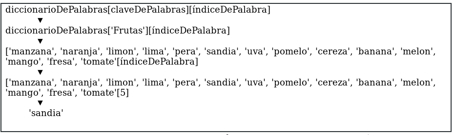

# 9 Extendiendo el Ahorcado

Ahora que ha creado un juego básico de Ahorcado, miremos algunas formas en las cuales puede extenderlo con nuevas características. En este capítulo, usted agregará múltiples conjuntos de palabras para que la computadora seleccione y la habilidad de cambiar el nivel de dificultad del juego. 

***

Temas cubiertos en este capítulo:

* El tipo de datos diccionario.
* Pares clave-valor (en inglés *key-value*)
* Los métodos `keys()` y `values()` del diccionario
* Asignaciones de variable múltiples.

***

## Añadir más intentos

Después de que haya jugado Ahorcado algunas veces, podrías pensar que seis intentos no son suficientes para que la jugadora adivine muchas de las palabras. Usted puede fácilmente darles más intentos al añadir más hileras de múltiples líneas en la lista `IMÁGENES_AHORCADO`.

Guarde su programa *ahorcado.py* como *ahorcado2.py*. Luego agregue las siguientes instrucciones en la línea 37 y posteriores para extender la lista que contiene los artes ASCII del ahorcado:

~~~Python
37.       ===''', '''
38.    +---+
39.   [O   |
40.   /|\  |
41.   / \  |
42.       ===''', '''
43.    +---+
44.   [O]  |
45.   /|\  |
46.   / \  |
47.       ===''']
~~~

Este código añade dos hileras multilínea a la lista `IMÁGENES_AHORCADO`, una con la oreja izquierda de la persona ahorcada dibujada, y otra con ambas orejas dibujadas. Debido a que el programa dirá a la jugadora que ha perdido en base a `len(letrasIncorrectas) == len(IMÁGENES_AHORCADO) - 1 `, este es el único cambio que tiene que hacer para conseguirlo. El resto del programa trabaja bien con la nueva lista `IMÁGENES_AHORCADO`.

## El tipo de dato diccionario

En la primera versión del programa Ahorcado, usamos una lista de palabras de animales, pero usted puede cambiar la lista de palabras en la línea 48. En vez de animales, usted podría tener colores. 

~~~Python
 48. palabras = 'rojo naranja amarillo verde azul índigo violeta blanco negro café'.split()
~~~

o formas:

~~~Python
 48. palabras = 'cuadrado triángulo rectángulo círculo elipse rombo trapezoide cheurón hexágono septágono octágono'.split()
~~~

o frutas:

~~~Python
 48. palabras = 'manzana naranja limón lima pera sandía uva pomelo cereza banano melón mango fresa tomate'.spli()
~~~

Con algunas modificaciones, usted inclusive podría cambiar el código para que el Ahorcado use conjuntos de palabras, como animales, colores, formas o frutas. El programa puede decirle  a la jugadora de cuál conjunto es la palabra secreta. 

Para hacer este cambio, usted necesitará un nuevo tipo de dato llamado *diccionario*. Un diccionario es una colección de valores como una lista. Pero en vez de acceder los ítemes en el diccionario con un índice entero, usted los puede acceder con un índice de cualquier tipo de dato. Para los diccionarios, estos índices se llamas *claves* (en inglés *keys*).

Los diccionarios usan `{`  y `}` (llaves) en vez de` [` y `]` (paréntesis cuadrados). Ingrese lo siguiente en la «shell» interactiva:

~~~Python
>>> cosas = {'hola':'Hola ¿como estas?',4:'tocineta','huevos':9999}
~~~

Los valores entre las llaves son pares clave-valor (en inglés key-value). Las claves están del lado izquierdo de los dos puntos y los valores de las llaves están a la derecha.  Usted puede acceder los valores, como lo hace con elementos en una lista, al utilizar la clave. Para ver un ejemplo, ingrese lo siguiente en la «shell» interactiva:

~~~Python
>>> cosas = {'hola':'Hola ¿como estas?',4:'tocineta','huevos':9999}
>>> cosas['hola']
'Hola ¿como estas?'
>>> cosas[4]
'tocineta'
>>> cosas['huevos']
9999
~~~

En vez de poner un entero entre los paréntesis cuadrados, usted puede utilizar, digamos, una llave de tipo cadena. En el diccionario `cosas`, usé ambos, el entero 4 y la cadenas 'huevos' como claves. 

## Obteniendo el tamaño de diccionarios con `len()`

Puede obtener la cantidad de pares clave-valor en el diccionario mediante la función `len()`. Prueba ingresando lo siguiente en la «shell» interactiva:

~~~Python
>>> cosas = {'hola':'Hola ¿como estas?',4:'tocineta','huevos':9999}
>>> len(cosas)
3
~~~

La función `len()` retornará un valor entero para el número de pares clave-valor, el cual en este caso es 3. 

## La diferencia entre diccionarios y listas

Una diferencia entre diccionarios y listas es que los diccionarios pueden tener claves de cualquier tipo de dato, como ya lo ha visto. Pero recuerde, como  `0` y `'0'` son valores diferentes, serán claves diferentes. Ingrese esto en la «shell» interactiva:

~~~Python
>>> spam = {'0':'una cadena', 0:'un entero'}
>>> spam[0]
'un entero'
>>> spam['0']
'una cadena'
~~~

También puede iterar sobre ambas, listas y claves en un diccionario, usando un ciclo `for`. Para ver cómo trabaja esto, ingrese lo siguiente en la «shell» interactiva:

~~~Python
>>> favoritos = {'fruta':'manzanas', 'animal':'gatos', 'número':42}
>>> for i in favoritos:
...     print(i)
fruta
número
animal
>>> for i in favoritos:
...     print(favoritos[i])
manzanas
42
gatos
~~~

A usted las claves y valores se le pueden haber impreso en un orden distinto porque, al contrario de la listas, los diccionarios son ordenados. El primer elemento en una lista llamada `listaDeCosas` será `listaDeCosas[0]`. Pero no hay un "primer" elemento en un diccionario, porque los diccionarios no tienen ningún tipo de orden. En este código, Python, simplemente elige un orden basado en cómo almacenó el diccionario en la memoria, lo cual no está garantizado que ocurra igual siempre. 

Ingrese el siguiente código en la «shell» interactiva:

~~~Python
>>> favoritos1 = {'fruta':'manzana', 'número:42, 'animal':'gatos'}
>>> favoritos2 = {'animal':'gatos', 'número:42, 'fruta':'manzana'}
>>> favoritos1== favoritos2
True
~~~

La expresión `favoritos1 == favoritos2` se evalúa a `True` porque los diccionarios son no-ordenados y considerados iguales si tienen los mismos pares clave-valor en ellos. Mientras tanto, las listas son ordenadas, dos listas con los mismos valores en distinto orden se consideran diferentes. Prueba ingresando lo siguiente en la «shell» interactiva:

~~~Python
>>> listaFavs1 = ['manzanas', 'gatos', 42]
>>> listaFavs2 = ['gatos', 42, 'manzanas']
>>> listaFavs1 == listFavs2
False
~~~

La expresión `listaFavs1 == listaFavs2` se evalúa a `False` porque los contenidos de la lista están ordenados diferente.

##Los métodos de diccionario `keys()` y `values()`

Los diccionarios poseen dos métodos útiles, `keys()` y `values()`. Estos devolverán valores de un tipo llamados `dict_keys` y `dict_values` respectivamente (claves y valores). Similar a los objetos de rango, los valores de estos tipo de datos pueden convertirse fácilmente a listas con la función `list()`. Prueba ingresando lo siguiente en la «shell» interactiva:

~~~Python
>>> favoritos = {'fruta':'manzanas', 'animal':'gatos', 'número:42}
>>> list(favoritos.keys())
['fruta', 'número, 'animal']
>>> list(favoritos.values())
['manzanas', 42, 'gatos']
~~~

Usando `list()` con los métodos `keys()` o `values()`, puede obtener una lista de solo las claves o solo los valores de un diccionario.

## Usando diccionarios de palabras en Ahorcado

Cambiemos el código en el nuevo juego de Ahorcado para soportar diferentes conjuntos de palabras secretas. Primero, cambie el valor asignado a `palabras` a un diccionario cuyas claves sean cadenas y los valores sean listas de cadenas. El método de cadena `split()` retornará una lista de cadenas con una palabra cada una.

~~~Python
 48. palabras = {'Colores':'rojo naranja amarillo verde azul añil violeta blanco negro marron'.split(),
 49. 'Formas':'cuadrado triangulo rectangulo circulo elipse rombo trapezoide chevron pentagono hexagono heptagono octogono'.split(),
 50. 'Frutas':'manzana naranja limon lima pera sandia uva pomelo cereza banana melon mango fresa tomate'.split(),
 51. 'Animales':'murcielago oso castor gato pantera cangrejo ciervo perro burro pato aguila pez rana cabra sanguijuela leon lagarto mono alce raton nutria buho panda piton conejo rata tiburon oveja mofeta calamar tigre pavo tortuga comadreja ballena lobo wombat cebra'.split()}
~~~

Las líneas del 48 al 51 son un solo enunciado de asignación. La instrucción no termina la llave final en la línea 51.

## Elegir aleatoriamente de una lista

La función `choice()` del módulo `random` toma una lista como argumento y devuelve un valor aleatorio de esta. Esto es similar a lo previamente hacia la función `obtenerPalabraAlAzar()`. Usarás `random.choice()` en la nueva versión de `obtenerPalabraAlAzar()`.

Para ver cómo funciona la función `choice`, ingrese lo siguiente en la «shell» interactiva:

~~~Python
>>> import random
>>> random.choice(['gato', 'perro', 'ratón'])
'ratón'
>>> random.choice(['gato', 'perro', 'ratón'])
'gato'
~~~

Así como la función `randint()`retorna un entero aleatoriamente cada vez, la función `choice()` retorna un valor aleatorio de la lista.

Cambie la función `obtenerPalabraAlAzar()` para que su parámetro sea un diccionario de listas de cadenas, en vez de tan sólo una lista de cadenas. Así es como la función se veía originalmente:

~~~Python
 40. def obtenerPalabraAlAzar(listaDePalabras):
 41.     # Esta función devuelve una cadena al azar de la lista de cadenas pasada como argumento.
 42.     índiceDePalabras = random.randint(0, len(listaDePalabras) - 1)
 43.     return listaDePalabras[índiceDePalabras]
~~~

Cambia el código en esta función para que se vea así:

~~~Python
53. def obtenerPalabraAlAzar(diccionarioDePalabras):
54.     # Esta función devuelve una cadena al azar del diccionario de listas de cadenas y sus claves
55.     # Primero, elige una clave al azar del diccionario:
56.     claveDePalabra = random.choice(list(diccionarioDePalabras.keys()))
57.
58.     # Segundo, elige una palabra aleatoria de la lista de claves en el diccionario:
59.     índiceDePalabra = random.randint(0, len(diccionarioDePalabras[claveDePalabra]) - 1)
60.
61.     return [diccionarioDePalabras[claveDePalabra][índiceDePalabra], claveDePalabra]
~~~

Cambiamos el nombre del parámetro `listaDePalabras` a `diccionarioDePalabras` para ser más descriptivos. Ahora en vez de elegir una cadena al azar de una lista de cadenas, primero la función elige una clave aleatoriamente en el diccionario `diccionarioDePalabras` llamando a `random.choice()`. Y en vez de devolver la cadena `listaDePalabras[índiceDePalabras]`, la función devuelve una lista con dos elementos. El primer elemento es `diccionarioDePalabras[claveDePalabra][índiceDePalabra]`. El segundo elemento es `claveDePalabra`.

La expresión `diccionarioDePalabras[claveDePalabra][índiceDePalabra]` en la línea 61 puede lucir complicada, pero es tan sólo una expresión que puedes evaluar un paso a la vez como todo. Primero, imagine que `claveDePalabra` posee el valor `'Frutas'` e `índiceDePalabra` posee el valor `5`.  Así es como se evalúa `diccionarioDePalabras[claveDePalabra][índiceDePalabra]`:

En este caso, el elemento de la lista que devuelve la función será la cadena 'sandía'. (Recuerde que los índices comienzan en `0`, así que `[5]` refiere al sexto elemento en la lista, no al quinto.)

Dado que la función `obtenerPalabraAlAzar()` ahora devuelve una lista de dos elementos en vez de una cadena, a `palabraSecreta` se le asignará una lista y no una cadena. Puede asignar dos elementos en dos variables separadas usando asignación múltiple, la cual cubriremos en "Asignación múltiple" en la página 118.

## Eliminar elementos de listas

Un enunciado `del` eliminará un elemento en un cierto índico de una lista. Debido a que `del` es un enunciado, no una función o un operador, este no tiene paréntesis o evalúa a un valor de retorno. Para probarlo, ingrese lo siguiente en la «shell» interactivo:

~~~Python
>>> animales = ['oso perezoso', 'manatí', 'venado cola blanca', 'zaguate']
>>> del animales[1]
>>> animales
['oso perezoso', 'venado cola blanca', 'zaguate']
~~~

Note que cuando eliminó el elemento en el índice 1, el elemento que estaba en el índice 2 se convirtió en el nuevo valor en el índice 1; el elemento que estaba en el índice 3 se convirtió en el nuevo valor en el índice 2; y así sucesivamente. Todos los elementos con índice superior al elemento eliminado se movieron un índice hacia abajo.

Puede ingresar `del animales[1]`una y otra vez para mantenerse eliminando elementos de la lista:

~~~Python
>>> animales = ['oso perezoso', 'venado cola blanca', 'zaguate']
>>> del animales[1]
>>> animales
['oso perezoso', 'zaguate']
>>> del animales[1]
>>> animales
['oso perezoso']
~~~

El largo de la lista `IMÁGENES_AHORCADO` es también el número de intentos que la jugadora obtiene. Eliminando hileras de la lista, puede reducir el número de intentos y hacer el jugo más difícil. 

Agregue las siguientes líneas de código en su programa entre las líneas `print('A H O R C A D O')` y `letrasIncorrectas = ''`:

~~~python
103. print('H A N G M A N')
104.
105. dificultad = 'X'
106. while dificultad not in ['F', 'M', 'D']:
107.     print('Ingrese la dificultad: F - Fácil, M - Medio, D - Difícil')
108.     dificultad = input().upper()
109. if dificultad == 'M':
110.     del IMÁGENES_AHORCADO[8]
111.     del IMÁGENES_AHORCADO[7]
112. if dificultad == 'D':
113.     del IMÁGENES_AHORCADO[8]
114.     del IMÁGENES_AHORCADO[7]
115.     del IMÁGENES_AHORCADO[5]
116.     del IMÁGENES_AHORCADO[3]
117.
118. letrasIncorrectas = ''
~~~

Este código elimina elementos de la lista  `IMÁGENES_AHORCADO` , haciéndola más corta dependiendo del nivel de dificultad seleccionado. Cuando el nivel de dificultad aumenta, más elementos son eliminado de la lista  `IMÁGENES_AHORCADO`, resultando en menos intentos. El resto del código del juego Ahorcado usa el largo de esta lista para saber cuando la jugadora se ha quedado sin intentos. 

## Asignación múltiple

Asignación múltiple es un atajo para asignar múltiples variables en una sola línea de código. Para usar asignación múltiple, separe sus variables con comas y asígneles una lista de valores. Por ejemplo, ingrese el siguiente código en la «shell»  interactiva:

~~~Python
>>> a, b, c = ['manzanas', 'gatos', 42]
>>> a
'manzanas'
>>> b
'gatos'
>>> c
42
~~~

El ejemplo anterior es equivalente a las siguientes sentencias de asignación:

~~~Python
>>> a = ['manzanas', 'gatos', 42][0]
>>> b = ['manzanas', 'gatos', 42][1]
>>> c = ['manzanas', 'gatos', 42][2]
~~~

Usted tiene que colocar tantas variables a la izquierda de la sentencia `=` como elementos en la lista en la parte derecha. Python automáticamente asignará el valor del primer elemento de la lista a la primer variable, el valor del segundo elemento de la lista en la segunda variable y así continuamente. Pero si no posee la misma cantidad de variables y elementos, el interprete de Python dará un error como este:

~~~Python
>>> a, b, c, d = ['manzanas', 'gatos', 42, 10, 'hola']
Traceback (most recent call last):
  File "<pyshell#8>", line 1, in <module>
    a, b, c, d = ['manzanas', 'gatos', 42, 10, 'hola']
ValueError: too many values to unpack
>>> a, b, c, d = ['manzanas', 'gatos']
Traceback (most recent call last):
  File "<pyshell#9>", line 1, in <module>
    a, b, c = ['manzanas', 'gatos']
ValueError: need more than 2 values to unpack
~~~

Cambia las líneas 120 y 157 del Ahorcado para usar asignación múltiple con el valor retornado por `obtenerPalabraAlAzar()`:

~~~Python
119. letrasCorrectas = ''
120. palabraSecreta, conjuntoSecreto = obtenerPalabraAlAzar(palabras)
121. juegoTerminado = False

... código recortado ...

156.            juegoTerminado = False
157.            palabraSecreta, conjuntoSecreto = obtenerPalabraAlAzar(palabras)
158.        else:
159.            break
~~~

## Imprimiendo la Categoría de la palabra a la jugadora

El último cambio que realizará es decirle a la jugadora que conjunto de palabras está intentando de adivinar. De esta manera, cuando la jugadora juegue podrá saber si la palabra secreta es un animal, color, forma o fruta. Acá está el código original:

~~~Python
 91. while True:
 92.     mostrarTablero(letrasIncorrectas, letrasCorrectas, palabraSecreta)
~~~

En su nueva versión de Ahorcado, agregue la línea 124 para que su programa se vea así:

~~~Python
123. while True:
124.     print('La palabra secreta pertenece al conjunto: ' + conjuntoSecreto)
125.     mostrarTablero(letrasIncorrectas, letrasCorrectas, palabraSecreta)
~~~

Ahora ha terminado con nuestros cambios al Ahorcado. En vez de sólo una lista de cadenas, la palabra secreta es elegida de diferentes listas de cadenas. El programa también dirá a la jugadora de qué conjunto de palabras es la palabra secreta. Prueba jugar esta nueva versión. Luego puede cambiar el diccionario de palabras de la línea 48 para incluir mas conjuntos de palabras.

## Resumen

¡Hemos terminado el Ahorcado!. Ha aprendido algunos nuevos conceptos en este capítulo cuando agregó las características extra. Aún cuando ha terminado de escribir el juego, usted puede fácilmente agregar más características mientras aprende más sobre programación en Python. 

Los diccionarios son similares a las listas excepto que las primeras puede usar cualquier tipo de valor como índice, no solo índices. Lo índices en los diccionarios son llamados claves. La asignación múltiple es un atajo para asignar a múltiples variables los valores en una lista.

El Ahorcado es ligeramente avanzado comparado con los juegos previos en este libro. Pero en este punto, sabe muchos de los conceptos básicos para escribir programas: variables, ciclos, funciones y los tipos de datos de Python como listas y diccionarios. Los siguientes programas en este libro seguirán siendo un desafío a dominar, pero ¡acabas de terminar la parte más empinada de la escalada!.

[Previo: Capítulo 8: Escribiendo el código del ahorcado ](capitulo8.md) | [Siguiente: Capítulo 10: Tres en línea](capitulo10.md)