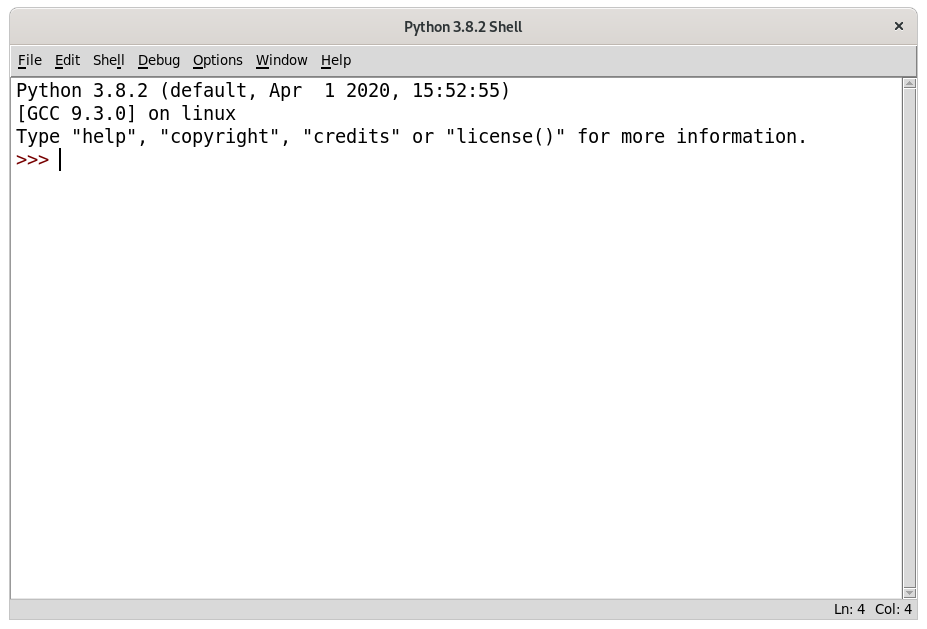

# Introducción

## Agradecimientos

Este libro no hubiera sido posible sin el trabajo excepcional del equipo de No Starch Press. Gracias a mi editor, Bill Pollock; gracias a mis editoras, Laurel Chun, Jan Cash y Tyler Ortman, por su increíble ayuda a lo largo del proceso; gracias a mi editora técnica Ari Lacenski por su revisión minuciosa; y gracias a Josh Ellingson por otra gran portada.


Cuando jugué mis primeros vídeo juegos de niño, estaba enganchado. Pero no sólo quería jugar vídeo juegos, quería hacerlos. Encontré un libro como este que me enseñó cómo escribir mis primeros programas y juegos. Fue divertido y sencillo. Los primeros juegos que hice eran como los de este libro. No eran lujosos como los juegos de Nintendo que mis padres me compraban, pero eran juegos que yo mismo hice.

Ahora, de adulto, aún me divierto programando y me pagan por hacerlo. Pero incluso si usted no quiere convertirse en una programadora de computadoras, programar es una habilidad útil y divertida. Entrena al cerebro a pensar de forma lógica, hacer planes y reconsiderar sus ideas siempre que encuentra errores en su código.

Muchos libros de programación para principiantes caen en dos categorías. La primera incluye libros que no enseñan tanto a programar sino que enseñan «programas de creación de juegos», o lenguajes que simplifican tanto que lo que enseñan ya no es programación. La otra categoría consiste en libros que enseñan programación como un libro de texto de matemáticas--todos los principios y conceptos, con pocas aplicaciones para la vida real de la lectora. Este libro toma un enfoque diferente y enseña cómo programar haciendo vídeo juegos. Enseño el código fuente de los juegos justo al frente, y explico principios de programación a partir de los ejemplos. Este enfoque fue la clave para mi cuando estaba aprendiendo a programar. Entre más aprendía cómo trabajaban los programas de otras personas, más ideas tenía para mis propios programas.

Todo lo que necesita es una computadora, un software libre llamado intérprete de Python y este libro. Una vez que haya aprendido cómo crear los juegos de este libro, será capaz de desarrollar juegos por su propia cuenta.

Las computadoras son máquinas increíbles, y aprender a programarlas no es tan difícil como la gente piensa. Un *programa* de computadora es un puñado de instrucciones que la computadora puede entender, así como un libro de cuentos es un puñado de oraciones que la lectora puede entender. Para darle una instrucción a una computadora, usted escribe un programa en un lenguaje que la computadora entienda. Este libro le enseñará un lenguaje de programación llamado Python. Hay muchos otros lenguajes de programación que puede aprender, como BASIC, Java, JavaScript, PHP y C++.

Cuando era niño yo aprendí BASIC, pero lenguajes de programación nuevos como Python son aún más fáciles de aprender. Python también es usado por programadoras profesionales en su trabajo *y* cuando programan para divertirse. Además, es totalmente gratis para instalar y usar--usted sólo necesitará una conexión a Internet para descargarlo.

Dado que los vídeo juegos no son más que programas de computadoras, estos también están hechos de instrucciones. Los juegos que creará desde este libro parecen sencillos comparados con los juegos de Xbox, PlayStation o Nintendo. Estos juegos no tienen gráficos lujosos porque su objetivo es enseñarle lo esencial de escribir código. Son simples a propósito para que se pueda enfocar en aprender a programar. ¡Los juegos no tienen que ser complicados para ser divertidos!

## ¿Para quién es este libro?

Programar no es difícil, pero *es* difícil encontrar materiales que le enseñen a hacer cosas interesantes con la programación. Otros libros de computadoras cubren muchos temas que las programadoras nuevas no necesitan. Este libro le enseñará cómo programar sus propios juegos; aprenderá una habilidad útil, ¡y tendrá juegos divertidos para mostrarla! Este libro es para:

* Principiantes que quieran enseñarse a sí mismas a programar, incluso si no tienen experiencia previa.
* Niñas y adolescentes que quieran aprender a programar creando juegos.
* Adultas y profesoras que quieran ensenar a otras a programar.
* Cualquier persona, joven o vieja, que quiera aprender cómo programar  aprendiendo un lenguaje de programación profesional.

## Acerca de este libro

En la mayoría de los capítulos de este libro, se presenta y explica un simple juego nuevo. Algunos de los capítulos cubren temas útiles adicionales, como depuración. Se explican nuevos conceptos de programación conforme los juegos los utilizan, y los capítulos están pensados para ser leídos en orden. Aquí hay un breve resumen de lo que encontrará en cada capítulo.

* **Capítulo 1: La consola interactiva** explica cómo la consola interactiva de Python se puede usar para experimentar con código una línea a la vez.
* **Capítulo 2: Escribiendo programas** cubre cómo escribir programas completos en el editor de archivos de Python.
* En el **Capítulo 3: Adivine el número**, usted programará el primer juego del libro, Adivine el número, el cual le pregunta a la jugadora que adivine un número secreto y luego le brinda pistas de si el número adivinado es muy alto o muy bajo.
* En el **Capítulo 4: Un programa que cuenta chistes**, usted escribirá un programa sencillo que le cuenta a la usuaria varios chistes.
* En el **Capítulo 5: El reino del dragón**, usted programará un juego de adivinanzas en el cual la jugadora debe escoger entre dos cuevas: una tiene un dragón amistoso, y la otra un dragón hambriento.
* **Capítulo 6: Usando el depurador** cubre cómo usar el depurador para arreglar problemas en su código.
* **Capítulo 7: Diseñando un ahorcado con diagramas de flujo** explica cómo se pueden usar diagramas de flujo para planear programas más largos, como el juego del ahorcado.
* En el **Capítulo 8: Escribiendo el ahorcado**, escribirá el juego del ahorcado, siguiendo el diagrama de flujo del Capítulo 7.
* **Capítulo 9: Extendiendo el ahorcado** extiende el juego del ahorcado con nuevas funcionalidades usando el tipo de datos de diccionario de Python.
* En el **Capítulo 10: Tres en línea**, usted aprenderá cómo escribir un juego de tres en línea de humano contra computadora que usa inteligencia artificial.
* En el **Capítulo 11: El juego de deducción de panecillos**, aprenderá cómo hacer un juego de deducción llamado *panecillos* en el que la jugadora debe adivinar números secretos con base en pistas.
* **Capítulo 12: El sistema de coordenadas cartesianas** explica el sistema de coordenadas cartesianas, que usará en los siguientes juegos.
* En el **Capítulo 13: Búsqueda del tesoro con sonar**, aprenderá cómo escribir un juego de búsqueda del tesoro en el cual la jugadora busca en el océano los cofres del tesoro.
* En el **Capítulo 14: Código del César**, creará un programa de cifrado sencillo que le permite escribir y decodificar mensajes secretos.
* En el **Capítulo 15: El juego reversegam**, usted programará un juego avanzado de humano contra computadora del tipo reversi que tiene un oponente de inteligencia artificial casi imbatible.
* **Capítulo 16: Simulación de IA de reversegam** expande en el juego de reversegam del Capítulo 15 para hacer múltiples IAs que compiten en juegos de computadora contra computadora.
* **Capítulo 17: Creando gráficos** introduce el módulo de Python pygame y le muestra cómo usarlo para dibujar gráficos de 2D.
* **Capítulo 18: Animando gráficos** le muestra cómo animar gráficos con pygame.
* En el **Capítulo 19: Detección de colisiones**, aprenderá cómo detectar cuando objetos chocan unos con otros en juegos 2D.
* En el **Capítulo 20: Usando sonido e imágenes**, usted mejorará sus juegos simples de pygame agregando sonido e imágenes.
* **Capítulo 21: Un juego de Dodger con sonido e imágenes** combina los conceptos de los Capítulos 17 al 20 para hacer un juego animado llamado Dodger.

## ¿Cómo usar este libro?

La mayoría de los capítulos en este libro empezarán con una ejecución de un programa de ejemplo. Esta ejecución le mostrará cómo se ve el programa y cómo ejecutarlo. Las partes que la usuaria debe escribir se muestran en negrita.

Le recomiendo que escriba el código de cada programa en el editor IDLE usted misma, en lugar de descargarlo, o copiarlo y pegarlo. Recordará mucho más si se toma el tiempo para escribir el código.

### Números de línea e indentación

Al escribir el código fuente de este libro, *no* escriba el número de línea al inicio de cada línea. Por ejemplo, si ve la siguiente línea de código, usted no necesitará escribir el `9.` del lado izquierdo, ni el espacio que le sigue inmediatamente:

```Python
9. number = random.randint(1, 20)
```

Usted escribiría sólo esto:

```Python
number = random.randint(1, 20)
```

Esos números están ahí solo para que el libro se pueda referir a líneas específicas en el programa. No son parte del código fuente del programa.

Aparte de los números de línea, escriba el código exactamente como aparece en este libro. Note que algunas de las líneas del código están indentadas a cuatro, ocho (o más) espacios. Los espacios al inicio de la línea cambian cómo Python interpreta las instrucciones, de forma que son muy importantes de incluir.

Veamos un ejemplo. Los espacios de indentación aquí están marcados con círculos negros (●) para que los pueda ver.

```Python
while guesses < 10:
●●●●if number == 42:
●●●●●●●●print('Hello')
```

La primera línea no está indentada, la segunda línea está indentada a cuatro espacios, y la tercera línea está indentada a ocho espacios. Aunque los ejemplos de este libro no tienen círculos negros para marcar los espacios, cada carácter en IDLE tiene el mismo ancho, entonces puede contar el número de espacios contando el número de caracteres en la línea de arriba o abajo.

### Líneas de código largas

Algunas instrucciones de código son muy largas para entrar en una línea en el libro, y serán continuadas en la línea siguiente. Pero la línea sí entrará en la pantalla de su computadora, entonces escríbala toda en una línea sin presionar ENTER. Puede saber cuando una nueva instrucción empieza viendo a los números de línea a la izquierda. Este ejemplo tiene dos instrucciones:

```Python
1. print('¡Esta es la primera instrucción!xxxxxxxxxxxxxxxxxxxxxxxxxxxxxxxxxxxxxx
   xxxxxxxxxxxx')
2. print('Esta es la segunda instrucción, no la tercera instrucción.')
```

La primera instrucción continúa y sigue en la segunda línea en la página, pero la segunda línea no tiene un número de línea, entonces puede ver que es todavía la linea 1 del código.

## Descargando e instalando Python

Necesitará instalar un software llamado intérprete de Python. El programa *intérprete* entiende las instrucciones que escribe en Python. Me referiré al software intérprete de Python sólo como *Python* a partir de ahora.

En esta sección, le mostraré cómo descargar e instalar Python 3 --específicamente, Python 3.4--para Windows, OS X o Ubuntu. Hay nuevas versiones de Python que la 3.4, pero el módulo pygame, que se usa en los Capítulos 17 al 21, actualmente sólo soporta hasta 3.4.

---
Nota de las traductoras:

El módulo pygame ya soporta Python 3.6. Para descargarlo para Windows y OS X utilice este enlace:
[https://www.python.org/downloads/release/python-364/](https://www.python.org/downloads/release/python-364/)

IDLE para Python 3.5 está disponible en Ubuntu 16.04, y IDLE para Python 3.6 está disponible en las versiones más recientes del sistema operativo. Todas estas funcionan igual que la que utiliza el texto original en inglés.

---

Es importante saber que hay algunas diferencias significativas entre Python 2 y Python 3. Los programas en este libro usan Python 3, y usted recibirá errores si trata de ejecutarlos con Python 2. De hecho, esto es tan importante, que he agregado una caricatura de un pingüino recordándoselo:


En Windows, descargue el instalador MSI para Windows x86-64 de [https://www.python.org/downloads/release/python-344/](https://www.python.org/downloads/release/python-344/) y luego dele doble clic. Podría tener que ingresar la contraseña de administración de su computadora. Siga las instrucciones que el instalador muestra en la pantalla para instalar Python, como se lista aquí:

1. Seleccione **Instalar para todas las usuarias** y luego haga clic en **Siguiente**.
2. Instale en el directorio *C:\Python34* haciendo clic en **Siguiente**.
3. Haga clic en **Siguiente** para saltarse la sección de Personalización de Python.

En OS X, descargue el instalador para Mac OS X 64-bit/32-bit de [https://www.python.org/downloads/release/python-344/](https://www.python.org/downloads/release/python-344/) y luego dele doble clic. Siga las instrucciones que el instalador muestra en la pantalla para instalar Python, como se lista aquí:

1. Si obtiene la advertencia de que «"Python.mpkg" no se puede abrir porque proviene de una desarrolladora desconocida», mantenga presionada la tecla CONTROL y haga clic derecho en el archivo *Python.mpkg*, y seleccione **Abrir** en el menú que aparece. Podría tener que ingresar la contraseña de administración de su computadora.
2. Haga clic en **Continuar** a través de la sección de Bienvenida y haga clic en **Estoy de acuerdo** para aceptar la licencia.
3. Seleccione *Macintosh HD* (o como se llame su disco duro) y haga clic en **Instalar**.

Si está ejecutando Ubuntu, puede instalar Python desde el Centro de software de Ubuntu siguiendo estos pasos:

1. Abra el Centro de software de Ubuntu.
2. Ingrese **Python** en el cuadro de búsqueda en la esquina superior derecha de la ventana.
3. Seleccione **IDLE (Python 3.4 GUI 64 bit)**.
4. Haga clic en **Instalar**. Podría tener que ingresar la contraseña de administración para completar la instalación.

Si los pasos de arriba no le funcionan, puede encontrar instrucciones alternativas de instalación de Python 3.4 en [https://www.nostarch.com/inventwithpython/](https://www.nostarch.com/inventwithpython/).

## Abriendo IDLE

IDLE son las iniciales de «**I**nteractive **D**eve**L**opment **E**nvironment» (Ambiente de desarrollo interactivo, en inglés). IDLE es como un procesador de texto para escribir programas en Python. IDLE se abre de forma distinta en cada sistema operativo:

* En Windows, haga clic en el menú de **Inicio** en la esquina inferior izquierda de la pantalla, escriba **IDLE**, y seleccione **IDLE (Python GUI)**.
* En OS X, abra Finder y haga clic en **Aplicaciones**. Haga doble clic en **Python 3.x** y luego doble clic en el icono de IDLE.
* En Ubuntu u otras distribuciones de Linux, abra una ventana de terminal y escriba **idle3**. También podría hacer clic en **Aplicaciones** en la parte de arriba de la pantalla. Luego clic en **Programación** y **IDLE 3**.

La ventana que aparece cuando ejecuta por primera vez IDLE es la **consola interactiva**, como se muestra en la Figura 1. Puede escribir instrucciones de Python en la consola interactiva en el «prompt» `>>>` y Python las realizará. Después de que la computadora realiza las instrucciones, un nuevo «prompt» `>>>` esperará por su siguiente instrucción.


Figura 1: La consola interactiva del programa IDLE

## Encontrando ayuda en línea

Puede encontrar los archivos con el código fuente y otros recursos para este libro en [https://www.nostarch.com/inventwithpython/](https://www.nostarch.com/inventwithpython/). Si quiere hacer preguntas de programación relacionadas con este libro, visite [https://reddit.com/r/inventwithpython/](https://reddit.com/r/inventwithpython/), o puede enviarme sus preguntas de programación a al@inventwithpython.com.

Antes de hacer una pregunta, asegúrese de hacer lo siguiente:

* Si está escribiendo un programa de este libro, pero está recibiendo un error, revise errores de tipografía con la herramienta `diff` en línea en [https://www.nostarch.com/inventwithpython#diff](https://www.nostarch.com/inventwithpython#diff) antes de hacer su pregunta. Copie y pegue el código en la herramienta `diff` para encontrar cualquier diferencia entre el código del libro y el suyo.
* Busque en la red para ver si alguien más ya preguntó (y respondió) su pregunta.

Tenga en mente que entre mejor redacte sus preguntas de programación, las otras personas podrán ayudarle mejor. Al hacer preguntas de programación, haga lo siguiente:

* Explique lo que estaba tratando de hacer cuando obtuvo el error. Esto le permitirá a su ayudante a saber si usted está en un camino totalmente equivocado.
* Copie y pegue todo el mensaje de error y su código.
* Brinde la información de su sistema operativo y versión.
* Explique qué cosas ya intentó para solucionar su problema. Esto le dice a la gente si usted ya puso un poco de trabajo para tratar de entender las cosas por su propia cuenta.
* Sea cortés. No exija ayuda o presione a sus ayudantes a responder de forma rápida.

Ahora que ya sabe cómo pedir ayuda, ¡usted aprenderá a programar sus propios juegos de computadora al instante!

[Siguiente: Capítulo 1: La consola interactiva](capitulo1.md)
